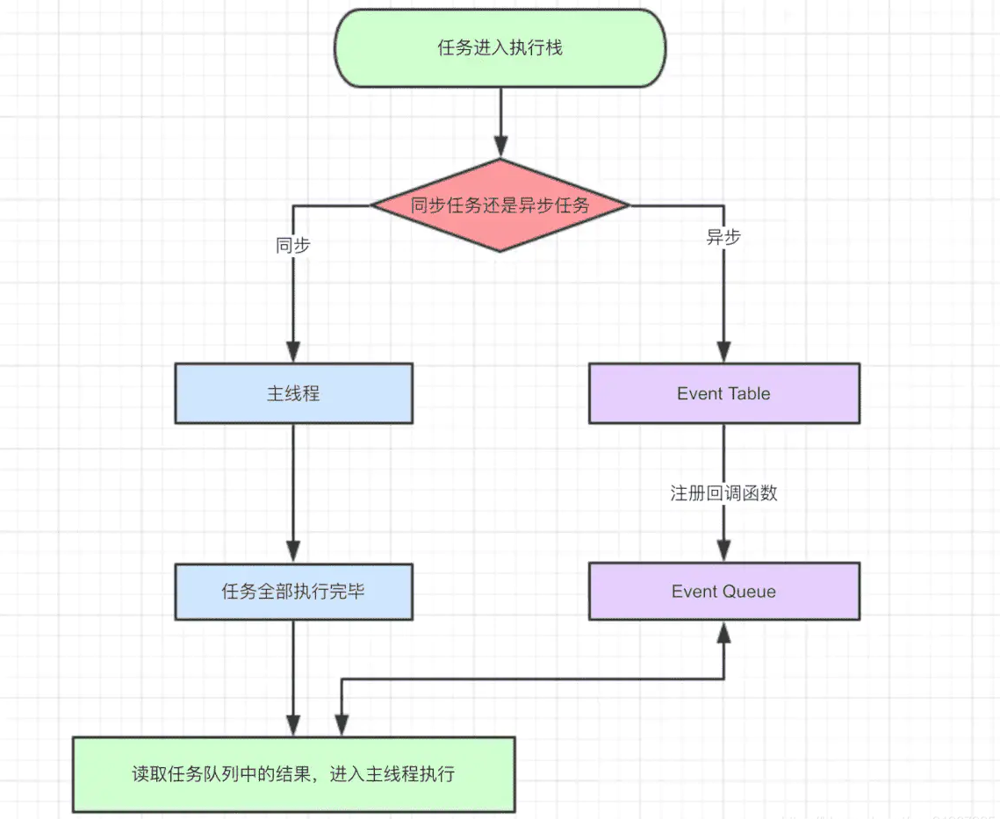
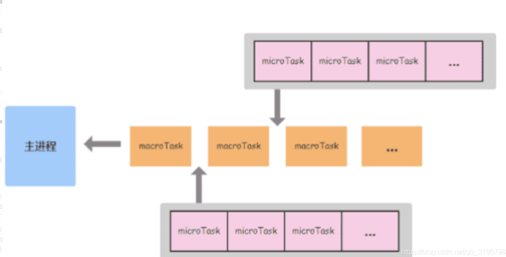
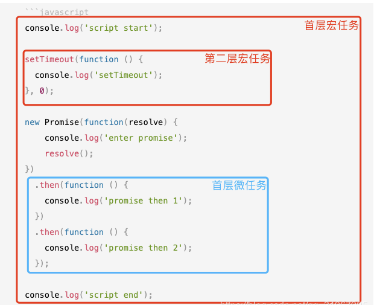
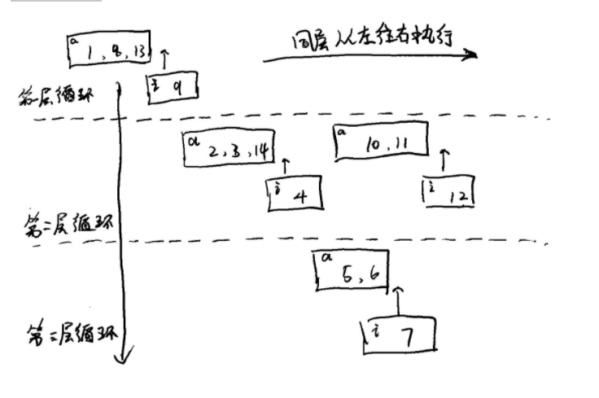
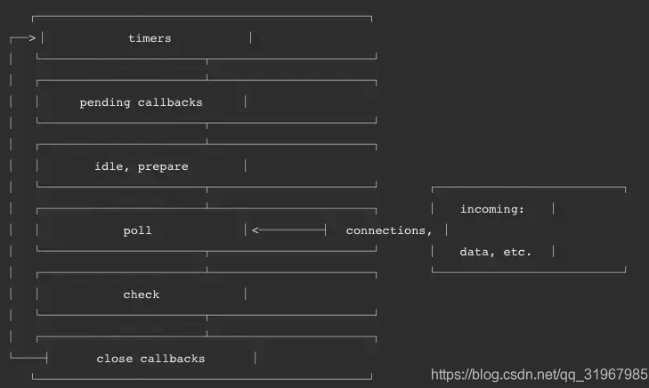
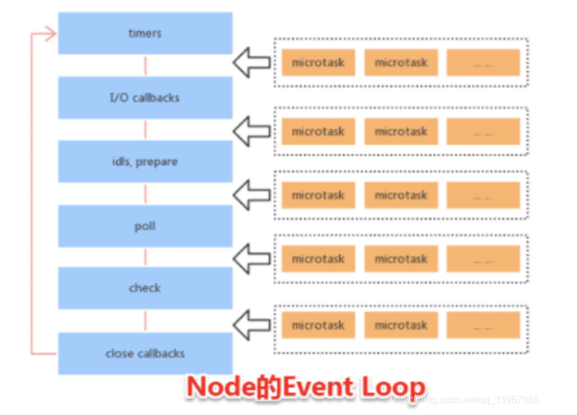

# Event Loop

**Event Loop：** 也叫做事件循环，是指浏览器 或者 Node 环境的一种解决 JavaScript 单线程运行时不会阻塞的一种机制，也就是实现异步的原理。作为一种单线程语言， JavaScript 本身是没有异步这一说法的，是由其宿主环境提供的。

> 注意：Event Loop 并不是在 ECMAScript 标准中定义的，而是在 HTML 标准中定义的；

## 一、Event Loop 知识铺垫

`javaScript` 代码运行时，任务被分为两种，`宏任务（MacroTask/Task）` 和 `微任务（MircoTask）`

Event Loop 在执行和协调各种任务时也将任务队列认为 `Task Quene（宏任务队列）` 和 `MircoTask Quene（微任务队列）` 分别对应管理 `宏任务（MacroTask/Task）` 和 `微任务（MircoTask）`；作为队列，`Task Quene` 和 `MircoTask Quene` 也具备队列的特性：`先进先出`

### 1、微任务(MircoTask)

在 HTML 标准中，并没有明确规定 MircoTask，但是实际开发中包含以下四种：

- Promise 中的 `then, catch, finally`
- MutationObserver（监视 DOM 变动的API，详情参考[MDN](https://developer.mozilla.org/zh-CN/docs/Web/API/MutationObserver)）
- Process.nextTick（Node环境，通常也被认为是微任务）

### 2、宏任务（MacroTask/ Task）

基本上，JavaScript 中 `非 微任务` 的所有任务都归为 宏任务， 比如：

- script 中全部代码
- DOM 操作
- 用户交互操作
- 所有的网络请求
- 定时器相关的 setTimeout， setInterval 等
- ...

### 3、JavaScript runtime

`JavaScript runtime： 为 JavaScript 提供一些对象或者机制，使它能够与外界交互，是JavaScript的执行环境。` 

javascript 运行时会创建一个 `main thread 主线程` 和 `call - stack 调用栈(执行栈，遵循后进先出的规则)`。`所有的任务都会被放到 调用栈 / 执行栈等待主线程执行`




1. 主线程自上而下依次执行所有代码；
2. 同步任务直接进入到主线程被执行；
3. 异步任务进入到 `Event Table`， 当异步任务有结果后，将相对应的回调函数进行注册，放入 **Event Quene**
4. 主线程任务执行完空闲下来后，从 `Event Quene(FIFO)` 中读取任务，放入主线程执行；
5. 放入主线程的 **Event Quene** 任务继续从第一步开始，如此循环执行；

上述步骤执行过程就是我们所说的事件循环(Event Loop)，上图展示了事件循环中的一个完整循环过程。


## 二、 浏览器环境的 Event Loop

不同的执行环境中，Event Loop 的执行机制是不同的；例如：Chrome 和 Nodejs 都使用了 V8 引擎。V8 实现并提供了 ECMAScript 标准中的所有**数据类型，操作符，对象和方法（注意并没有DOM）**。但是他们的 Runtime 并不一样： `chrome 提供了 window、 Dom 而 Nodejs 则是 require、process 等等` 在了解 浏览器中的 Event Loop 的具体表现前需要先整理 同步，异步，微任务， 宏任务之间的关系。

### 1、同步，异步 和 宏任务，微任务

宏任务和微任务是相对而言的，根据代码执行时循环的先后，将代码执行分层理解，在每一层（一次）的事件循环中，首先整体代码块看做一个宏任务，宏任务的 Promise（then，catch，finally），MutationObserver， Process.nextTick 就是该宏任务层的微任务；宏任务中的同步代码进入主线程中立即执行，宏任务中的**非微任务**异步代码块将作为下一次循环的宏任务，进入调用栈等待执行，此时，调用栈中等待执行的队列分为两种，优先级较高的本层循环的**微任务队列**，和优先级较低的下层循环执行的**宏任务队列**，按照优先级进行执行。

> 注意：`每一次/层循环，都是首先从宏任务开始，微任务结束;`





### 2、简单实例分析

上面描述的相对繁琐，结合代码和图片进行分析理解



进行代码分析：这是一个简单而典型的**双层循环**的**事件循环**执行案例，在这个循环中可以按照以下步骤进行分析

1. 首先区分出该层的 **宏任务** 范围（整个代码）

2. 区分 **宏任务** 中 **同步代码** 和 **异步代码**

   同步代码：`console.log('script start');`、`console.log('enter promise');`和`console.log('script end');`；

   异步代码块：`setTimeout`和`Promise的then`（**注意**：`Promise中只有then、catch、finally的执行需要等到结果，Promise传入的回调函数属于同步执行代码`）;

3. 在**异步**中找出同层的**微任务** （代码中的`Promise的then`）和下层事件循环的`宏任务`（代码中的`setTimeout`）

4. **宏任务** 的 **同步代码优先进入主线程**，按照自上而下的顺序执行完毕

	输出顺序为：

   ```
   //同步代码执行输出
   script start
   enter promise
   script end
   ```

5. 当主线程空闲时，执行该层的`微任务`
	
```
	//同层微任务队列代码执行输出
	promise then 1
	promise then 2
	```
	
6. 首层事件循环结束，进入第二层事件循环（`setTimeout`包含的执行代码，只有一个同步代码）

   ```
   //第二层宏任务队列代码执行输出
   setTimeout
   ```

7. 综合分析最终得出数据结果为：

   ```
   //首层宏任务代码执行输出
   script start
   enter promise
   script end
   //首层微任务队列代码执行输出
   promise then 1
   promise then 2
   //第二层宏任务队列代码执行输出
   setTimeout
   ```


### 3、 复杂案例分析

对于下列多循环的事件循环进行分析检验，给出你的结果：

```
console.log('1')

setTimeout(function () {
  console.log('2')
  new Promise(function (resolve) {
    console.log('3')
    resolve()
  }).then(() => {
    console.log('4')
  })
  setTimeout(() => {
    console.log('5')
    new Promise(function (resolve) {
      console.log('6')
      resolve()
    }).then(() => {
      console.log('7')
    })
  })
  console.log('14')
})

new Promise((resolve) => {
  console.log('8')
  resolve()
}).then(() => {
  console.log('9')
})

setTimeout(() => {
  console.log('10')
  new Promise((resolve) => {
    console.log('11')
    resolve()
  }).then(() => {
    console.log('12')
  })
})

console.log('13')
```

分析：如下图草稿所示，`左上角标a为宏任务队列，左上角标i为微任务队列`，同一层循环中，本层宏任务先执行，再执行微任务；本层宏任务中的非微任务异步代码块作为下层循环的宏任务进入下次循环，如此循环执行；



```
1->8->13->9->2->3->14->4->10->11->12->5->6->7
```

## 三 、Node 环境下的 Event Loop

在 **Node** 环境下，浏览器的 Event Loop 机制并不适用，切记不能混为一谈，Node 中的 Event Loop 是基于**[libuv](https://nodejs.org/en/docs/guides/event-loop-timers-and-nexttick/)** 实现的。**libuv 是 Node 的新跨平台抽象层，libuv 使用异步，事件驱动的编程方式，核心是提供 I/O 的事件循环和异步回调，libuv 的 APi 包含有时间，非阻塞网络，异步文件操作，子进程等等。**

### 1、 Event Loop 的6个阶段



**Node的Event loop一共分为`6个阶段`，每个细节具体如下：**

- `timers:` 执行 setTimeout 和 setInterval 中到期的 callback。
- `pending callback:` 上一轮循环中少数的 callback 会放在这一阶段执行。
- `idle, prepare:` 仅在内部使用。
- `poll:` 最重要的阶段，执行pending callback，在适当的情况下回阻塞在这个阶段。
- `check:` 执行setImmediate的callback。
- `close callbacks: ` 执行close事件的callback，例如socket.on(‘close’[,fn])或者http.server.on('close, fn)。

**注意：上面六个阶段都不包括 `process.nextTick()`**



**重点：如上图所，`在Node.js中，一次宏任务可以认为是包含上述6个阶段、微任务microtask会在事件循环的各个阶段之间执行，也就是一个阶段执行完毕，就会去执行microtask队列的任务。`**

 资料参考自： https://blog.csdn.net/qq_31967985/article/details/110310685


