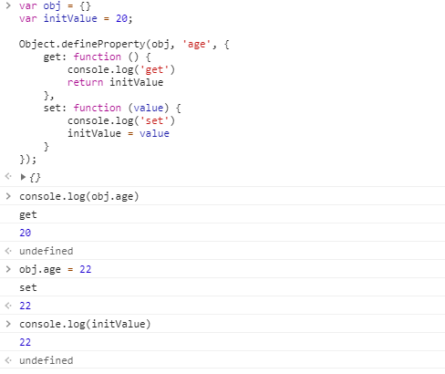
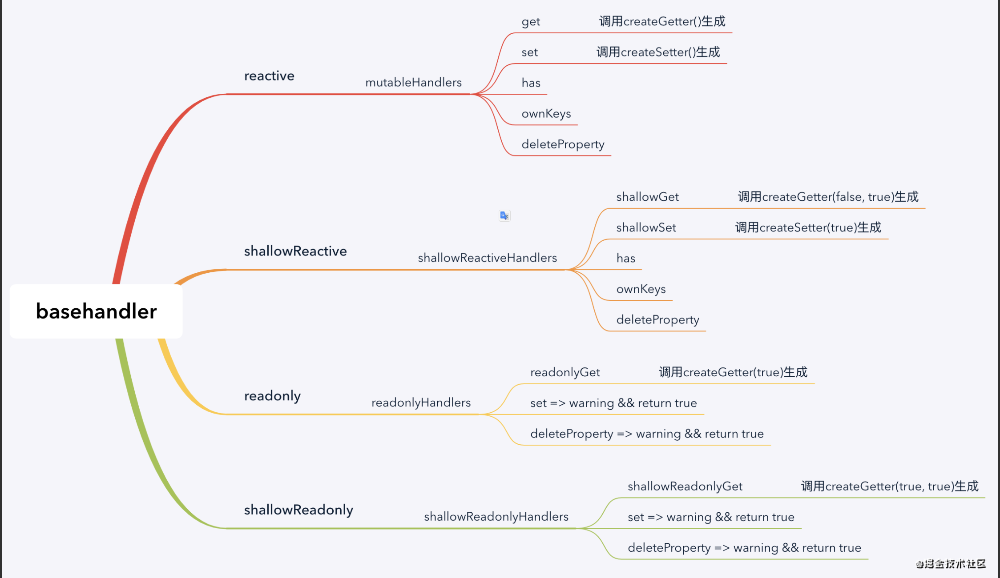

# 一文搞懂Vue2 和 Vue3 的 Proxy

## Vue2 的 proxy 实现

Vue2 中实现代理的方式是通过数据劫持来实现的，也就是使用 `Object.defineProperty`；简单举例如下：

```javascript
var obj = {}
var initValue = 20;

Object.defineProperty(obj, 'age', {
    get: function () {
        console.log('get')
        return initValue
    },
    set: function (value) {
        console.log('set')
        initValue = value
    }
});
console.log(obj.age)
obj.age = 22
console.log(initValue)
```

运行结果如下：



在Vue2中其实就是这么来实现的数据劫持，其中get里面会收集依赖--`depend`，set里面会触发依赖--`notify`;[vue-defineReactive源码直达](https://github.com/vuejs/vue/blob/v2.6.12/src/core/observer/index.js#L135)

当然还有数组的处理，因为数组是个比较特殊的数据类型，Vue2中对数组的方法进行了重新封装，改变原始数组数据的方法都被重新封装了，如下：`push、pop、shift、unshift、splice、sort、reverse`；[vue数组重新封装源码直达](https://github.com/vuejs/vue/blob/v2.6.12/src/core/observer/array.js)

关于Vue2中的observe具体是如何实现的，在这里不做过多解读，可以看下这篇文章[Vue2源码解读-Observe](https://juejin.cn/post/6872232567244849160)

## Vue2 的proxy存在的问题

在Vue2中，即便是对数组进行了重新封装，还是会存在问题，如下：

```javascript
var list = ['tom', 'jack', 'draven', 'ifil']
// 直接改变数组的长度，Vue2 是监听不到的
list.length = 3
// 直接改变数组中某个元素，vue2中也是监听不到的
list[2] = 'luckyDraven';
```


## Vue3 的 Proxy

Vue3抛弃了数据劫持，转而使用的是[Proxy](https://developer.mozilla.org/zh-CN/docs/Web/JavaScript/Reference/Global_Objects/Proxy)+[Reflect](https://developer.mozilla.org/zh-CN/docs/Web/JavaScript/Reference/Global_Objects/Reflect)来实现的数据代理。

### 什么是 Proxy

Proxy 对象用于创建一个对象的代理，从而实现基本操作的拦截和自定义（如：属性查找，赋值，枚举，函数调用等）。proxy 的构造函数语法为：

```javascript
const p = new Proxy(target, handler)
```

- target：要使用 Proxy 包装的目标对象（可以是任何类型的对象，包括原生数组，函数，甚至另一个代理）。
- handler：一个通常以函数作为属性的对象，各属性中的函数分别定义了在执行各种操作时，代理 P 的行为

handler可以包含的方法(也叫捕捉器)如下：

```js
// Object.getPrototypeOf 方法的捕捉器。
handler.getPrototypeOf()

// Object.setPrototypeOf 方法的捕捉器。
handler.setPrototypeOf()

// Object.isExtensible 方法的捕捉器。
handler.isExtensible()

// Object.preventExtensions 方法的捕捉器。
handler.preventExtensions()

// Object.getOwnPropertyDescriptor 方法的捕捉器。
handler.getOwnPropertyDescriptor()

// Object.defineProperty 方法的捕捉器。
handler.defineProperty()

// in 操作符的捕捉器。
handler.has()

// 属性读取操作的捕捉器。
handler.get()

// 属性设置操作的捕捉器。
handler.set()

// delete 操作符的捕捉器。
handler.deleteProperty()

// Object.getOwnPropertyNames 方法和 Object.getOwnPropertySymbols 方法的捕捉器。
handler.ownKeys()

// 函数调用操作的捕捉器。
handler.apply()

// new 操作符的捕捉器。
handler.construct()
```

举个官方例子：

```js
const handler = {
    get: function(obj, prop) {
        return prop in obj ? obj[prop] : 37;
    }
};

const p = new Proxy({}, handler);
p.a = 1;
p.b = undefined;

console.log(p.a, p.b);      // 1, undefined
console.log('c' in p, p.c); // false, 37
```

在上面简单的例子中，当对象中不存在属性名时，默认返回值为 37。上面的代码以此展示了 get handler 的使用场景。详细描述可以移步[官网Proxy](https://developer.mozilla.org/zh-CN/docs/Web/JavaScript/Reference/Global_Objects/Proxy)

### 什么是 Reflect

Reflect 是一个内置的对象，它提供拦截 JavaScript 操作的方法。这些方法与 proxy handlers 的方法相同。Reflect 不是一个函数对象，因此它是不可构造的。

与大多数全局对象不同Reflect并非一个构造函数，所以不能通过new运算符对其进行调用，或者将Reflect对象作为一个函数来调用。Reflect的所有属性和方法都是静态的（就像Math对象）。

Reflect 对象提供了以下静态方法，这些方法与**proxy handler methods**的命名相同.

语法：

```js

// 对一个函数进行调用操作，同时可以传入一个数组作为调用参数。
// 和 Function.prototype.apply() 功能类似。
Reflect.apply(target, thisArgument, argumentsList)

// 对构造函数进行 new 操作，相当于执行 new target(...args)。
Reflect.construct(target, argumentsList[, newTarget])

// 和 Object.defineProperty() 类似。如果设置成功就会返回 true
Reflect.defineProperty(target, propertyKey, attributes)

// 作为函数的delete操作符，相当于执行 delete target[name]。
Reflect.deleteProperty(target, propertyKey)

// 获取对象身上某个属性的值，类似于 target[name]。
Reflect.get(target, propertyKey[, receiver])

// 类似于 Object.getOwnPropertyDescriptor()。
// 如果对象中存在该属性，则返回对应的属性描述符,  否则返回 undefined.
Reflect.getOwnPropertyDescriptor(target, propertyKey)

// 类似于 Object.getPrototypeOf()。
Reflect.getPrototypeOf(target)

// 判断一个对象是否存在某个属性，和 in 运算符 的功能完全相同。
Reflect.has(target, propertyKey)

// 类似于 Object.isExtensible().
Reflect.isExtensible(target)

// 返回一个包含所有自身属性（不包含继承属性）的数组。
// (类似于 Object.keys(), 但不会受enumerable影响).
Reflect.ownKeys(target)

// 类似于 Object.preventExtensions()。返回一个Boolean。
Reflect.preventExtensions(target)

// 将值分配给属性的函数。返回一个Boolean，如果更新成功，则返回true。
Reflect.set(target, propertyKey, value[, receiver])

// 设置对象原型的函数. 返回一个 Boolean， 如果更新成功，则返回true。
Reflect.setPrototypeOf(target, prototype)
```

举个例子：

- 检测一个对象是否存在特定属性

  ```
  const duck = {
    name: 'Maurice',
    color: 'white',
    greeting: function() {
      console.log(`Quaaaack! My name is ${this.name}`);
    }
  }
  
  Reflect.has(duck, 'color');
  // true
  Reflect.has(duck, 'haircut');
  // false
  
  // Reflect.set方法设置target对象的name属性等于value。
  Reflect.set(duck, 'eyes', 'black'); // returns "true" if successful
  // Reflect.ownKeys方法用于返回对象的所有属性
  console.log(Reflect.ownKeys(duck)); // ["name", "color", "greeting", "eyes"]
  ```


### 实现部分

阅读到这里，应该可以看到Proxy中handler部分和Reflect中所支持的静态方法是一一对应的。

Vue3中通过Proxy结合Reflect来彻底代理实现了数据代理。关于源码分析部分可以查看这篇文章[Vue3源码解读-createReactiveObject](https://juejin.cn/post/6893045604592418830#heading-19)。

Vue3中通过不同的api来调用不同的handler实现数据代理。贴一下源码解读中的图吧：





## Vue2 和 Vue3 的 proxy 对比

- 通过Vue2中`Object.defineProperty`是不支持对数组的监听的，只支持对对象的监听；

- 来看个Vue3中使用Proxy+Reflect的例子

  ```js
  var list = ["tom", "jack"];
  
  var proxy = new Proxy(list, {
    set: function (target, key, value) {
      Reflect.set(target, key, value);
    }
  });
  
  proxy.length = 3;
  
  console.log(list);  // ["tom", "jack", undefined]
  
  proxy[2] = "draven";
  
  console.log(list); // ["tom", "jack", "draven"]
  ```

可以看到通过Proxy+Reflect实现了Vue2中length和直接赋值监听不到的问题。


