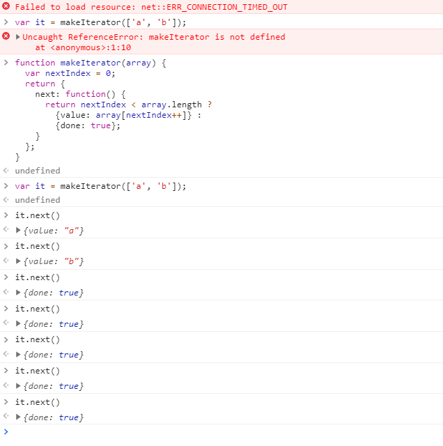

# 16. Iterator 和 for...of 循环

> 1. Iterator (遍历器) 的概念
> 2. 默认 Iterator 接口
> 3. 调用 Iterator 接口的场合
> 4. 字符串的 Iterator 接口
> 5. Iterator 接口与 Generator 函数
> 6. 遍历器对象的 return(), throw()
> 7. for...of 循环

## 1. Iterator （遍历器）的概念

JavaScript 原有的表示“集合”的数据结构，主要是数组（`Array`）和对象（`Object`）, ES6 又添加了 `Map`和 `Set`。这样就有了四种数据集合，用户还可以组合使用它们，定义自己的数据结构，比如数组的成员是 `Map`, `Map`的成员是对象。这样就需要一种统一的接口机制，来处理所有不同的数据结构。

遍历器（ Iterator ）就是这样一种机制。它是一种接口，为各种不同的数据结构提供统一的访问机制。任何数据结构只要部署 Iterator 接口，就可以完成遍历操作（即一次处理该数据结构的所有成员）。

Iterator 的作用有三个：

- 一是为各种数据结构，提供一个统一的，简便的访问接口；
- 二是使得数据结构的成员能够按某种次序排列；
- 三是 ES6 创造了一种新的遍历命令 `for...of` 循环，Iterator 接口主要供 `for...of` 消费

Iterator 的遍历过程是这样的。

1. 创建一个指针对象，指向当前数据结构的起始位置。也就是说，遍历器对象本质上，就是一个指针对象。
2. 第一次调用指针对象的 `next` 方法，可以将指针指向数据结构的第一个成员。
3. 第二次调用指针对象的 `next` 方法，指针就指向数据结构的第二个成员。
4. 不断调用指针对象的 `next` 方法，直到它指向数据结构的结束位置。

每一次调用 `next` 方法，都会返回数据结构的当前成员的信息。具体来说，就是返回一个包含 `value` 和 `done` 两个属性的对象。其中，`value` 属性是当前成员的值， `done` 属性是一个布尔值，表示遍历是否结束。

下面是一个模拟 `next` 方法返回值的例子。

```javascript
var it = makeIterator(['a', 'b']);

it.next() // { value: "a", done: false }
it.next() // { value: "b", done: false }
it.next() // { value: undefined, done: true }

function makeIterator(array) {
    var nextIndex = 0;
    return {
        next: function() {
            return nextIndex < array.length ? {value: array[nextIndex++], done: false} : {value: undefined, done: true}
        }
    }
}
```

上面代码定义了一个 `makeIterator` 函数，它是一个遍历器生成函数，作用就是返回一个遍历器对象。对数组 `['a', 'b']` 执行这个函数，就会返回该数组的遍历器对象（即指针对象）`it`。

指针对象的 `next` 方法，用来移动指针。开始时，指针指向数组的开始位置。然后，每次调用 `next` 方法，指针就会指向数组的下一个成员。第一次调用，指向 `a`；第二次调用，指向 `b`。

`next`方法返回一个对象，表示当前数据成员的信息。这个对象具有`value`和`done`两个属性，`value`属性返回当前位置的成员，`done`属性是一个布尔值，表示遍历是否结束，即是否还有必要再一次调用`next`方法。

总之，调用指针对象的`next`方法，就可以遍历事先给定的数据结构。

对于遍历器对象来说，`done: false`和`value: undefined`属性都是可以省略的，因此上面的`makeIterator`函数可以简写成下面的形式。

```javascript
function makeIterator(array) {
  var nextIndex = 0;
  return {
    next: function() {
      return nextIndex < array.length ?
        {value: array[nextIndex++]} :
        {done: true};
    }
  };
}
```



由于 Iterator 只是把接口规格加到数据结构上，所以，遍历器与它所遍历的那个数据结构，实际上是分开的，完全可以写出没有对应数据结构的遍历器对象，或者说用遍历器对象模拟出数据结构。下面是一个无限运行的遍历器对象的例子。

```javascript
var it = idMaker();

it.next().value // 0
it.next().value // 1
it.next().value // 2
// ...

function idMaker() {
  var index = 0;

  return {
    next: function() {
      return {value: index++, done: false};
    }
  };
}
```

上面的例子中，遍历器生成函数`idMaker`，返回一个遍历器对象（即指针对象）。但是并没有对应的数据结构，或者说，遍历器对象自己描述了一个数据结构出来。

如果使用 TypeScript 的写法，遍历器接口（Iterable）、指针对象（Iterator）和`next`方法返回值的规格可以描述如下。

```typescript
interface Iterable {
  [Symbol.iterator]() : Iterator,
}

interface Iterator {
  next(value?: any) : IterationResult,
}

interface IterationResult {
  value: any,
  done: boolean,
}
```


## 2. 默认 Iterator 接口

Iterator 接口的目的，就是为所有数据结构，提供了一种统一的访问机制，即`for...of`循环（详见下文）。当使用`for...of`循环遍历某种数据结构时，该循环会自动去寻找 Iterator 接口。

一种数据结构只要部署了 Iterator 接口，我们就称这种数据结构是“可遍历的”（iterable）。

ES6 规定，默认的 Iterator 接口部署在数据结构的 `Symbol.iterator` 属性，或者说，一个数据结构只要具有 `Symbol.iterator` 属性，就可以认为是 “可遍历的”（Iterable）。

`Symbol.iterator`属性本身是一个函数，就是当前数据结构默认的遍历器生成函数。执行这个函数，就会返回一个遍历器。至于属性名`Symbol.iterator`，它是一个表达式，返回`Symbol`对象的`iterator`属性，这是一个预定义好的、类型为 Symbol 的特殊值，所以要放在方括号内（参见《Symbol》一章）。

```javascript
const obj = {
  [Symbol.iterator] : function () {
    return {
      next: function () {
        return {
          value: 1,
          done: true
        };
      }
    };
  }
};
```

上面代码中，对象 `obj` 是可遍历的（Iterator），因为具有 `Symbol.iterator` 属性。执行这个属性，会返回一个遍历对象。该对象的根本特征就是具有 `next` 方法。每次调用 `next` 方法，都会返回一个代表当前成员的信息对象，具有 `value` 和 `done` 两个属性。

ES6 的有些数据结构原生具备 Iterator 接口（比如数组），即不用任何处理，就可以被 `for...of` 循环遍历。原因在于，这些数据结构原生部署了 `Symbol.iterator` 属性的数据结构，就称为部署了遍历器接口。调用这个接口，就会返回一个遍历器对象。

原生具备 Iterator 接口的数据结构如下：

- Array
- Map
- Set
- String
- TypedArray
- 函数的 argument 对象
- NodeList 对象

下面的例子是数组的 `Symbol.iterator` 属性。
