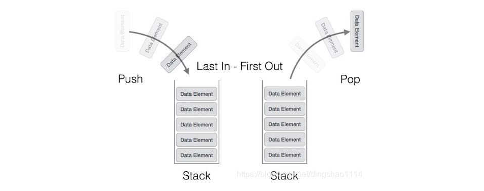
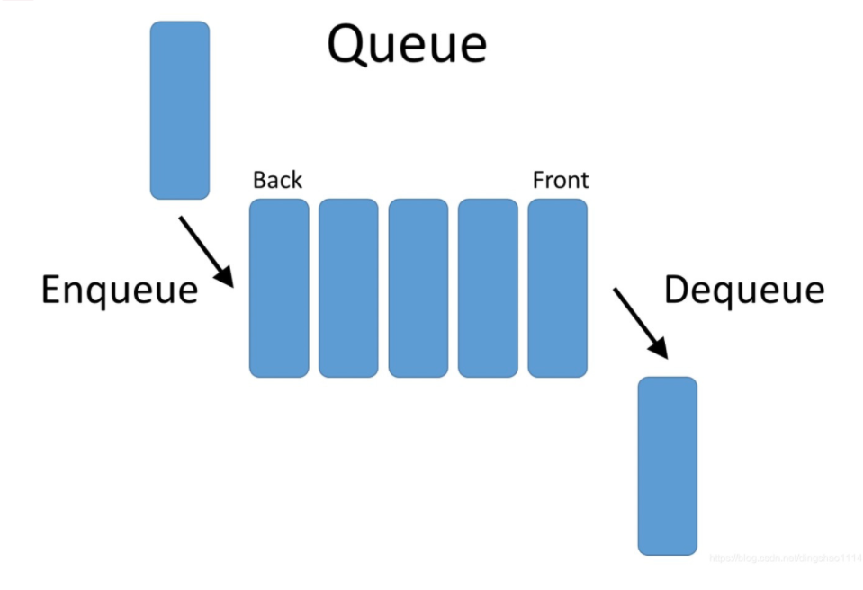
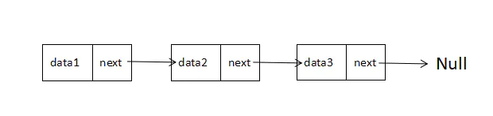
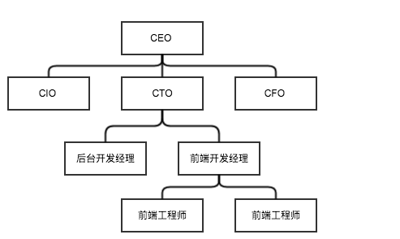
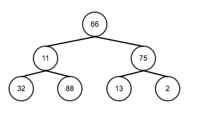
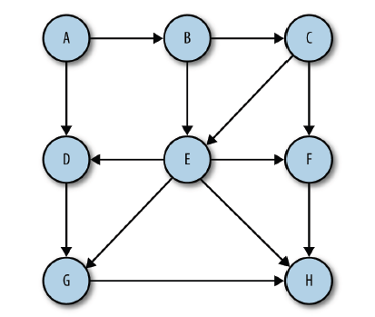
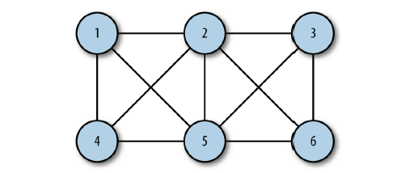

# 数据结构

## 栈

 ### 概念

栈只允许在有序的线性数据集合的一端 (栈顶) 进行数据插入和移除。因而按照<b style='color: red'>后进先出</b> (LIFO, Last In First Out) 的原理运作。 

### 图示



### 栈的实现

在JavaScript中，可以使用数组来模拟栈，直接使用数组的push()方法就可以在数组末端加入元素，将数据入栈，使用数组的pop()方法删除最后一个元素，将数据出栈。

 push() 方法可向数组的末尾添加一个或多个元素，并返回新的长度。 

 pop() 方法用于删除并返回数组的最后一个元素。 


## 队列

### 概念

 队列是一种<b style='color:red'>先进先出</b>的数据结。队列只能在队尾插入元素，在队首删除元素，这点和栈不一样。它用于存储顺序排列的数据。队列就像我们日常中的排队一样，排在最前面的第一个办理业务，新来的人只能在后面排队。 


### 图示



### 队列的实现

 在JavaScript中，可以使用数组来模拟栈，直接只用数组的push()方法就可以在数组末端加入元素，使用shift()方法可以删除数组的第一个元素。

push() 方法可向数组的末尾添加一个或多个元素，并返回新的长度。 

shift() 方法用于把数组的第一个元素从其中删除，并返回第一个元素的值。 


## 链表

### 概念

  链表是一组节点组成的集合，每个节点都使用一个对象的引用来指向它的后一个节点。指向另一节点的引用讲做链。 

### 图示



data中保存着数据，next保存着下一个链表的引用。上图中，我们说 data2 跟在 data1 后面，而不是说 data2 是链表中的第二个元素。上图，值得注意的是，我们将链表的尾元素指向了 null 节点，表示链接结束的位置。

### 链表的实现

模拟一个链表数据

```javascript
const a = {value: 1}
const b = {value: 2}
const c = {value: 3}
const d = {value: 4}
a.next = b
b.next = c
c.next = d
// a: {value: 1, next: b}
// b: {value: 2, next: c}
// c: {value: 3, next: d}
```


## 集合

### 概念

 集合是由一组**无序**但彼此之间有一定相关性的成员构成的，每个成员在集合中只能出现一次。 

 集合的两个最重要特性是：首先，集合中的成员是无序的；其次，集合中不允许相同成员存在。 

### 集合的实现

set 数据结构，请参考12节set介绍


## 字典

 ### 概念

字典(Dictionary)是一种以 **键-值对** 形式存储数据的数据结构 ，就如同我们平时查看通讯录一样，要找一个电话，首先先找到该号码的机主名字，名字找到了，紧接着电话号码也就有了。这里的键就是你用来查找的东西，本例中指代的就是名字，值就是查找得到的结果，也就是对应的电话号码。

其实，JavaScript 中的 Object 类就是以字典的形式设计的，下面我们将会借助 Object 类的特性，自主实现一个 Dictionary 类，让这种字典类型的对象使用起来更加方便。

https://www.jianshu.com/p/eece86baec10


## 树

 树，是一种使用节点来模拟分等级（层次）数据的数据结构。节点存储数据，并指向其他节点（每个节点都存储有自身数据，和指向其它节点的指针）。 



### 二叉树

 二叉树，每个节点<b style='color:red'>最多有两个子树</b>的树结构。二叉树是一种特殊的树，也是一个连通的无环图。 




## 图

### 概念

图是最简单的数学结构之一，它由于若干个**顶点（Vertices）**和某些顶点的对子组成，顶点通常用平面上的点来表示，再用线段把相连接的顶点连接起来，这些线段就叫做**边（Edge）。**

很多时候我们在描绘事物之间的关系，如服务器-客户端、城市之间、企业之间的关系时，对过图形来表述，会非常清晰。

图可以分为，有向图和无向图

**有向图：**



**无向图：**




## 堆


