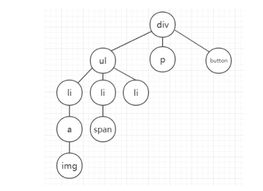
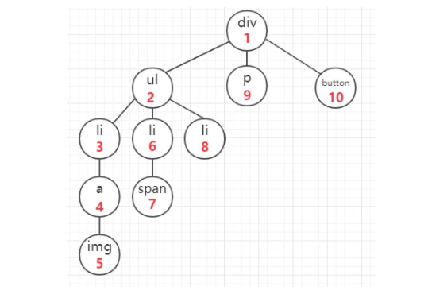
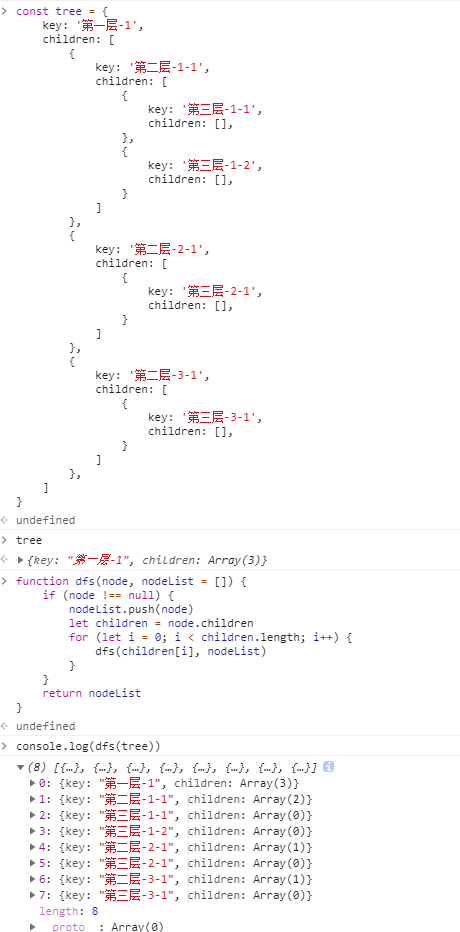
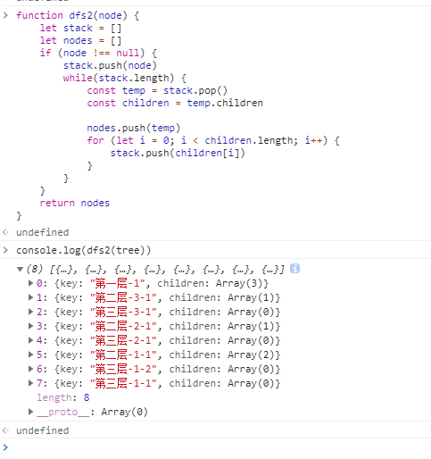
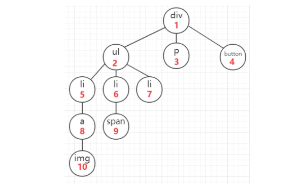
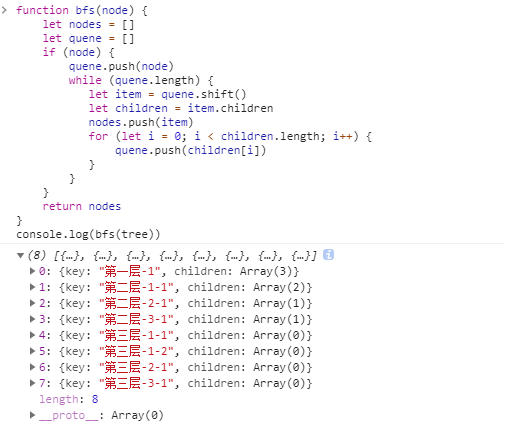

# JS算法之深度优先遍历和广度优先遍历

### 背景

在开发页面的时候，我们有时候会遇到这种需求：在页面某个dom节点中遍历，找到目标dom节点，我们正常做法是利用选择器document.getElementById()，document.getElementsByName()或者document.getElementsByTagName()，但在本文，我们从算法的角度去查找dom节点，同时理解一下深度优先遍历(DFS)和广度优先遍历(BFS)的原理。


### 准备

假设页面上的dom结构如下：

```
<div id="root">
    <ul>
        <li>
            <a href="">
                
            </a>
        </li>
        <li>
            <span></span>
        </li>
        <li>
        </li>
    </ul>
    <p></p>
    <button></button>
</div>
```

让我们来把这个dom结构转化成树的样子



 这样之后，dom结构似乎清楚了不少。 

### 深度优先遍历（Depth-First Search）【DFS】

 该方法是以纵向的维度对dom树进行遍历，从一个dom节点开始，一直遍历其子节点，直到它的所有子节点都被遍历完毕之后在遍历它的兄弟节点。即如图所示（遍历顺序为红字锁标）： 



#### 深度优先遍历 递归实现

优点： 实现简单

缺点：数据层级特别深的情况下，容易发生爆栈

```javascript
function dfs(node, nodeList = []) {
    if (node !== null) {
        nodeList.push(node)
        let children = node.children
        for (let i = 0; i < children.length; i++) {
            dfs(children[i], nodeList)
        }
    }
    return nodeList
}
console.log(dfs(tree))
```

#### 深度优先遍历 非递归实现

优点：搜索速度快，不会发生爆栈

```javascript
function dfs(node) {
    let stack = []
    let nodes = []
    if (node !== null) {
        stack.push(node)
        while(stack.length) {
            const temp = stack.pop()
            const children = temp.children
            
            nodes.push(temp)
            for (let i = 0; i < children.length; i++) {
                stack.push(children[i])
            }
        }
    }
    return nodes
}
console.log(dfs(tree))
```






### 广度优先遍历（breadth-first traverse）【BFS】

 该方法是以横向的维度对dom树进行遍历，从该节点的第一个子节点开始，遍历其所有的兄弟节点，再遍历第一个节点的子节点，完成该遍历之后，暂时不深入，开始遍历其兄弟节点的子节点。即如图所示（遍历顺序为红字锁标）： 



#### 广度优先遍历 非递归实现

优点： 实现简单

缺点：数据层级特别深的情况下，容易发生爆栈

```javascript
function bfs(node) {
    let nodes = []
    let quene = []
    if (node) {
        quene.push(node)
        while (quene.length) {
           let item = quene.shift()
           let children = item.children
           nodes.push(item)
           for (let i = 0; i < children.length; i++) {
               quene.push(children[i])
           }
        }
    }
    return nodes
}
console.log(bfs(tree))
```




