# JS 全方位解读栈结构

理解栈对于我们理解 JavaScript 语言至关重要，本文主要从以下几个方面介绍栈：

- 首先介绍栈及代码实现
- 介绍 JavaScript 运行机制及栈在其中的应用
- 详细介绍调用栈及我们开发中如何利用调用栈
- JS 内存机制：栈（基本类型、引用类型地址）与堆（引用类型数据）
- 最后来一份总结与字节&leetcode刷题，实现最小栈

## 1. 栈

栈是一种遵从 `后进先出 (LIFO / Last In First Out) ` 原则的有序集合，它的结构类似如下：

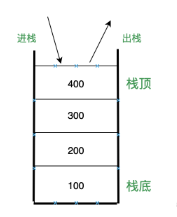

 栈的操作主要有： `push(e)` (进栈)、 `pop()` (出栈)、 `isEmpty()` (判断是否是空栈)、 `size()` (栈大小)，以及 `clear()` 清空栈，具体实现也很简单 。

```js
function Stack() {
  let items = []
  this.push = function(e) { 
    items.push(e) 
  }
  this.pop = function() { 
    return items.pop() 
  }
  this.isEmpty = function() { 
    return items.length === 0 
  }
  this.size = function() { 
    return items.length 
  }
  this.clear = function() { 
    items = [] 
  }
}
```

 **查找：从栈头开始查找，时间复杂度为 O(n)** 

 **插入或删除：进栈与出栈的时间复杂度为 O(1)** 


## 2. 浏览器中 JS 运行机制

 我们知道 JavaScript 是单线程的，所谓单线程，是指在 JavaScript 引擎中负责解释和执行 JavaScript 代码的线程唯一，同一时间上只能执行一件任务。 

 为什么是单线程的喃？这是因为 JavaScript 可以修改 DOM 结构，如果 JavaScript 引擎线程不是单线程的，那么可以同时执行多段 JavaScript，如果这多段 JavaScript 都修改 DOM，那么就会出现 DOM 冲突。 

 为了避免 DOM 渲染的冲突，可以采用单线程或者死锁，JavaScript 采用了单线程方案。 

但单线程有一个问题：如果任务队列里有一个任务耗时很长，导致这个任务后面的任务一直排队等待，就会发生页面卡死，严重影响用户体验。

为了解决这个问题，JavaScript 将任务的执行模式分为两种：同步和异步。

#### 同步

```js
// 同步任务
let a = 1
console.log(a) // 1
```

#### 异步

```js
// 异步任务
setTimeout(() => {
    console.log('时间到')
}, 1000)
```

同步任务都在主线程（这里的主线程就是 JavaScript 引擎线程）上执行，会形成一个 **调用栈** ，又称 **执行栈**

除了主线程外，还有一个任务队列（也称消息队列），用于管理异步任务的 **事件回调** ，在 **调用栈** 的任务执行完毕之后，系统会检查任务队列，看是否有可执行的异步任务。

**注意：任务队列存放的是异步任务的事件回调**

例如：

```js
setTimeout(() => {
    console.log('时间到')
}, 1000)
```

在执行这段代码时，并不会立刻打印 ，只有定时结束后（1s）才打印。 `setTimeout` 本身是同步执行的，放入任务队列的是它的回调函数。

下面我们重点看一下主线程上的调用栈。


## 3. 调用栈

从两方面介绍调用栈

- 调用栈是用来做什么？
- 在开发中，如何利用调用栈

### 3.1 调用栈的职责

 在 JavaScript 中有很多函数，经常会出现一个函数调用另外一个函数的情况，**调用栈就是用来管理函数调用关系的一种栈结构**。

举例说明：

```js
var a = 1
function add(a) {
  var b = 2
  let c = 3
  return a + b + c
}

// 函数调用
add(a)
```

 这段代码很简单，就是创建了一个 `add` 函数，然后调用了它 。

 下面我们就一步步的介绍整个函数调用执行的过程。 

在执行这段代码之前，JavaScript 引擎会先创建一个全局执行上下文，包含所有已声明的函数与变量：

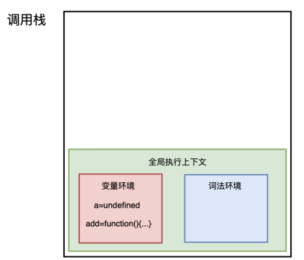

从图中可以看出，代码中的全局变量 `a` 及函数 `add` 保存在变量环境中。

执行上下文准备好后，开始执行全局代码，首先执行 `a = 1` 的赋值操作，

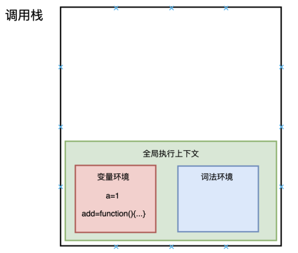

 赋值完成后 a 的值由 undefined 变为 1，然后执行 `add` 函数，JavaScript 判断出这是一个函数调用，然后执行以下操作： 

- 首先，从全局执行上下文中，取出 add 函数代码
- 其次，对 add 函数的这段代码进行编译，并创建该函数的执行上下文和可执行代码，并将执行上下文压入栈中

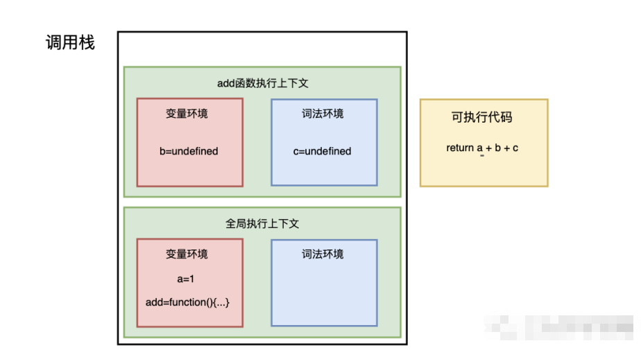

- 然后，执行代码，返回结果，并将 add 的执行上下文也会从栈顶部弹出，此时调用栈中就只剩下全局上下文了。 

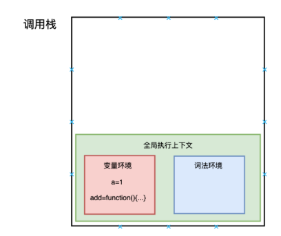

 至此，整个函数调用执行结束了。 

所以说， **调用栈是JavaScript用来管理函数执行上下文的一种数据结构，他记录了当前函数执行的位置，哪个函数正在被执行** 。 如果我们执行一个函数，就会为函数创建执行上下文并放入栈顶，如果我们从函数返回，就将它的执行上下文从栈顶弹出。也可以说**调用栈是用来管理这种执行上下文的栈，或称 执行上下文栈（执行栈）**


### 3.2 懂调用栈的开发人员有哪些优势

#### 栈溢出

 在我们执行 JavaScript 代码的时候，有时会出现栈溢出的情况： 

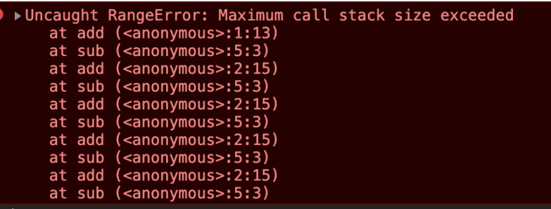

上图就是一个典型的栈溢出，那为什么会出现这种错误喃？

我们知道调用栈是用来管理执行上下文的一种数据结构，它是有大小的，当入栈的上下文过多的时候，它就会报栈溢出，例如：

```js
function add() {
  return 1 + add()
}

add()
```

 `add` 函数不断的递归，不断的入栈，调用栈的容量有限，它就溢出了，所以，我们日常的开发中，一定要注意此类代码的出现。 

##### 在浏览器中获取调用栈信息

 两种方式，一种是断点调试，这种很简单，我们日常开发中都用过。 

 一种是 `console.trace()` 

>  console.trace() 方法用于显示当前执行的代码在堆栈中的调用路径。 

```js
function sum(){
  return add()
}
function add() {
  console.trace()
  return 1
}

// 函数调用
sum()
```

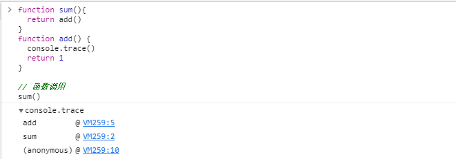

## 4. JS 内存机制：栈（基本类型、引言类型地址）与堆 （引用类型数据）

 在 JavaScript 开发日常中，前端人员很少有机会了解内存，但如果你想成为前端的专家，打造高性能的前端应用，你就需要了解这一块，同时它也是面试的常见考察点。 

 JavaScript 中的内存空间主要分为三种类型： 

- 代码空间：主要用来存放可执行代码
- 栈空间：调用栈的存储空间就是栈空间。
- 堆空间

 代码空间主要用来存放可执行代码的。栈空间及堆空间主要用来存放数据的。接下来我们主要介绍栈空间及堆空间。 

 JavaScript 中的变量类型有 `8` 种，可分为两种：基本类型、引用类型 

基本类型：

- `undefined`
- `null`
- `boolean`
- `number`
- `string`
- `bigint`
- `symbol`

引用类型：

- `object`

 其中，基本类型是保存在栈内存中的简单数据段，而引用类型保存在堆内存中。 

### 4.1 栈空间

基本类型在内存中占有固定大小的空间，所以它们的值保存在栈空间，我们通过 **按值访问** 。

一般栈空间不会很大。

### 4.2 堆空间

引用类型，值大小不固定，但指向指针大小（内存地址）是固定的，所以把对象放入堆中，将对象的地址放入栈中，这样，在调用栈中切换上下文时，只需将指针下移到上个执行上下文的地址就可以了，同时保证了栈空间不会很大。

 当查询引用类型的变量时， 先从栈中读取内存地址， 然后再通过地址找到堆中的值。对于这种，我们把它叫做 **按引用访问** 。 

 一般堆内存空间很大，能存放很多数据，但它内存分配与回收都需要花费一定的时间。 

举例：

```js
var a = 1
function foo() {
  var b = 2
  var c = { name: 'an' }
}

// 函数调用
foo()
```

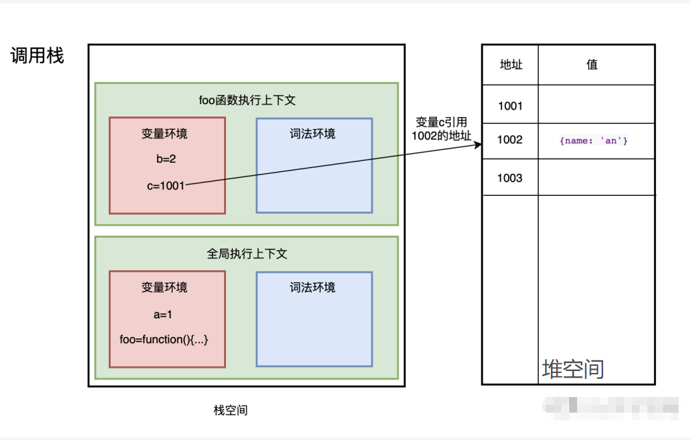

 基本类型（栈空间）与引用类型（堆空间）的存储方式决定了：**基本类型赋值是值赋值，而引用类型赋值是地址赋值。** 

```js
// 值赋值
var a = 1
var b = a
a = 2
console.log(b) 
// 1
// b 不变

// 地址赋值
var a1 = {name: 'an'}
var b1 = a1
a1.name = 'bottle'
console.log(b1)
// {name: "bottle"}
// b1 值改变
```


### 4.3 垃圾回收

 JavaScript 中的垃圾数据都是由垃圾回收器自动回收的，不需要手动释放

#### 回收栈空间

 在 JavaScript 执行代码时，主线程上会存在 ESP 指针，用来指向调用栈中当前正在执行的上下文，如下图，当前正在执行 `foo` 函数： 

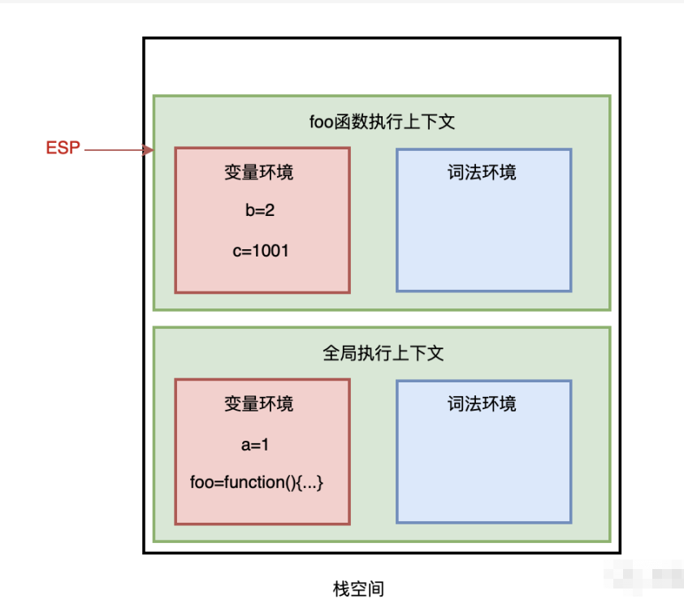

 当 `foo` 函数执行完成后，ESP 向下指向全局执行上下文，此时需要销毁 `foo` 函数。 

  当 ESP 指针指向全局执行上下文，`foo` 函数执行上下文已经是无效的了，当有新的执行上下文进来时，可以直接覆盖这块内存空间。 

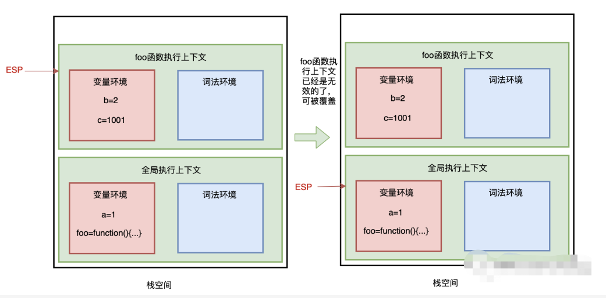

 即：**JavaScript 引擎通过向下移动 ESP 指针来销毁存放在栈空间中的执行上下文。** 

#### 回收堆空间

V8 中把堆分成新生代与老生代两个区域：

- 新生代：用来存放生存周期较短的小对象，一般只支持1～8M的容量
- 老生代：用来存放生存周期较长的对象或大对象

V8 对这两块使用了不同的回收器：

- 新生代使用副垃圾回收器
- 老生代使用主垃圾回收器

 其实无论哪种垃圾回收器，都采用了同样的流程（三步走）： 

- **标记：** 标记堆空间中的活动对象（正在使用）与非活动对象（可回收）
- **垃圾清理：** 回收非活动对象所占用的内存空间
- **内存整理：** 当进行频繁的垃圾回收时，内存中可能存在大量不连续的内存碎片，当需要分配一个需要占用较大连续内存空间的对象时，可能存在内存不足的现象，所以，这时就需要整理这些内存碎片。

 副垃圾回收器与主垃圾回收器虽然都采用同样的流程，但使用的回收策略与算法是不同的。 

####  副垃圾回收器

它采用 Scavenge 算法及对象晋升策略来进行垃圾回收

所谓 Scavenge 算法，即把新生代空间对半划分为两个区域，一半是对象区域，一半是空闲区域，如下图所示：

 新加入的对象都加入对象区域，当对象区满的时候，就执行一次垃圾回收，执行流程如下： 

- 标记：首先要对区域内的对象进行标记（活动对象、非活动对象）
- 垃圾清理：然后进行垃圾清理：将对象区的活动对象复制到空闲区域，并进行有序的排列，当复制完成后，对象区域与空闲区域进行翻转，空闲区域晋升为对象区域，对象区域为空闲区域

翻转后，对象区域是没有碎片的，此时不需要进行第三步（内存整理了）

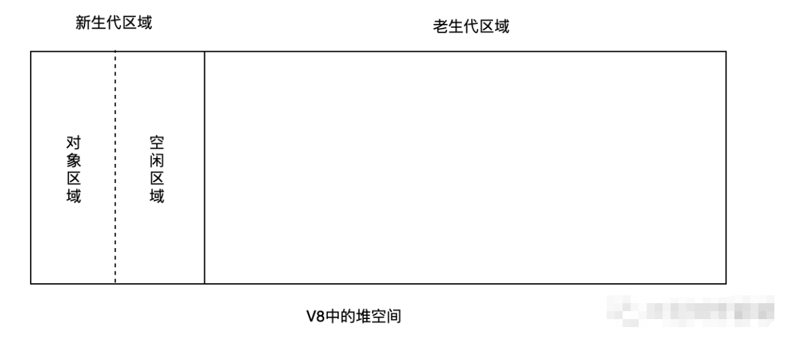

 但，新生代区域很小的，一般1～8M的容量，所以它很容易满，所以，JavaScript 引擎采用对象晋升策略来处理，即只要对象经过两次垃圾回收之后依然继续存活，就会被晋升到老生代区域中。 

#### 主垃圾回收器

 老生代区域里除了存在从新生代晋升来的存活时间久的对象，当遇到大对象时，大对象也会直接分配到老生代。 

 所以主垃圾回收器主要保存存活久的或占用空间大的对象，此时采用 Scavenge 算法就不合适了。V8 中主垃圾回收器主要采用标记-清除法进行垃圾回收。 

主要流程如下：

- 标记：遍历调用栈，看老生代区域堆中的对象是否被引用，被引用的对象标记为活动对象，没有被引用的对象（待清理）标记为垃圾数据。
- 垃圾清理：将所有垃圾数据清理掉
- 内存整理：标记-整理策略，将活动对象整理到一起

#### 增量标记

V8 浏览器会自动执行垃圾回收，但由于 JavaScript 也是运行在主线程上的，一旦执行垃圾回收，就要打断 JavaScript 的运行，可能会或多或少的造成页面的卡顿，影响用户体验，所以 V8 决定采用增量 标记算法回收：

即把垃圾回收拆成一个个小任务，穿插在 JavaScript 中执行。

## 5. 总结

从栈结构开始介绍，满足后进先出 (LIFO) 原则的有序集合，然后通过数组实现了一个栈。

接着介绍浏览器环境下 JavaScript 的异步执行机制，即事件循环机制， JavaScript 主线程不断的循环往复的从任务队列中读取任务（异步事件回调），放入调用栈中执行。调用栈又称执行上下文栈（执行栈），是用来管理函数执行上下文的栈结构。

JavaScript 的存储机制分为代码空间、栈空间以及堆空间，代码空间用于存放可执行代码，栈空间用于存放基本类型数据和引用类型地址，堆空间用于存放引用类型数据，当调用栈中执行完成一个执行上下文时，需要进行垃圾回收该上下文以及相关数据空间，存放在栈空间上的数据通过 ESP 指针来回收，存放在堆空间的数据通过副垃圾回收器（新生代）与主垃圾回收器（老生代）来回收。


