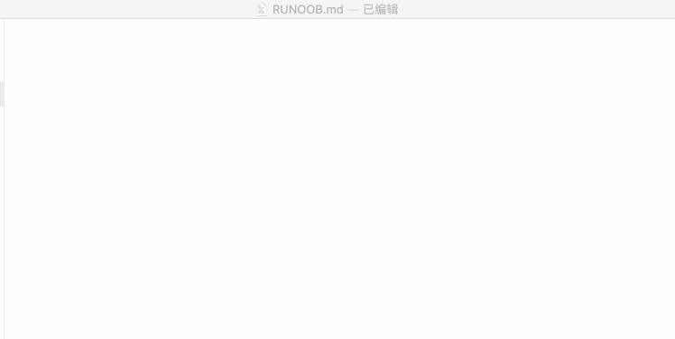

# Markdown 标题

Markdown 标题有两种格式

### 1、 使用 = 和 - 标记一级和二级标题

= 和 - 标记语法格式如下:

```
我展示的是一级标题（=号长短不限，都会显示一级标题）
============

我展示的是二级标题（-号至少两个，一个表示列表）
```


-------------------------------------------------
### 2、 使用 # 号标记
使用 <b>#</b> 号可以表示1-6级标题, 一级标题对应一个 <b>#</b> 号， 二级标题对应两个 <b>#</b> 号，以此类推。

```
# 一级标题
## 二级标题
### 三级标题
#### 四级标题
##### 五级标题
###### 六级标题
```


----------------------------------------------
