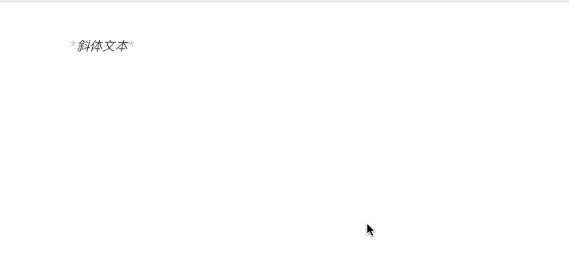

# Markdown 段落格式

markdown 段落没有特殊的格式， 直接编写文字就好， <b>段落的换行是使用两个以上空格加上回车。</b>

  

当然也可以在段落后面使用一个空行来表示重新开始一个段落


------------------------------------

### 字体

Markdown 可以使用以下几种字体：

```markdown
*斜体文本*
_斜体文本_
**粗体文字**
__粗体文字__
*** 斜粗体文本 ***
___ 斜粗体文本 ___
```



--------------------------------------------

### 分隔线
你可以在一行中用三个以上的星号、减号、底线来建立一个分隔线，行内不能有其他东西。你也可以在星号或者减号中间插入空格。下面每种写法都可以建立分隔线

```markdown

***

* * *

*****

- - - 

-------------

```


--------------------------------

### 删除线
如果段落上的文字要添加删除线、只需要在文字的两端加上两个波浪线 <span style="background: #cccccc">~~</span>即可，实例如下：

```markdown
RUNOOT.COM
GOOGLE.COM
~~BAIDU.COM~~
```


-----------------------------

### 下划线
下划线可以通过HTML的 <span style="background: #cccccc"> \<u> </span>标签来实现:

```arkdown
<u>带下划线文本</u>
```

显示效果如下所示：


------------------------------------

### 脚注
脚注是对文本的补充说明。
Markdown 脚注的格式如下：

```markdown
[^要注明的文本]
```

以下实例演示了脚注的用法：
```markdown
创建脚注格式类似这样[^RUNOOB]
[^RUNOOB]: 菜鸟教程 -- 学的不仅仅是技术，更是梦想
```


创建脚注格式类似这样[^RUNOOB]

[^RUNOOB]: 菜鸟教程 -- 学的不仅仅是技术，更是梦想

