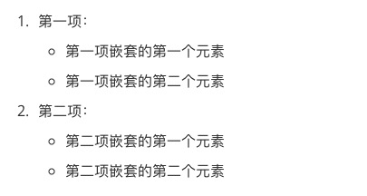

# Markdown 列表
Markdown 支持有序列表和无序列表。  
无序列表试用星号(<span style="background: #ccc">*</span>)、加号(<span style="background: #ccc">+</span>)或是(<span style="background: #ccc">-</span>)作为列表标记：

```markdown
* 第一项
* 第二项
* 第三项

+ 第一项
+ 第二项
+ 第三项

- 第一项
- 第二项
- 第三项
```

显示结果如下：


有序列表使用数组并加上 <span style="background: #ccc">.</span> 号来表示，如：

```markdown
1. 第一项
2. 第二项
3. 第三项
```

显示效果如下：


---------------------------

### 列表嵌套
列表嵌套只需在子列表中的选项添加四个空格即可

```markdown
1. 第一项
  - 第一项嵌套的第一个元素
  - 第一项嵌套的第二个元素
2. 第二项
  - 第二项嵌套的第一个元素
  - 第二项嵌套的第二个元素
```
显示效果如下：

