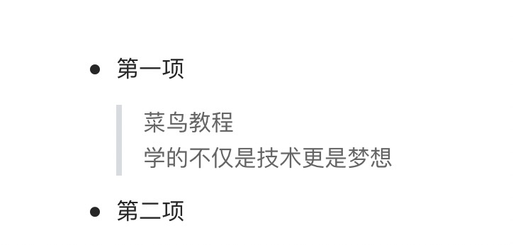

# Markdown 区块
Markdown 区块引用是在段落开头使用 <span style="background: #ccc">></span> 符号，然后后面紧跟一个 **空格** 符号:

```markdown
> 区块引用
> 菜鸟教程
> 学的不仅是技术更是梦想
```
显示结果如下：  


另外区块是可以嵌套的，一个 <span style="background: #ccc">></span> 符号是最外层，两个 <span style="background: #ccc">  ></span> 符号是第一层嵌套，以此类推：

```markdown
> 最外层
> > 第一层嵌套
> > > 第二层嵌套
```

显示结果如下：


-------------------------------

### 区块中使用列表
区块中使用列表实例如下：

```markdown
> 区块中使用列表
> 1. 第一项
> 2. 第二项
> + 第一项
> + 第二项
> + 第三项
```

显示结果如下：


-------------------------------

### 列表中使用区块
如果要在列表项目内放进区块，那么就需要在 <span style="background：#ccc">></span> 前添加四个空格的缩进。  
区块中使用列表实例如下：

```markdown
* 第一项
  > 菜鸟教程
  > 学的不仅是技术更是梦想
* 第二项
```

显示结果如下：



