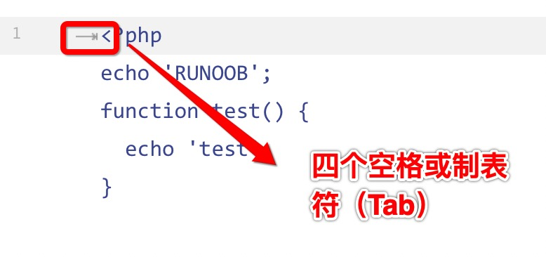

# Markdown 代码
如果是段落上的一个函数或片段的代码可以用反引号把它包起来( <span style="background:#ccc">`</span> )，例如：

```markdown
`printf()` 函数
```
显示结果如下：


-------------------------------

### 代码区块
代码区块使用 **4个空格** 或者一个 **制表符（Tab键）**。  
实例如下：



显示结果如下：


你也可以用 <span style="background: #ccc">```</span> 包裹一段代码，并制定一种语言（也可以不指定）

```markdown
 ```javascript
 $(document).ready(function () {
   alert('RUNOOB')
 })
.```
```

显示结果如下：

