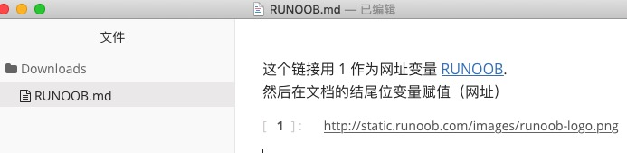
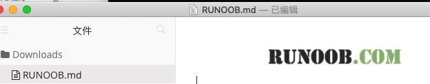

# Markdown 图片
Markdown 图片语法格式如下:

```markdown


```
- 开头一个感叹号！
- 接着一个方括号，里面放上图片的替代文字
- 接着一个普通括号，里面放上图片的网址，最后还可以用引号包住并加上选择性的'title'属性的文字。

使用实例：

```markdown


```

显示结果如下：


当然，你也可以像网址那样对图片地址使用变量：

```markdown
这个链接用 1 作为网址变量[RUNOOB][1],
然后在文档的结尾位变量赋值(网址)

[1]: http://static.runoob.com/images/runoob-logo.png
```

显示结果如下：



Markdown 还没有办法指定图片的高度与宽度，如果你需要的话，那可以使用普通的  标签。

```markdown

```

显示结果如下：


