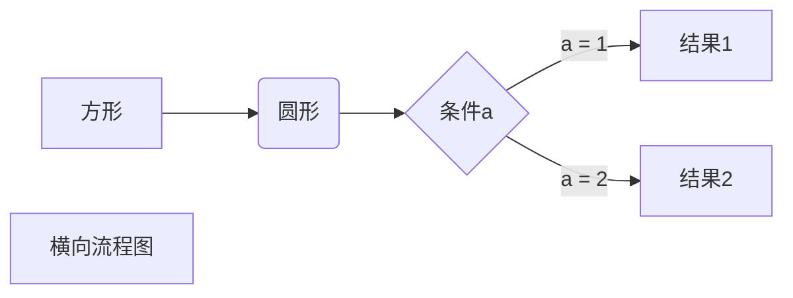

# Markdown 高级技巧

### 支持 HTML 元素
不在 Markdown 涵盖范围之内的标签，都可以直接在文档里面用 HTML 撰写。  
目前支持的 HTML 元素有 \<kbd></kbd> \<b></b> \<em></em> \<sup></sup> \<br />等，如：

```markdown
使用 <kbd>Ctrl</kbd> + <kbd>Alt</kbd> + <kbd>Del</kbd> 重启电脑
```
输出结果为：

使用 <kbd>Ctrl</kbd> + <kbd>Alt</kbd> + <kbd>Del</kbd> 重启电脑


### 转义
Markdown 使用了很多特殊符号来表示特定的意义， 如果需要显示特定的符号则需要使用转义字符，Markdown 使用反斜杠转义特殊字符：

```markdown
**文本加粗**
\*\* 正常显示星号 \*\*
```
输出结果为：


Markdown 支持以下这些符号前面加上反斜杠来帮助插入普通的符号：

```markdown
\  反斜杠
`  反引号
*  星号
_  下划线
{}  花括号
[]  方括号
#   井字号
+   加号
-   减号
.   英文句点
！  感叹号
```

### 公式
当你需要在编辑器中插入数学公式时， 可以使用两个美元符 $$ 包裹 TeX 或者 LaTeX 格式的数学公式来实现。 提交后，问答和文章页会根据需要加载 Mathjax 对数学公式进行渲染。如：

```markdown
$$
\mathbf{V}_1 \times \mathbf{V}_2 =  \begin{vmatrix} 
\mathbf{i} & \mathbf{j} & \mathbf{k} \\
\frac{\partial X}{\partial u} &  \frac{\partial Y}{\partial u} & 0 \\
\frac{\partial X}{\partial v} &  \frac{\partial Y}{\partial v} & 0 \\
\end{vmatrix}
$$tep1}{\style{visibility:hidden}{(x+1)(x+1)}}
$$

```
输出结果为：  


### 画流程图，时序图（顺序图），甘特图 （typora支持流程图）

1. 横向流程图源码格式：


