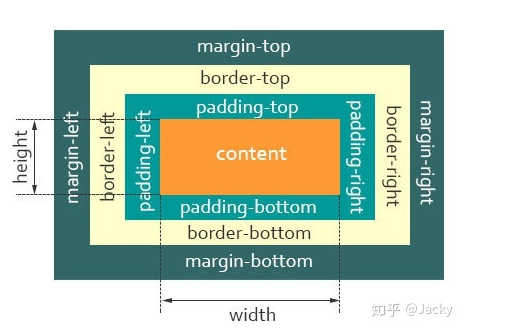
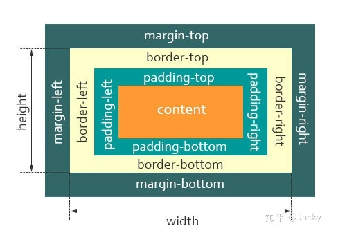
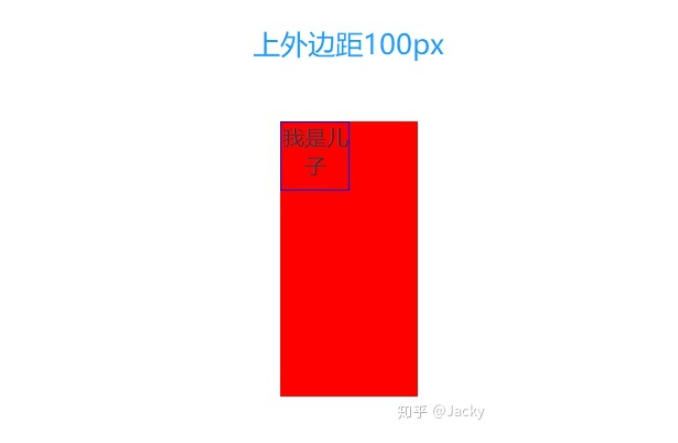
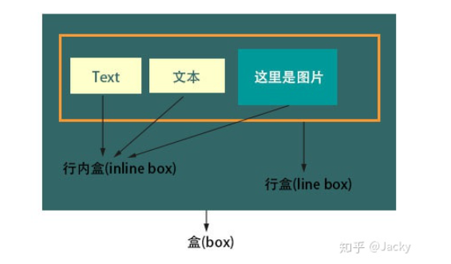

# CSS盒模型

文章转载自：https://zhuanlan.zhihu.com/p/110617108

## 概念

CSS 盒模型本质上是一个盒子，盒子包裹着HTML 元素，盒子由四个属性组成，从内到外分别是：**content 内容**、**padding 内填充**、**border 边框**、**外边距 margin**


## 盒模型分类

- W3C 盒子模型（标准盒模型）

标准盒模型盒子的宽度和高度就是 content内容的width，height




- IE盒子模型（怪异盒模型）

IE盒模型盒子的宽度和高度是 content + padding + border 总和的width，height




## 两种盒模型的区别

<b>宽度和高度的计算方式不同</b>

标准盒模型

> width = content-width
>
> height = content-height

怪异盒模型

> width = content - width + padding - width + border - width
>
> height = content - height + padding - height + border - height


## 如何在CSS 设置这两个模型

标准盒模型：

> box-sizing:  content-box; 在宽度和高度之外绘制元素的内边距和边框。

怪异盒模型

> box-sizing:  border-box;  为元素指定的任何内边距和边框都将在已设定的宽度和高度内进行绘制。


## 外边距合并

所谓外边距合并，指的是`margin` 合并，MDN是这样定义的

> 块的顶部外边距和底部外边距有时被组合(折叠)为单个外边距，其大小是组合到其中的最大外边距，这种行为称为**外边距合并**。

要注意的是，外边距合并只针对块级元素，而且是顶部或底部的外边距

外边距合并有下面几种情况

-  **相邻兄弟元素**

```html
//HTML
<div class="up">我在上面</div>
<div class="down">我在下面</div>

//CSS
<style>
.up {
  width: 100px;
  height: 100px;
  border: 1px solid blue;
  margin: 100px;
}
.down {
  width: 100px;
  height: 100px;
  border: 1px solid red;
  margin: 100px;
}
</style>
```


- 父元素

如果在块级父元素中，不存在上边框、上内补、inline content、清楚浮动这四个属性，(对于不存在上边框和上内补，也可以理解为上边框和上内补宽度为0)，那么这个块级元素和其第一个子元素的存在外边距合并，也就是上边距”挨到一起“，那么此时父元素展现出来的外边距，将会是子元素的`margin-top` 和父元素的`margin-top` 的较大值。

```html
/HTML
<div class="parent">
  <div class="child">我是儿子</div>
</div>
//CSS
<style>
.parent {
  width: 100px;
  height: 200px;
  background: red;
  margin-top: 50px;
}
.child {
  width: 50px;
  height: 50px;
  margin-top: 100px;
  border: 1px solid blue;
}
</style>
```



## BFC

> 一个 **块格式化上下文（blcok formatting context）** 是 WEB 页面的可视化CSS 渲染的一部分。它是块盒子的布局发生浮动相交互的区域。

**具有BFC特性的元素可以看作是隔离了的独立容器，容器里面的元素不会在布局上影响到外面的元素，并且BFC具有普通容器所没有的一些特性。**

通俗来讲，可以把BFC理解为一个封闭的大箱子，箱子内部的元素无论如何翻江倒海，都不会影响到外部。

**触发BFC**

- body 根元素
- 浮动元素： float 除 none 以外的值
- 绝对定位元素：position（absolute， fixed）
- display 为 inline-block、table-cells、flex
- overflow 除了 visible 以外的值 （hidden、auto、scroll）

> 注意：根元素就创建了个BFC


**BFC特点**

- 内部块级盒子垂直方向排列
- 盒子垂直距离由 `margin` 决定，同一个 BFC 盒子的外边距会重叠
- BFC就是一个隔离的容器，内部子元素不会影响到外部元素
- BFC 的区域不会与 float box 叠加
- 每个元素的 margin box 的左边，与包含块 border box 的左边相接触（对于从左往右的格式化，否则相反）。即使存在浮动也是如此。


**BFC 用途 **

- 清楚浮动
- 解决外边距合并
- 布局

**看到这里相信大家都知道怎么解决外边距重合了，答案是: 将两个外边距重合的元素放在不同的BFC 容器中**

看看上面的例子怎么解决外边距重合

- 相邻兄弟元素

```html
//HTML
<div class="up">我在上面</div>
<div class="down">我在下面</div>

<style>
.up {
  width: 100px;
  height: 100px;
  border: 1px solid blue;
  margin: 100px;
}
.down {
  width: 100px;
  height: 100px;
  border: 1px solid red;
  margin: 100px;
  display: inline-block; // 触发BFC
}
// up和down两个元素处于不同的BFC ，外边距不重合
</style>
```

- 父子元素

```html
HTML
<div class="parent">
  <div class="child">我是儿子</div>
</div>
<style>
.parent {
  width: 100px;
  height: 200px;
  background: red;
  margin-top: 50px;
  overflow: hidden; // 触发父元素FBFC,取消上边距合并
}
.child {
  width: 50px;
  height: 50px;
  margin-top: 100px;
  border: 1px solid blue;
}
</style>
```


## IFC

既然块级元素会触发BFC，那么内联元素会触发的则是IFC

IFC 只有在一个块元素中**仅包含**内联级别元素时才会生成



**IFC原理：**

- 内部的 box 会在水平方向排布
- 这些 box 之间的水平方向的 margin，border，padding 都有效
- box 垂直对齐方式：以它们的底部，顶部对齐，或以它们里面的文本的基线 （baseline） 对齐（默认，文本与图片对其）例：line-height 与 vertical-align


