# webpack 5 基础


## webpack 打包 CSS

- 非 JS 文件打包，需要对应的 loader

  - css-loader 将 CSS 转换为 JS （将 CSS 输出到打包后的 JS 文件中）
  - style-loader 将包含 CSS 内容的 JS 代码，挂载到页面的 、\<style\>  标签中

- 引入 CSS 

  > import ’./css/main.css‘

- 安装

  > npm install css-loader style-loader -D

- 配置

  - 匹配后缀名： ***text: /\\.css$/i***

  - 指定加载器： ***use: ['style-loader', 'css-loader']*** 

    > 指定加载器的时候，后指定的加载器会优先执行。上面代码中，先指定了 `style-loader` 后指定了 `css-loader` 。实际执行的时候，先执行 `css-loader` 后执行 `style-loader`

    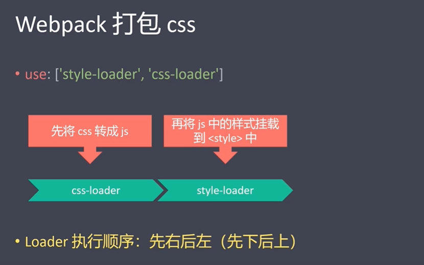

```js
module: {
    rules: [
      // 在这里指定配置规则 执行顺序按照数组里面，从后往前的顺序执行
      {
        text: /\.css$/i,
        use: [
          // 执行顺序2: 将 js 中的样式，挂载到 <style> 标签中
          'style-loader',
          // 执行顺序1： css-loader 按照 CommonJS 规范，将样式文件，输出到 JS 中
          'css-loader'
        ]
      }
    ]
  }
```

## 打包 less

**less-loader 将 less 样式转换为 css 样式**

- 引入 Less

  > import './css/main.less'  // 引入 less 样式文件

- 安装

  > npm install less less-loader -D // 配置的时候需要用到 style-loader 和 css-loader 如果未安装，请安装

- 配置

  - 匹配后缀名： 

    > text: /\\.less$/i

  - 指定加载器： 

    > use: ['style-loader', 'css-loader', 'less-loader']

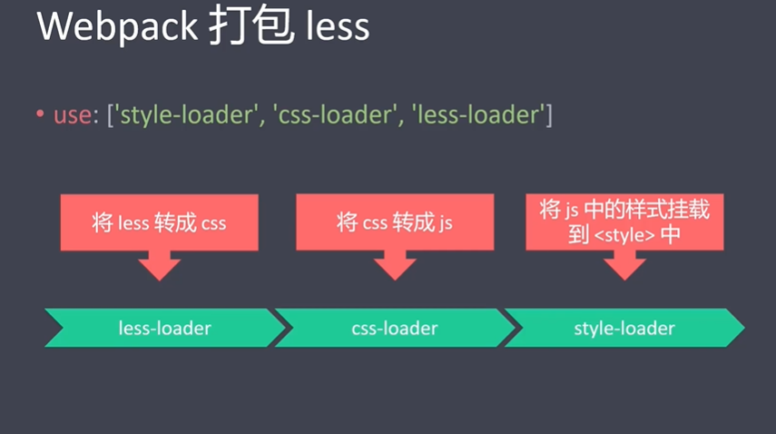

```js
module: {
    rules: [
      // 在这里指定配置规则 执行顺序按照数组里面，从后往前的顺序执行
      {
        text: /\.less$/i,
        use: [
          // 执行顺序3: 将 js 中的样式，挂载到 <style> 标签中
          'style-loader',
          // 执行顺序3： css-loader 按照 CommonJS 规范，将样式文件，输出到 JS 中
          'css-loader',
          // 执行顺序1：将 less 转换为普通的 css
          'less-loader'
        ]
      }
    ]
  }
```

## 打包 CSS 打包成独立文件

- 安装插件

  >  npm install mini-css-extract-plugin -D

- 引入插件 （ webpack.config.js ）

  > const MiniCssExtractPlugin = require('mini-css-extract-plugin')

- 替换 style-loader ( use: ['MiniCssExtractPlugin.loader', 'css-loader'] )

  -  style-loader ：将 css 打包到  \<style\> 标签中
  - MiniCssExtractPlugin.loader: 将 CSS 打包到 独立文件中

- 配置插件 new MiniCssExtractPlugin({}) 

```js
const { resolve } = require('path')
const MiniCssExtractPlugin = require('mini-css-extract-plugin')

module.exports = {
  mode: "production", // "production" | "development" | "none"

  entry: './index.js',

  output: {
    // 所有输出文件的目标路径 必须是绝对路径
    path: resolve(__dirname, 'dist'),

    filename: 'bundle.js'
  },
  module: {
    rules: [
      // 在这里指定配置规则 执行顺序按照数组里面，从后往前的顺序执行
      {
        text: /\.css$/i,
        use: [
          // 执行顺序2: 将 css 打包成独立的文件
          'MiniCssExtractPlugin.loader',
          // 执行顺序1： css-loader 按照 CommonJS 规范，将样式文件，输出到 JS 中
          'css-loader',
        ]
      },
      {
        text: /\.less$/i,
        use: [
          // 执行顺序3: 将 js 中的样式，挂载到 <style> 标签中
          'MiniCssExtractPlugin.loader',
          // 执行顺序2： css-loader 按照 CommonJS 规范，将样式文件，输出到 JS 中
          'css-loader',
          // 执行顺序1：将 less 转换为普通的 css
          'less-loader'
        ]
      }
    ]
  },
  plugins: [
    new MiniCssExtractPlugin({
      filename: 'css/[name].css'
    })
  ]
}
```


## 添加样式前缀

- 安装

  > npm install postcss-loader autoprefixer -D

- 配置 webpack.config.js

  -  postcss-loader 应该放在 css-loader 后面

    > use: ['MiniCssExtractPlugin.loader', 'css-loader', '**postcss-loader**']

- 新建 postcss.config.js

  - plugins: [ require('autoprefixer') ]

- 配置需要兼容的浏览器

  - package.json 中指定 browserslist

  - 详情参考：https://www.npmjs.com/package/browserslist

  - 具体操作

    1. 可以在 package.json 中指定 （推荐）

    ```js
    "browserslist": {
        "last 1 version", // 匹配浏览器最后的一个版本（最新的一个版本）
        "> 1%" // 代表全球超过 1% 使用的浏览器（市场占有率超过 1% 的浏览器）
    }
    ```

    2. 在项目根目录下创建 `.browserslistrc`

    ```js
    // .browserslistrc
    
    # Browsers that we support
    
    last 1 version
    > 1%
    ```

    

```js
// webpack.config.js 文件
const { resolve } = require('path')
const MiniCssExtractPlugin = require('mini-css-extract-plugin')

module.exports = {
  mode: "production", // "production" | "development" | "none"

  entry: './index.js',

  output: {
    // 所有输出文件的目标路径 必须是绝对路径
    path: resolve(__dirname, 'dist'),

    filename: 'bundle.js'
  },
  module: {
    rules: [
      // 在这里指定配置规则 执行顺序按照数组里面，从后往前的顺序执行
      {
        text: /\.css$/i,
        use: [
          // 执行顺序2: 将 css 打包成独立的文件
          'MiniCssExtractPlugin.loader',
          // 执行顺序1： css-loader 按照 CommonJS 规范，将样式文件，输出到 JS 中
          'css-loader',
          // 执行顺序0：通过 postcss-loader 给样式属性添加浏览器前缀
          'postcss-loader'
        ]
      },
      {
        text: /\.less$/i,
        use: [
          // 执行顺序4: 将 js 中的样式，挂载到 <style> 标签中
          'MiniCssExtractPlugin.loader',
          // 执行顺序3： css-loader 按照 CommonJS 规范，将样式文件，输出到 JS 中
          'css-loader',
          // 执行顺序2：通过 postcss-loader 给样式属性添加浏览器前缀，在less中，需要先转换成 css 代码，再给样式属性添加前缀
          'postcss-loader',
          // 执行顺序1：将 less 转换为普通的 css
          'less-loader'
        ]
      }
    ]
  },
  plugins: [
    new MiniCssExtractPlugin({
      filename: 'css/[name].css'
    })
  ]
}
```

```js
module.exports = {
  'plugins': [
    require('autoprefixer')
  ]
}
```


## 校验 CSS 代码 格式

- 安装

  > npm install stylelint stylelint-config-standard stylelint-webpack-plugin -D

- 引入

  > const StylelintPlugin = require('stylelint-webpack-plugin')

- 配置

  - new StylelintPlugin({})

- 指定校验规则 （在 package.json 中指定 stylelint）

  > "stylelint": { "extends": "stylelint-config-standard", rules: [] }
  > 

**安装的 三个包分别有什么作用**

- stylelint

  - https://stylelint.io/

  - 定义了很多代码校验规则

    >例如：number-leading-zero
    >
    >- line-height: .5 (错误)
    >- lint-height：0.5 （正确）
    >
    >因为校验规则，所以缺少0 会报错

  - 

- stylelint-config-standard （提供了一个具体的规则集）

  - https://github.com/stylelint/stylelint-config-standard
  - 指定规则配置有三种方式， 按照加载的先后顺序，依次是：
    - 在 package.json 中的 stylelint 属性指定规则
    - 在 `.stylelintrc` 中指定规则
    - 在`stylelint.config.js` 中指定规则 

- stylelint-webpack-plugin ()

  - https://webpack.docschina.org/plugins/stylelint-webpack-plugin

    

  ## 压缩 CSS 插件 optimize-css-assets-webpack-plugin

- 安装

  > npm install optimize-css-assets-webpack-plugin -D

- 引入

  > const OptimizeCssAssetsPlugin = require('optimize-css-assets-webpack-plugin')

- 配置插件

  > new OptimizeCssAssetsPlugin()


## webpack 打包 HTML

- **html-webpack-plugin**
  - 生成 HTML 文件（用于服务器访问），并在 HTML 中加载所有的打包资源
  - 指定 HTML 模板、设置 HTML 变量、压缩 HTML

- 安装

  > npm install html-webpack-plugin -D

- 配置

  - https://www.npmjs.com/package/html-webpack-plugin

```js
const HtmlWebpackPlugin = require('html-webpack-plugin')

// 插件配置
new HtmlWebpackPlugin({
    // 指定打包后的文件名称
    filename: 'about.html',
    // 用来指定生成 html 的模板
    template: './src/index.html',
    // 指定 HTML 中的变量
    title: '关于我们',
    // 压缩html
    minify: {
        collapseWhitespace: true,
        keepClosingSlash: true,
        removeComments: true,
        removeRedundantAttributes: true,
        removeScriptTypeAttributes: true,
        removeStyleLinkTypeAttributes: true,
        useShortDoctype: true
    }
})
```


## 打包 JS （ webpack编译JS ）

- **目的**

  - 将 ES6+ 转成 ES5， 从而保证，JS在低版本浏览器的兼容性

- 安装

  > npm install babel-loader @babel/core @babel/preset-env -D

- 配置

  - https://www.npmjs.com/package/babel-loader
  - 

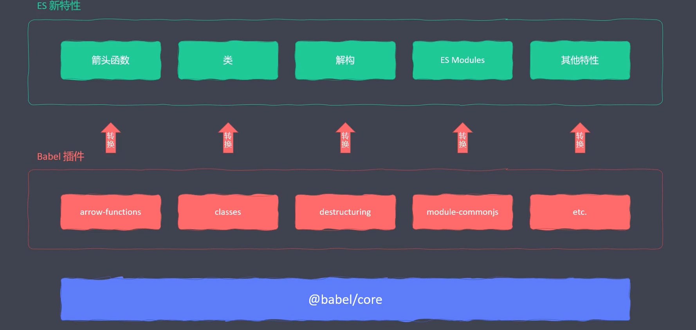


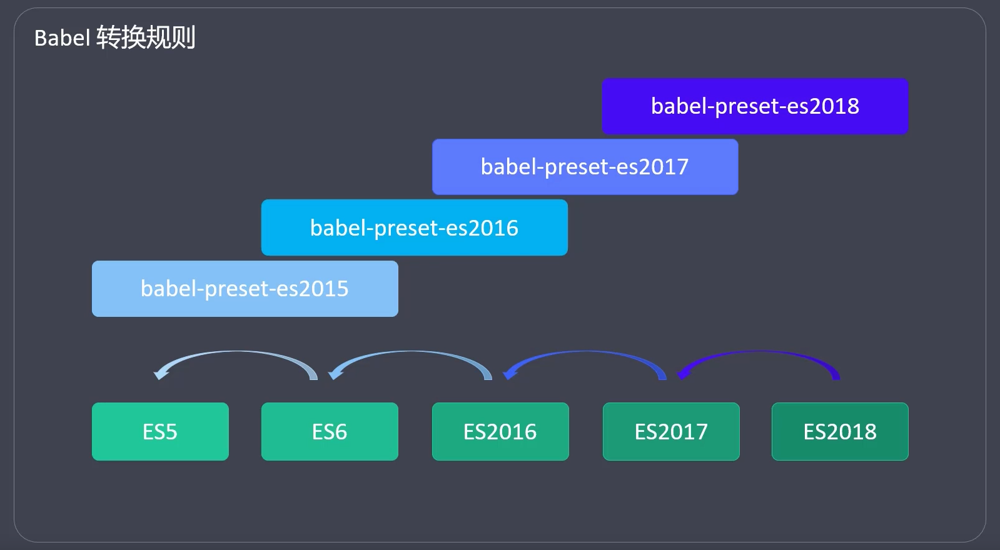


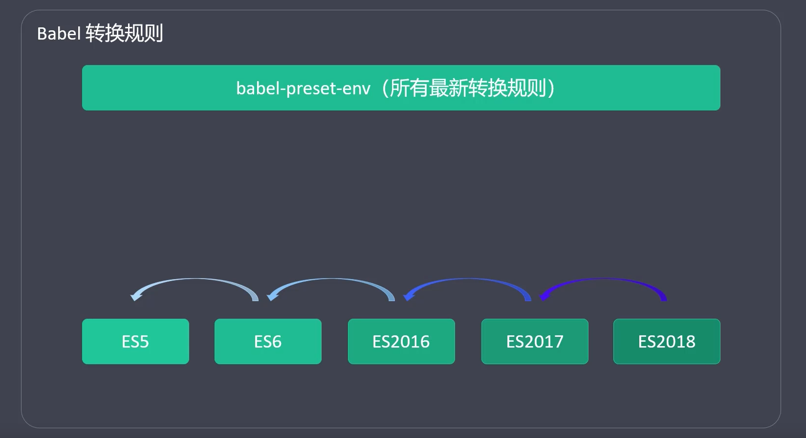

- @babel/preset-env 只能编译基本语法 （promise 等高级语法就不能转换）

- @babel/polyfill （转译所有 JS 新语法）

  > 安装： npm install @babel/polyfill -D
  >
  > 只需要在入口文件引入即可（不是webpack.config.js文件）
  >
  > import '@babel/polyfill' 
  
- 因为 polyfill 转换太大，有些不需要转换，所以使用 core-js （按需转译 JS 新语法）

  - 安装 npm install core-js -D
  - 配置：
    - 按需加载 useBuiltIns："usage"
    - 指定版本 corejs: 3

**@babel/polyfill优点**

- 一次性解决所有兼容性问题,而且是全局的,浏览器的`console`也可以使用

**@babel/polyfill缺点**

- 一次性引入了ES6+的所有polyfill, 打包后的js文件体积会偏大
- 对于现代的浏览器,有些不需要polyfill,造成流量浪费
- 污染了全局对象
- 不适合框架或库的开发

```js
{
  test: /\.m?js$/,
  exclude: /node_modules/,
  use: {
    loader: 'babel-loader',
    options: {
      presets: [
        [
          '@babel/preset-env',
          {
            // 按需加载
            useBuiltIns: 'usage',
            // 指定 corejs 版本
            corejs: 3,
            // targets: "defaults"
            // target 可以指定浏览器版本
            targets: {
              // 谷歌浏览器 58 以上的版本
              chrome: '58',
              // IE 9 以上的版本
              ie: 9,
              firefox: '60',
              safari: '10',
              edge: '17'
            }
          }
        ]
      ]
    }
  }
}
```

## 打包 JS （eslint 格式校验）

- **安装**

  - npm install eslint eslint-config-airbnb-base eslint-webpack-plugin eslint-plugin-import -D
  - eslint （校验 JS 代码格式的工具）
    - https://eslint.org/
  - esint-config-airbnb-base (最流行的 JS 代码格式规范)
  - eslint-webpack-plugin (Webpack 的 eslint 插件 )
    - https://www.npmjs/com/package/eslint-webpack-plugin
  - eslint-plugin-import
    - 用于在 package.json 中读取 eslintConfig 配置项

- 配置

  - eslint-webpack-plugin

    - const ESLintPlugin = require("eslint-webpack-plugin")
    - plugins: [new ESLintPlugin() ]

  - eslintConfig （在package.json 中配置）

    > "eslintConfig": { "extends": "airbnb-base" }


## 打包图片

- file-loader	
  - 将用到的图片复制到输出目录，过滤掉不用的图片
  - npm install file-loader -D
  - https://www.npmjs.com/package/file-loader

- url-loader
  - 是 file-loader 的升级版，如果图片小于配置大小，会转成 base64 字符串
  - 转成 base64 字符串后，图片会跟着 js 一起加载 （减少图片请求次数）
  - npm install url-loader -D
  - https://www.npmjs.com/package/url-loader

  

```js
// file-loader 配置
{
  test: /\.(png|jpe?g|gif)$/i,
  use: [
    {
      // 转换之后，使用import 引入的图片会显示出来，但是css 引入的图片会因为路径问题找不到图片，需要在设置css的loader上面配置路径
      loader: 'file-loader',
    }
  ]
}

// 注意要修改 css 的loader配置 添加路径
{
  text: /\.css$/i,
  use: [
    // 执行顺序2: 将 css 打包成独立的文件
    // 'MiniCssExtractPlugin.loader',
    {
      loader: MiniCssExtractPlugin.loader,
      options: {
        // 为背景图片指定路径
        publicPath: '../'
      }
    },
    // 执行顺序1： css-loader 按照 CommonJS 规范，将样式文件，输出到 JS 中
    'css-loader',
    // 执行顺序0：通过 postcss-loader 给样式属性添加浏览器前缀
    'postcss-loader'
  ]
},
{
  text: /\.less$/i,
  use: [
    // 执行顺序4: 将 js 中的样式，挂载到 <style> 标签中
    // 'MiniCssExtractPlugin.loader',
    {
      loader: MiniCssExtractPlugin.loader,
      options: {
        // 为背景图片指定路径
        publicPath: '../'
      }
    },
    // 执行顺序3： css-loader 按照 CommonJS 规范，将样式文件，输出到 JS 中
    'css-loader',
    // 执行顺序2：通过 postcss-loader 给样式属性添加浏览器前缀，在less中，需要先转换成 css 代码，再给样式属性添加前缀
    'postcss-loader',
    // 执行顺序1：将 less 转换为普通的 css
    'less-loader'
  ]
},
```

```js
// url-loader 配置 
{
  test: /\.(png|jpe?g|gif)$/i,
  use: [
    {
      loader: 'file-loader',
      options: {
        // 指定图片的大小，小于该数值的图片，会被转成 base64 的字符串 limit 数值的单位是字节，
        limit: 8 * 1024, // 8kb
        // [name] 是原来图片的名称。
        // [ext] 是原来图片的格式
        name: 'image/[name].[ext]'
      }
    }
  ]
}
```

- html-loader

  - 将 HTML 导出为字符串 （负责引入img，从而能被 url-loader 进行处理）
  - https://www.npmjs.com/package/html-loader

- html-loader 与 html-webpack-plugin 的冲突

  - 原因： html-webpack-plugin 会检查目标文件是否已经有 loader处理，如果有其他 loader 处理，html-webpack-plugin 不再使用 lodash.template 去处理 ejs 语法
  - 解决：将 html-webpack-plugin 中，模板文件的后缀名改为 `.ejs` （非 .html）修改完配置文件之后，还需要修改模板文件的文件名

- 修改完文件名和webpack 插件之后，在模板文件index.ejs img标签中添加src的图片还是不能显示出来,需要使用模板字符串的写法引入。修改完模板文件之后，如果没有 html文件。则不需要加载 html-loader

> `" />`

```
module: {
  rules: [
    {
      test: /\.(png|jpe?g|gif)$/i,
      use: [
        {
          loader: 'file-loader',
          options: {
            // 指定图片的大小，小于该数值的图片，会被转成 base64 的字符串 limit 数值的单位是字节，
            limit: 8 * 1024, // 8kb
            // [name] 是原来图片的名称。
            // [ext] 是原来图片的格式
            name: 'image/[name].[ext]',
            // url-loader 默认采用 ES Modules 规范进行解析，但是 html-loader 引用图片使用的是 commonjs 规范
            // 解决：关闭 url-loader 默认的 ES Modules 规范，强制 url-loader 使用 CommonJS 规范进行打包
            esModule: false,

          }
        }
      ]
    },
    {
      test: /\.(htm|html)$/i,
      use: {
        loader: 'html-loader',
        options: {
          // webpack 4 中，只需要在 url-loader 配置 esModule: false
          // wbeoack 5 中，还需要在 html-loader 配置 esModule: false
          esModule: false
        }
      }
    }
  ]
}
plugins: [
	new HtmlWebpackPlugin({
      // 指定打包后的文件名称
      filename: 'index.html',
      // 用来指定生成 html 的模板
      template: './src/index.ejs',
      // 指定 HTML 中的变量
      title: 'Webpack Demo'
    }),
    new HtmlWebpackPlugin({
      // 指定打包后的文件名称
      filename: 'about.html',
      // 用来指定生成 html 的模板
      template: './src/index.ejs',
      // 指定 HTML 中的变量
      title: '关于我们',
      // 压缩html
      minify: {
        collapseWhitespace: true,
        keepClosingSlash: true,
        removeComments: true,
        removeRedundantAttributes: true,
        removeScriptTypeAttributes: true,
        removeStyleLinkTypeAttributes: true,
        useShortDoctype: true
      }
    }),
]
```


## 打包字体

- 字体文件
  - https://www.iconfont.cn
- file-loader
  - test: /\.(eot|svg|ttf|woff|woff2)$/i,
- copy-webpack-plugin
  - 不需要处理的其他文件，可以直接复制到输出目录
  - https://www.npmjs.com/package/copy-webpack-plugin

```js
      {
        test: /\.(eot|svg|ttf|woff|woff2)$/i,
        use: {
          loader: 'file-loader',
          options: {
            name: 'fonts/[name].[ext]'
          }
        }
      }
```

- clean-webpack-plugin （每次打包之前，先删除历史文件）
  - https://www.npmjs.com/package/clean-webpack-plugin


## 资源模块 （Asset Modules）

- 功能：

  - 资源模块是一种模块类型，它允许使用**资源文件**，而不需配置额外 loader
  - **资源文件：** 字体、图片、图标、HTML...
  - 不用 file-loader、url-loader 也能加载图片和字体

- 详情

  - https://webpack.docschina.org/guides/asset-modules/

- Webpack 4

  - raw-loader （将文件导入为字符串）
  - file-loader （将文件发送到输出目录）
  - url-loader （将文件发送到输出目录，或转为 Data URI 内联到 bundle 中）
  
- Webpack 5
- asset/resource 发送一个单独的文件并导出 URL （之前通过使用file-loader实现）
  - asset/inline      导出一个资源的 data URI （之前通过使用 url-loader 实现）
  - asset/source     导出资源的源代码 （之前通过使用 raw-loader 实现）
  - asset                  在导出一个data URL 和发送一个单独的文件之间自动选择（url-loader）

 

**使用资源模块打包字体和图片**

```js
{
  test: /\.(png|jpe?g|gif)$/i,
  // 使用资源模块处理图片
  // asset 可以在 asset/resource 和 asset/inline 之间进行选择
  // 如果文件小于 8kb，则使用 asset/inline 类型
  // 如果文件大于 8kb，则使用 asset/resource 类型
  type: 'asset',
  parser: {
    dataUrlCondition: {
      maxSize: 8 * 1024 // 默认使用的也是 8kb， 也可以在此处设置
    }
  },
  // 设置打包之后的路径和名称
  generator: {
    filename: "image/[name][ext]"
  }
},
{
  test: /\.(eot|svg|ttf|woff|woff2)$/i,
  // use: {
  //   loader: 'file-loader',
  //   options: {
  //     name: 'fonts/[name].[ext]'
  //   }
  // }

  // 使用资源模块处理字体文件
  // asset 可以在 asset/resource 和 asset/inline 之间进行选择
  // 如果文件小于 8kb，则使用 asset/inline 类型
  // 如果文件大于 8kb，则使用 asset/resource 类型
  type: 'asset',
  parser: {
    dataUrlCondition: {
      maxSize: 8 * 1024 // 默认使用的也是 8kb， 也可以在此处设置
    }
  },
  // 设置打包之后的路径和名称
  generator: {
    filename: "fonts/[name][ext]"
  }
}
```


## webpack dev server

- 作用： 发布web服务，提高开发效率
- 详情：
  - https://www.npmjs.com/package/webpack-dev-server
  - https://webpack.docschina.org/configuration/dev-server/
- 使用
  - webpack 4 ： webpack-dev-server ...
  - webpack 5 ： webpack serve ...
- 热更新(HMR)
  - webpack 4： 
    - 设置方式： hot: true
  - webpack 5: 
    - liveReload: true (禁用 hot)
    - target: "web" （热更新只适用于 web 相关的 targets ）
- proxy (配置接口代理)
  - 解决 webpack-dev-server 下，访问接口的跨域问题

```js
  devServer: {
    // 指定加载内容的路径
    contentBase: resolve(__dirname, 'output'),
    // 启用 gzip 压缩
    compress: true,
    // 端口号
    port: 9200,
    // 启用自动更新 （禁用hot）
    liveReload: true,
    // 配置代理，解决接口跨域问题
    proxy: {
      // https://localhost:9200/api
      '/api': {
        // https://localhost:9200/api/users => https://api.github.com/api/users
        target: 'https://api.github.com',
        // https://localhost:9200/api/users => https://api.github.com/users
        pathRewrite: {
          '^/api': ''
        },
        // 不能使用 localhost:9200 作为 github 的主机名
        changeOrigin: true
      }
    }
  },
  // 配置目标
  target: "web",
```


## webpack 区分环境打包

- 通过变量环境区分

  - webpack --env.production
  - webpack.config.js 中判断 env 
  - 命令行中设置环境变量
    - webpack 4： webpack --env.production  // 注意： `--env` 和 `production` 中间用 `.`(点链接)
    - webpack 5:   webpack --env production // 注意： `--env` 和 `production` 中间是空格
  - webpack.config.js
    - 读取环境变量 env.production
    - 根据环境变量指定不同的配置
  - 详情：
    - https://www.webpackjs.com/guides/environment-variables/

  ```js
  // webpack.config.js
  module.exports = (env, argv) => {
    // 开发环境配置
    const config = {
      mode: 'development',
      // 更多配置...
    }
    if (env.production) {
        // 生产环境的配置
        config.mode: 'production'
        // 更多配置...
    }
    return config
  }
  
  ```

  ```js
  // webpack.config.js 根据环境不同区分
  const { resolve, isAbsolute } = require('path')
  const MiniCssExtractPlugin = require('mini-css-extract-plugin')
  const StylelintPlugin = require('stylelint-webpack-plugin')
  const OptimizeCssAssetsPlugin = require('optimize-css-assets-webpack-plugin')
  const HtmlWebpackPlugin = require('html-webpack-plugin')
  const ESLintPlugin = require("eslint-webpack-plugin")
  const CopyWebpackPlugin = require('copy-webpack-plugin')
  const { CleanWebpackPlugin } = require('clean-webpack-plugin')
  
  
  module.exports = (env) => {
    const config = {
      mode: "production", // "production" | "development" | "none"
  
      entry: './index.js',
  
      output: {
        // 所有输出文件的目标路径 必须是绝对路径
        path: resolve(__dirname, 'dist'),
  
        filename: 'bundle.js'
      },
      module: {
        rules: [
          // 在这里指定配置规则 执行顺序按照数组里面，从后往前的顺序执行
    
          // 将样式挂载到 <style> 标签中
          // {
          //   text: /\.css$/i,
          //   use: [
          //     // 执行顺序2: 将 js 中的样式，挂载到 <style> 标签中
          //     'style-loader',
          //     // 执行顺序1： css-loader 按照 CommonJS 规范，将样式文件，输出到 JS 中
          //     'css-loader'
          //   ]
          // },
          // {
          //   text: /\.less$/i,
          //   use: [
          //     // 执行顺序3: 将 js 中的样式，挂载到 <style> 标签中
          //     'style-loader',
          //     // 执行顺序3： css-loader 按照 CommonJS 规范，将样式文件，输出到 JS 中
          //     'css-loader',
          //     // 执行顺序1：将 less 转换为普通的 css
          //     'less-loader'
          //   ]
          // }
          // 将 css 打包成独立的文件
          {
            text: /\.css$/i,
            use: [
              // 执行顺序2: 将 css 打包成独立的文件
              // 'MiniCssExtractPlugin.loader',
              {
                loader: MiniCssExtractPlugin.loader,
                options: {
                  // 为背景图片指定路径
                  publicPath: '../'
                }
              },
              // 执行顺序1： css-loader 按照 CommonJS 规范，将样式文件，输出到 JS 中
              'css-loader',
              // 执行顺序0：通过 postcss-loader 给样式属性添加浏览器前缀
              'postcss-loader'
            ]
          },
          {
            text: /\.less$/i,
            use: [
              // 执行顺序4: 将 js 中的样式，挂载到 <style> 标签中
              // 'MiniCssExtractPlugin.loader',
              {
                loader: MiniCssExtractPlugin.loader,
                options: {
                  // 为背景图片指定路径
                  publicPath: '../'
                }
              },
              // 执行顺序3： css-loader 按照 CommonJS 规范，将样式文件，输出到 JS 中
              'css-loader',
              // 执行顺序2：通过 postcss-loader 给样式属性添加浏览器前缀，在less中，需要先转换成 css 代码，再给样式属性添加前缀
              'postcss-loader',
              // 执行顺序1：将 less 转换为普通的 css
              'less-loader'
            ]
          },
          {
            test: /\.m?js$/,
            exclude: /node_modules/,
            use: {
              loader: 'babel-loader',
              options: {
                presets: [
                  [
                    '@babel/preset-env',
                    {
                      // 按需加载
                      useBuiltIns: 'usage',
                      // 指定 corejs 版本
                      corejs: 3,
                      // targets: "defaults"
                      // target 可以指定浏览器版本
                      targets: {
                        // 谷歌浏览器 58 以上的版本
                        chrome: '58',
                        // IE 9 以上的版本
                        ie: 9,
                        firefox: '60',
                        safari: '10',
                        edge: '17'
                      }
                    }
                  ]
                ]
              }
            }
          },
          // {
          //   test: /\.(png|jpe?g|gif)$/i,
          //   use: [
          //     {
          //       // 转换之后，使用import 引入的图片会显示出来，但是css 引入的图片会因为路径问题找不到图片，需要在设置css的loader上面配置路径
          //       loader: 'file-loader',
          //     }
          //   ]
          // }
          {
            test: /\.(png|jpe?g|gif)$/i,
            // use: {
            //   loader: 'file-loader',
            //   options: {
            //     // 指定图片的大小，小于该数值的图片，会被转成 base64 的字符串 limit 数值的单位是字节，
            //     limit: 8 * 1024, // 8kb
            //     // [name] 是原来图片的名称。
            //     // [ext] 是原来图片的格式
            //     name: 'image/[name].[ext]',
            //     // url-loader 默认采用 ES Modules 规范进行解析，但是 html-loader 引用图片使用的是 commonjs 规范
            //     // 解决：关闭 url-loader 默认的 ES Modules 规范，强制 url-loader 使用 CommonJS 规范进行打包
            //     esModule: false,
    
            //   }
            // }
    
    
            // 使用资源模块处理图片
            // asset 可以在 asset/resource 和 asset/inline 之间进行选择
            // 如果文件小于 8kb，则使用 asset/inline 类型
            // 如果文件大于 8kb，则使用 asset/resource 类型
            type: 'asset',
            parser: {
              dataUrlCondition: {
                maxSize: 8 * 1024 // 默认使用的也是 8kb， 也可以在此处设置
              }
            },
            // 设置打包之后的路径和名称
            generator: {
              filename: "image/[name][ext]"
            }
          },
          {
            test: /\.(htm|html)$/i,
            use: {
              loader: 'html-loader',
              options: {
                // webpack 4 中，只需要在 url-loader 配置 esModule: false
                // wbeoack 5 中，还需要在 html-loader 配置 esModule: false
                esModule: false
              }
            }
          },
          {
            test: /\.(eot|svg|ttf|woff|woff2)$/i,
            // use: {
            //   loader: 'file-loader',
            //   options: {
            //     name: 'fonts/[name].[ext]'
            //   }
            // }
    
            // 使用资源模块处理字体文件
            // asset 可以在 asset/resource 和 asset/inline 之间进行选择
            // 如果文件小于 8kb，则使用 asset/inline 类型
            // 如果文件大于 8kb，则使用 asset/resource 类型
            type: 'asset',
            parser: {
              dataUrlCondition: {
                maxSize: 8 * 1024 // 默认使用的也是 8kb， 也可以在此处设置
              }
            },
            // 设置打包之后的路径和名称
            generator: {
              filename: "fonts/[name][ext]"
            }
          }
        ]
      },
      devServer: {
        // 指定加载内容的路径
        contentBase: resolve(__dirname, 'output'),
        // 启用 gzip 压缩
        compress: true,
        // 端口号
        port: 9200,
        // 启用自动更新 （禁用hot）
        liveReload: true,
        // 配置代理，解决接口跨域问题
        proxy: {
          // https://localhost:9200/api
          '/api': {
            // https://localhost:9200/api/users => https://api.github.com/api/users
            target: 'https://api.github.com',
            // https://localhost:9200/api/users => https://api.github.com/users
            pathRewrite: {
              '^/api': ''
            },
            // 不能使用 localhost:9200 作为 github 的主机名
            changeOrigin: true
          }
        }
      },
      // 配置目标
      target: "web",
      plugins: [
        new MiniCssExtractPlugin({
          filename: 'css/[name].css'
        }),
        new StylelintPlugin({
          // 指定需要进行格式校验的文件
          files: ['src/css/*.{css, less, sass, scss}']
        }),
        new HtmlWebpackPlugin({
          // 指定打包后的文件名称
          filename: 'index.html',
          // 用来指定生成 html 的模板
          template: './src/index.ejs',
          // 指定 HTML 中的变量
          title: 'Webpack Demo'
        }),
        new HtmlWebpackPlugin({
          // 指定打包后的文件名称
          filename: 'about.html',
          // 用来指定生成 html 的模板
          template: './src/index.ejs',
          // 指定 HTML 中的变量
          title: '关于我们'
        }),
        new ESLintPlugin({
          // 自动解决常规的代码格式报错
          fix: true
        }),
        // 直接将 src 下，不需要特殊处理的文件，直接复制到输出目录中
        new CopyWebpackPlugin({
          patterns: [
            {
              from: 'src/public',
              to: 'public'
            }
          ]
        }),
        new CleanWebpackPlugin()
      ]
    }
    // 判断当前是否是生产环境打包
    if (env.production) {
      config.mode = 'production'
      config.plugins = [
        new MiniCssExtractPlugin({
          filename: 'css/[name].css'
        }),
        new StylelintPlugin({
          // 指定需要进行格式校验的文件
          files: ['src/css/*.{css, less, sass, scss}']
        }),
        // 压缩 css
        new OptimizeCSSPlugin(),
        new HtmlWebpackPlugin({
          // 指定打包后的文件名称
          filename: 'index.html',
          // 用来指定生成 html 的模板
          template: './src/index.ejs',
          // 指定 HTML 中的变量
          title: 'Webpack Demo',
          // 压缩html
          minify: {
            collapseWhitespace: true,
            keepClosingSlash: true,
            removeComments: true,
            removeRedundantAttributes: true,
            removeScriptTypeAttributes: true,
            removeStyleLinkTypeAttributes: true,
            useShortDoctype: true
          }
        }),
        new HtmlWebpackPlugin({
          // 指定打包后的文件名称
          filename: 'about.html',
          // 用来指定生成 html 的模板
          template: './src/index.ejs',
          // 指定 HTML 中的变量
          title: '关于我们',
          // 压缩html
          minify: {
            collapseWhitespace: true,
            keepClosingSlash: true,
            removeComments: true,
            removeRedundantAttributes: true,
            removeScriptTypeAttributes: true,
            removeStyleLinkTypeAttributes: true,
            useShortDoctype: true
          }
        }),
        new ESLintPlugin({
          // 自动解决常规的代码格式报错
          fix: true
        }),
        // 直接将 src 下，不需要特殊处理的文件，直接复制到输出目录中
        new CopyWebpackPlugin({
          patterns: [
            {
              from: 'src/public',
              to: 'public'
            }
          ]
        }),
        new CleanWebpackPlugin()
      ]
    }
    return config
  }
  ```

  

- 通过配置文件区分

  - webpack.`dev`.conf.js （对应的 mode: development ）
  - webpack.`prod`.conf.js (对应的 mode: production )
  - webpack.base.conf.js (公共配置)

- webpack-merge

  - 将多个配置合并在一起
  - https://www.npmjs.com/package/webpack-merge

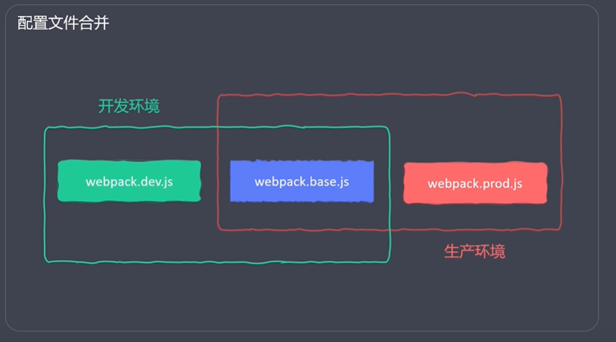

```js
// webpack.base.conf.js
// 公共配置模块
const { resolve } = require('path')
const MiniCssExtractPlugin = require('mini-css-extract-plugin')
const StylelintPlugin = require('stylelint-webpack-plugin')
const ESLintPlugin = require("eslint-webpack-plugin")
const CopyWebpackPlugin = require('copy-webpack-plugin')
const { CleanWebpackPlugin } = require('clean-webpack-plugin')

// 通用的样式loader
const commonStyleLoader = [
  // 执行顺序2: 将 css 打包成独立的文件
  {
    loader: MiniCssExtractPlugin.loader,
    options: {
      // 为背景图片指定路径
      publicPath: '../'
    }
  },
  // 执行顺序1： css-loader 按照 CommonJS 规范，将样式文件，输出到 JS 中
  'css-loader',
  // 执行顺序0：通过 postcss-loader 给样式属性添加浏览器前缀
  'postcss-loader'
]

module.exports = {
  mode: "production", // "production" | "development" | "none"

  entry: './index.js',

  output: {
    // 所有输出文件的目标路径 必须是绝对路径
    path: resolve(__dirname, 'dist'),

    filename: 'bundle.js'
  },
  module: {
    rules: [
      // 在这里指定配置规则 执行顺序按照数组里面，从后往前的顺序执行
      // 将 css 打包成独立的文件
      {
        text: /\.css$/i,
        use: commonStyleLoader
      },
      {
        text: /\.less$/i,
        use: [...commonStyleLoader, 'less-loader']
      },
      {
        test: /\.m?js$/,
        exclude: /node_modules/,
        use: {
          loader: 'babel-loader',
          options: {
            presets: [
              [
                '@babel/preset-env',
                {
                  // 按需加载
                  useBuiltIns: 'usage',
                  // 指定 corejs 版本
                  corejs: 3,
                  // targets: "defaults"
                  // target 可以指定浏览器版本
                  targets: {
                    // 谷歌浏览器 58 以上的版本
                    chrome: '58',
                    // IE 9 以上的版本
                    ie: 9,
                    firefox: '60',
                    safari: '10',
                    edge: '17'
                  }
                }
              ]
            ]
          }
        }
      },
      {
        test: /\.(png|jpe?g|gif)$/i,
        type: 'asset',
        parser: {
          dataUrlCondition: {
            maxSize: 8 * 1024 // 默认使用的也是 8kb， 也可以在此处设置
          }
        },
        // 设置打包之后的路径和名称
        generator: {
          filename: "image/[name][ext]"
        }
      },
      {
        test: /\.(htm|html)$/i,
        use: {
          loader: 'html-loader',
          options: {
            esModule: false
          }
        }
      },
      {
        test: /\.(eot|svg|ttf|woff|woff2)$/i,
        type: 'asset',
        parser: {
          dataUrlCondition: {
            maxSize: 8 * 1024 // 默认使用的也是 8kb， 也可以在此处设置
          }
        },
        // 设置打包之后的路径和名称
        generator: {
          filename: "fonts/[name][ext]"
        }
      }
    ]
  },

  devServer: {
    // 指定加载内容的路径
    contentBase: resolve(__dirname, '../output'),
    // 启用 gzip 压缩
    compress: true,
    // 端口号
    port: 9200,
    // 启用自动更新 （禁用hot）
    liveReload: true,
    // 配置代理，解决接口跨域问题
    proxy: {
      // https://localhost:9200/api
      '/api': {
        // https://localhost:9200/api/users => https://api.github.com/api/users
        target: 'https://api.github.com',
        // https://localhost:9200/api/users => https://api.github.com/users
        pathRewrite: {
          '^/api': ''
        },
        // 不能使用 localhost:9200 作为 github 的主机名
        changeOrigin: true
      }
    }
  },
  // 配置目标
  target: "web",
  plugins: [
    new MiniCssExtractPlugin({
      filename: 'css/[name].css'
    }),
    new StylelintPlugin({
      // 指定需要进行格式校验的文件
      files: ['src/css/*.{css, less, sass, scss}']
    }),
    new ESLintPlugin({
      // 自动解决常规的代码格式报错
      fix: true
    }),
    // 直接将 src 下，不需要特殊处理的文件，直接复制到输出目录中
    new CopyWebpackPlugin({
      patterns: [
        {
          from: 'src/public',
          to: 'public'
        }
      ]
    }),
    new CleanWebpackPlugin()
  ]
}
```

```
// webpack.dev.conf.js
// 开发环境配置文件
const HtmlWebpackPlugin = require('html-webpack-plugin')
const { merge } = require('webpack-merge')
const baseWebpackConfig = require('./webpack.base.conf')

const devWebpackConfig = merge(baseWebpackConfig, {
  // 这里是开发模式对应的配置
  mode: 'development',
  plugins: [
    new HtmlWebpackPlugin({
      // 指定打包后的文件名称
      filename: 'index.html',
      // 用来指定生成 html 的模板
      template: './src/index.ejs',
      // 指定 HTML 中的变量
      title: 'Webpack Demo'
    }),
    new HtmlWebpackPlugin({
      // 指定打包后的文件名称
      filename: 'about.html',
      // 用来指定生成 html 的模板
      template: './src/index.ejs',
      // 指定 HTML 中的变量
      title: '关于我们'
    })
  ]
})

module.exports = devWebpackConfig
```

```js
// webpack.prod.conf.js
// 生产环境配置文件
const HtmlWebpackPlugin = require('html-webpack-plugin')
const OptimizeCSSPlugin = require('optimize-css-assets-webpack-plugin')

const { merge } = require('webpack-merge')
const baseWebpackConfig = require('./webpack.base.conf')

const prodWebpackConfig = merge(baseWebpackConfig, {
  // 这里是开发模式对应的配置
  mode: 'production',
  plugins: [
    // 压缩 css
    new OptimizeCSSPlugin(),
    new HtmlWebpackPlugin({
      // 指定打包后的文件名称
      filename: 'index.html',
      // 用来指定生成 html 的模板
      template: './src/index.ejs',
      // 指定 HTML 中的变量
      title: 'Webpack Demo',
      // 压缩html
      minify: {
        collapseWhitespace: true,
        keepClosingSlash: true,
        removeComments: true,
        removeRedundantAttributes: true,
        removeScriptTypeAttributes: true,
        removeStyleLinkTypeAttributes: true,
        useShortDoctype: true
      }
    }),
    new HtmlWebpackPlugin({
      // 指定打包后的文件名称
      filename: 'about.html',
      // 用来指定生成 html 的模板
      template: './src/index.ejs',
      // 指定 HTML 中的变量
      title: '关于我们',
      // 压缩html
      minify: {
        collapseWhitespace: true,
        keepClosingSlash: true,
        removeComments: true,
        removeRedundantAttributes: true,
        removeScriptTypeAttributes: true,
        removeStyleLinkTypeAttributes: true,
        useShortDoctype: true
      }
    })
  ]
})

module.exports = prodWebpackConfig
```

- Webpack DefinePlugin

  - DefinePlugin
    - 为配置注入全局变量
    - 开发环境和生成环境的接口地址不同

  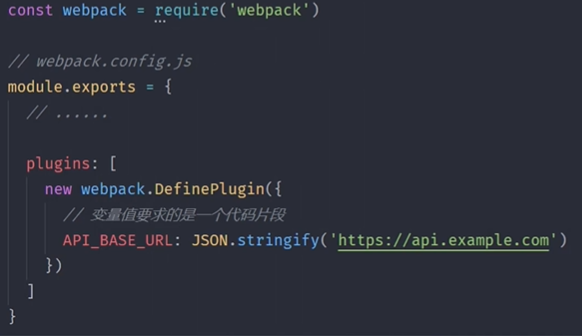

  

##  自定义 plugin

- Webpack 插件是一个具有 apply 方法的 JavaScript 对象。apply 方法会被 webpack.compiler 调用，并且在整个编译声明周期都可以访问 compiler 对象
- 原理：
  - 通过在 `生命周期` 的 `钩子` 中挂载函数，来实现功能扩展
- 详情：
  - https://webpack.docschina.org/concepts/plugins/

**生命周期**

- 生命周期就是`整个生命过程中的关键节点`
- 人：出生 -> 入学 -> 毕业 -> 结婚 -> 生子 -> 死亡
- 程序：初始化 -> 挂载 -> 渲染 -> 展示 -> 销毁

**钩子**

- 钩子是 `提前在可能增加功能的地方，埋好(预设)一个函数`
- 生命周期中的函数

#### webpack 常用钩子

- https://webpack.docschina.org/api/compiler-hooks/

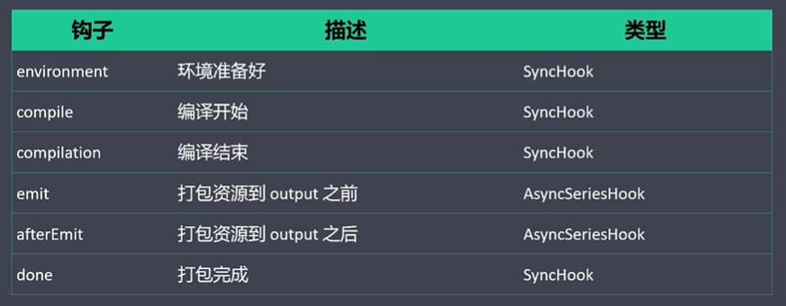


## 自定义 loader

- loader 本质上就是一个 ESM 模块，它导出一个函数，在函数中对打包资源进行转换
- 声明一个读取 markdown（.md）文件内容的 loader
  - marked （将 markdown 语法转换成 html ）
  - loader-utils （接受 loader 的配置项）

```js
// 自定义 loader 的语法
const { getOptions } = require('loader-utils');
const marked = require('marked');

module.exports = function (source) {
  // 获取 loader 配置选项
  const options = getOptions(this)

  // 对输入内容进行处理
  const html = marked(source)

  // 返还给下一个 loader 处理
  return html
}
```


## 代码分离 （Code Splitting）

如果把所有代码都打包到一起，可能最终的代码非常大，从而影响加载时间，而且很多代码初始化时是不需要加载的，因此，我们可以根据代码使用的紧急程度，将代码分割打包后，按需加载。

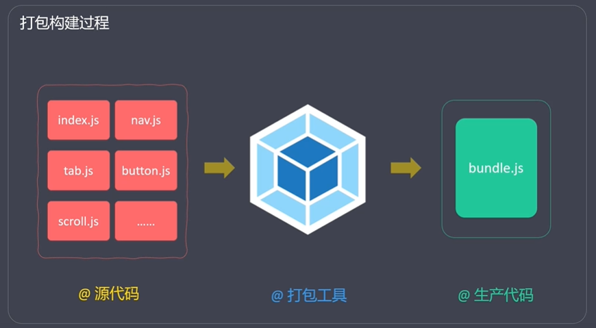

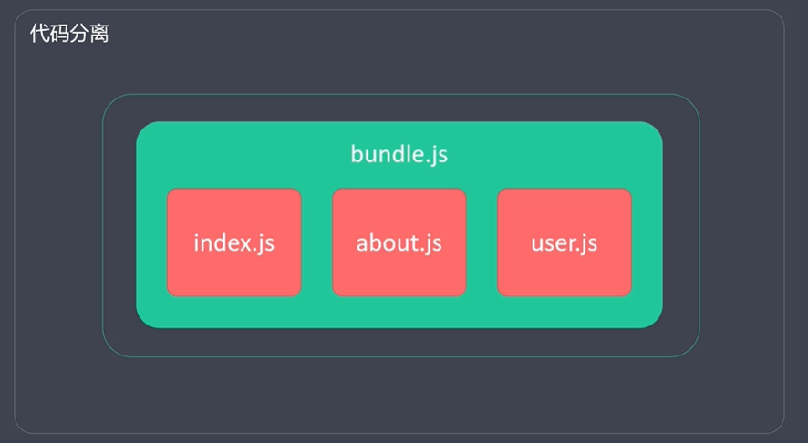

### **如何分离**

- **多入库打包**：配置 entry 加载多个入口文件
- **提取公共模块**：optimization.splitChunks.chunks:all
- **动态导入**：按需加载 | 预加载

### 多入口打包

- entry （后面写成对象）

  > {
  >
  > ​	index: "./src/index.js",
  >
  > ​	about: "./src/about.js"
  >
  > }

- output.filename （不能写成固定名称，否则报错）
  
  - [name].bundle.js
- HtmlWebpackPlugin （不同页面加载各自的 bundle ）
  - chunks: ["index"]  ---> index.html 加载 index.bundle.js
  - chunks: ["about"]    --> about.html 加载 about.bundle.js

```js
 entry: {
    index: './src/index.js',
    about: './src/about.js'
  },

  output: {
    // 所有输出文件的目标路径 必须是绝对路径
    path: resolve(__dirname, 'dist'),

    filename: '[name].bundle.js'
  },
 // plugin 设置 HtmlWebpackPlugin 
  new HtmlWebpackPlugin({
      // 指定打包后的文件名称
      filename: 'index.html',
      // 用来指定生成 html 的模板
      template: './src/index.ejs',
      // 指定 HTML 中的变量
      title: 'Webpack Demo',
      // 引入要加载的打包文件
      chunks: ['index']
  }),
```


### 提取公共模块

以jquery为例，需要将 jquery 单独提取出来

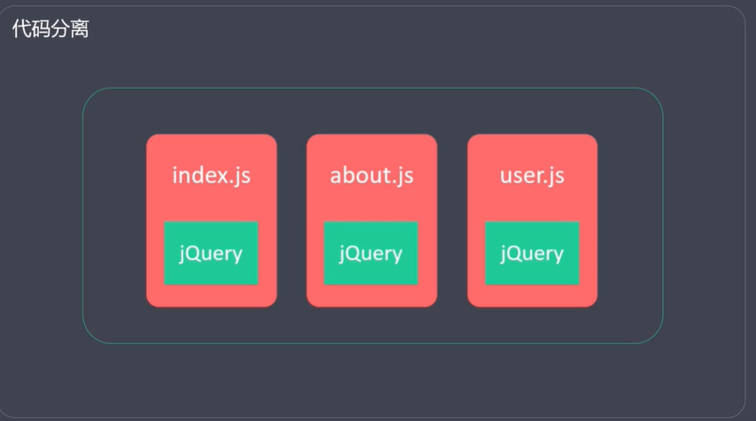

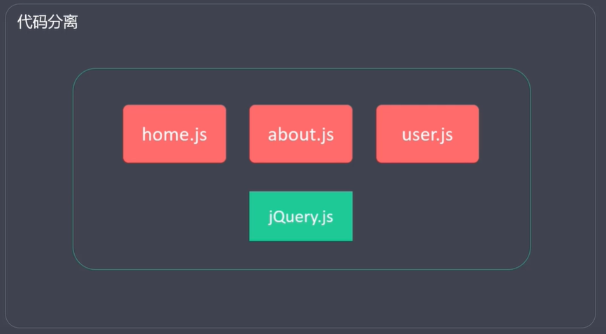

- 使用 optimization.splitChunks.chunks:all
  - 将公共文件提取出来，单独打包

```js
module.export = {
  mode: 'production'
  // 优化策略 在最底层
  optimization: {
    splitChunks: {
      chunks: 'all'
    }
  }
}
```

### 动态导入

- 懒加载
  - 默认不加载，事件触发后才加载
  - webpackChunkName: "懒加载名称"
- 预加载
  - 先等待其他资源加载，浏览器空闲时，再加载
  - webpackPrefetch: true
  - 缺点： 在移动端有兼容性问题


可以根据注释中的 webpackChunkName 指定懒加载的文件名称

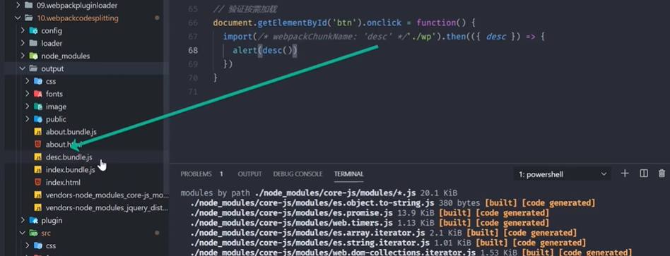

```js
document.getElementById('btn').onclick = function () {
  // import 启动懒加载
  // webpackChunkName: 'desc' 指定懒加载的文件名称
  // webpackPrefetch: true 启动预加载
  import(/* webpackChunkName: 'desc', webpackPrefetch: true */'js文件').then(({ desc }) => {
    alert(desc())
  })
}
```

## 源码映射（source Map）

**什么是 source Map**

- 是一种 `源代码` 与 `构建后代码` 之间的映射技术。
- 通过 .map 文件，将构建后的代码与源代码之间建立映射关系。

**为什么要用 source Map**

因为构建后的代码，是压缩之后的代码，出现问题之后不好定位，所以才有了 source Map 可以快速定位问题代码。

**如何生成 source Map**

> devtool: "映射模式"

#### 映射模式

不同的映射模式的报错定位效果和打包执行速度不同

- webpack 4 中，一共有 13 种不同的映射模式
- webpack 5 中，一共有 26 种不同的映射模式

Webpack 5 中的命名更严格

- cheap-module-eval-source-map => eval-cheap-module-source-map
- ^(inline-|hidden-|eval-)?(nosources-)?(cheap-(module-)?)?source-map$


##### **webpack 4映射模式**

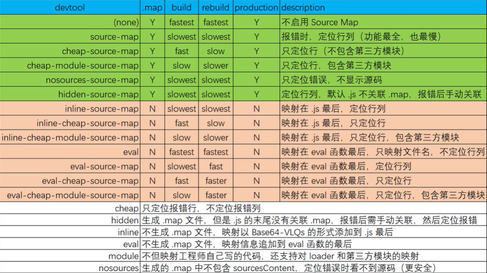

##### 映射模式: source-map

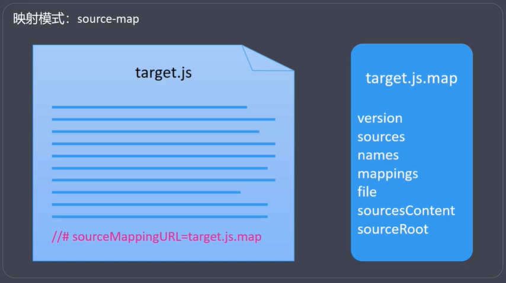

##### 映射模式：cheap-source-map

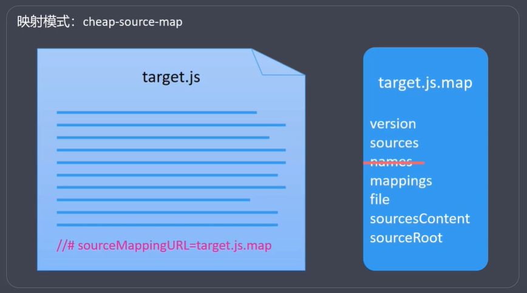

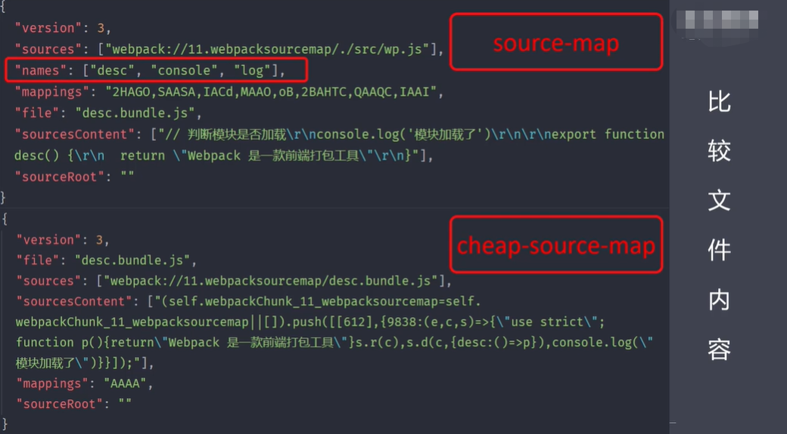

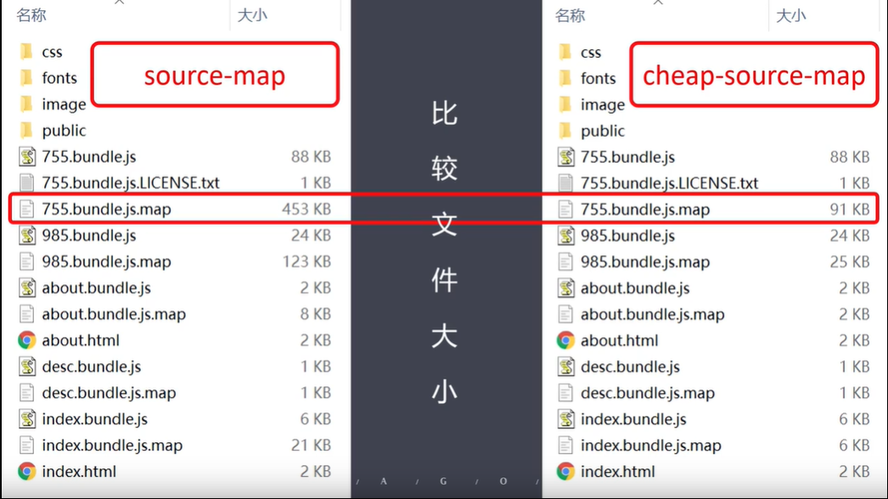

##### 映射模式：cheap-module-source-map

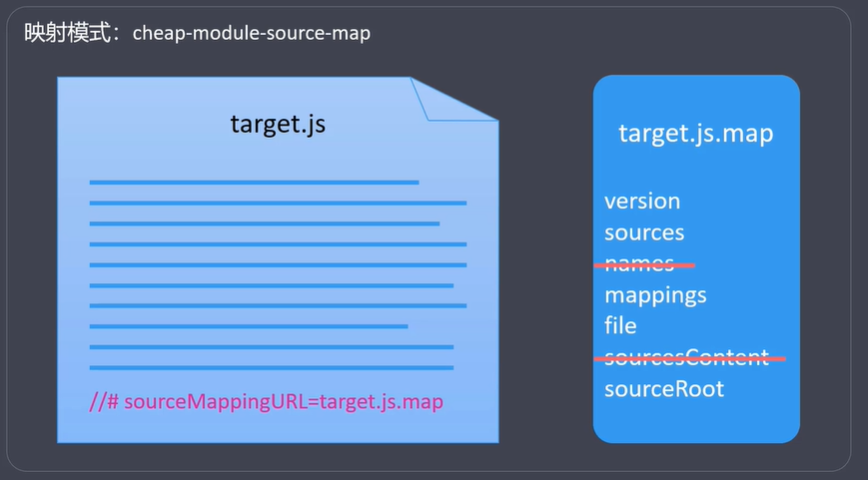

##### 映射模式：nosources-source-map


##### 映射模式：hidden-source-map

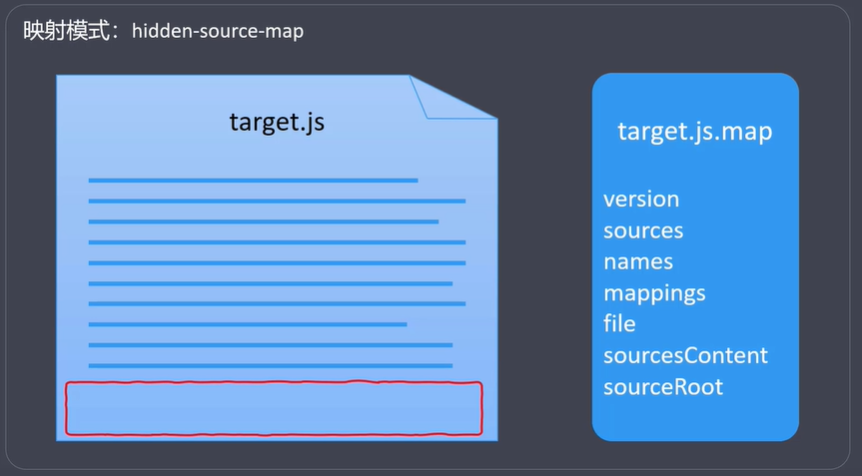

##### 映射模式: inline-source-map

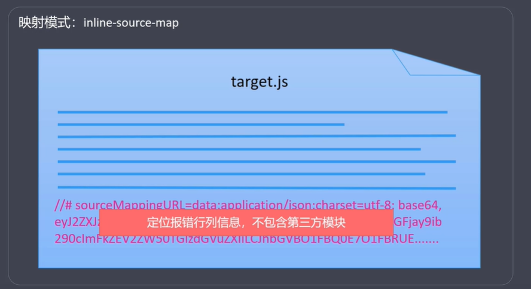

##### 映射模式: inline-cheap-source-map

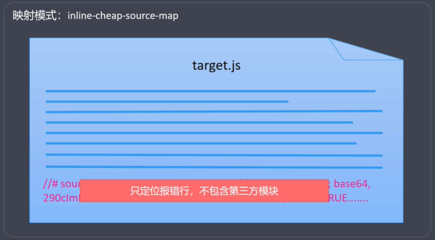

##### 映射模式: inline-cheap-module-source-map

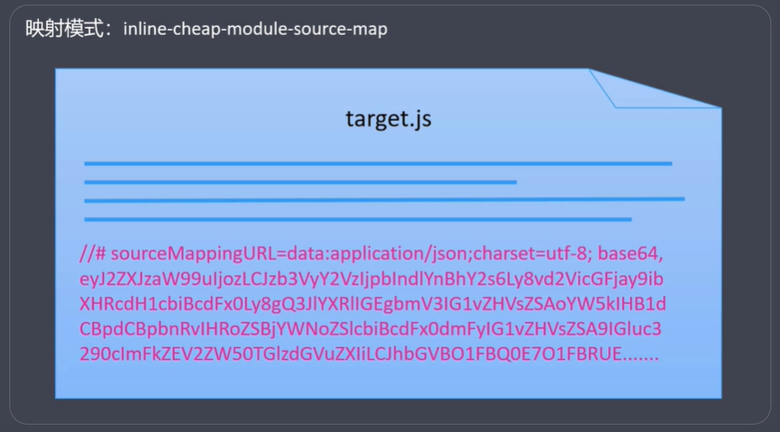

##### 映射模式： eval

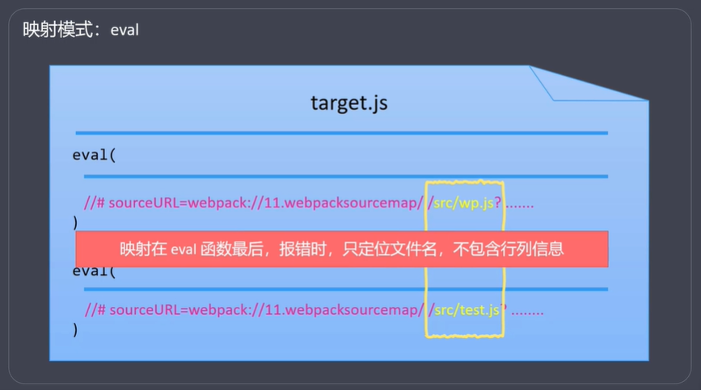

##### 映射模式：eval-source-map

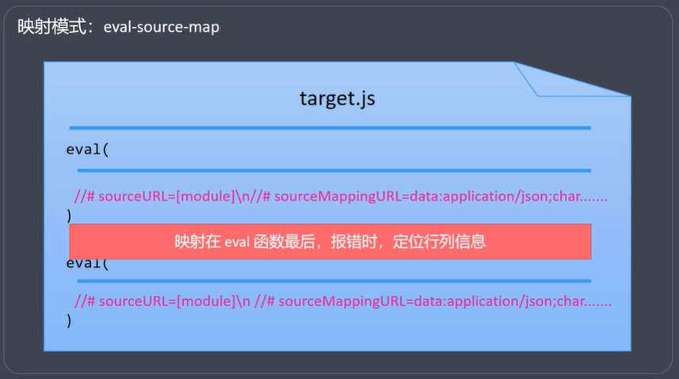

##### 映射模式：eval-cheap-source-map

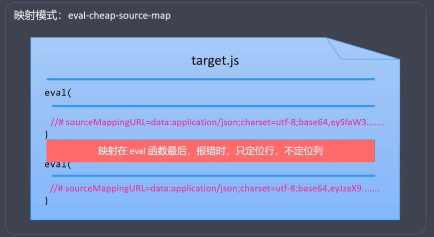

##### 映射模式：eval-cheap-module-source-map

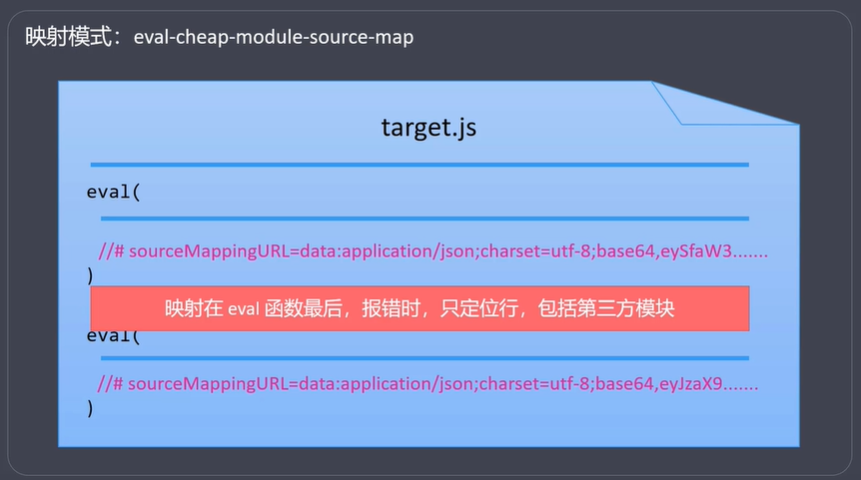

##### webpack 5 中映射模式

> 注意: webpack 5 中 有些模式还不可以使用,一定要亲测

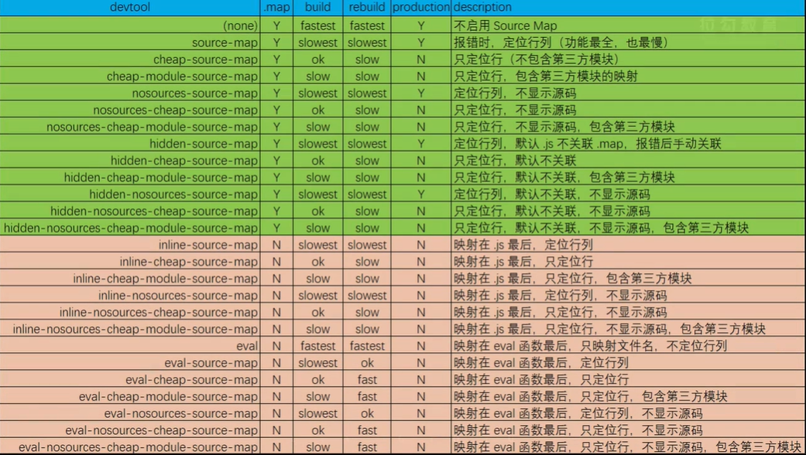

#### 如何选取合适的映射模式

- **最重要的是按照项目需求来决定**

- 开发环境 (个人推荐：`eval-cheap-module-source-map`)
- 生成环境（个人推荐：`none | nosource-source-map`）


## Tree Shaking (摇树)

- Tree Shaking 的作用是删除 **未引用代码（dead code）**
  - 例如： return 后面的代码
  - 只声明，而未使用的函数
  - 只引入，未使用的代码

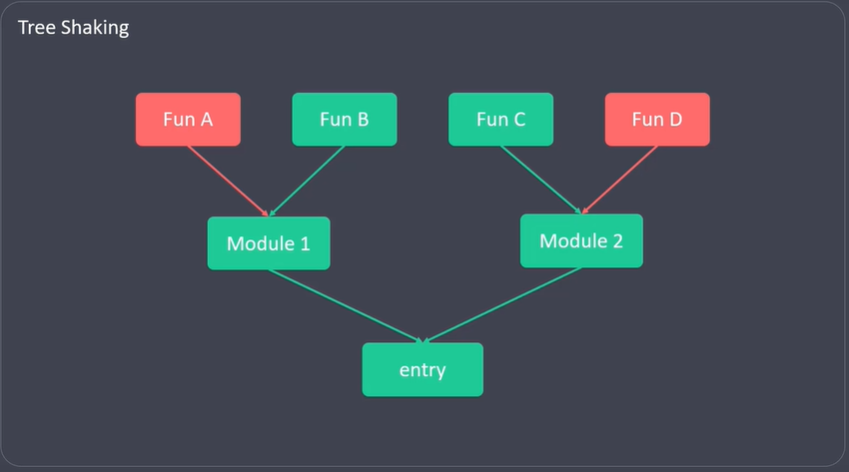

红色方块表示未使用，无效代码，将无效代码去掉，只打包需要的代码

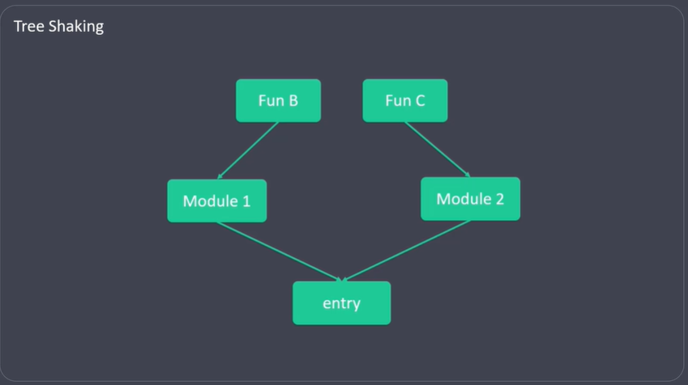

### 使用 Three Shaking 的前提

- 使用 ES Modules 规范的模块，才能执行 Tree Shaking
- Tree Shaking 依赖于 ES Modules 的静态语法分析

### 如何使用 Tree Shaking

- 生产模式： Tree shaking 会自动开启
- 开发模式：
  - usedExports
  - sideEffects

### usedExports

- optimization.usedExports （标记没用的代码）
  
  - 使用注释的方式，在代码前添加 `/* unused harmony export xxxxx */`
  
- terser-webpack-plugin (插件：用来删除没用的代码)

  - optimization.minimze: true （删除 `unused harmony export xxxxx` 标记的代码）
  - 在webpack 4里面需要安装，在webpack 5 无须安装
  - https://www.npmjs.com/package/terser-webpack-plugin
  
- Tree Shaking 与 Source Map 存在兼容性问题

  - 如果想在 source map 中使用 Tree Shaking 的话，source map 只能设置为 `source-map | inline-source-map | hidden-source-map | nosources-source-map`

    > devtool: source-map | inline-source-map | hidden-source-map | nosources-source-map

  - 原因： eval 模式，将 JS 输出为 字符串（不是 ES Modules 规范），导致 Tree Shaking 失效

#### 使用

```js
const TerserPlugin = require('terser-webpack-plugin')
module.exports = {
  mode: "development",/ 优化策略
  // 优化策略
  optimization: {
    // 标记未被使用的代码
    usedExports: true,
    // 删除 usedExports 标记的未使用的代码
    minimize: true,
    minimizer: [new TerserPlugin()],
    splitChunks: {
      chunks: 'all'
    }
  }
}
```

### sideEffects （副作用）

- 无副作用：如果一个模块单纯的导入导出变量，那么它是无副作用的
- 有副作用： 如果一个模块还修改其他模块或者全局的一些东西，就有副作用
  - 修改全局变量
  - 在原型上拓展方法
  - css的引入
- sideEffects 的作用：把**未使用**但**无副作用**的模块一并删除
  - 对于没有副作用的模块，未使用代码不会被打包（相当于压缩了输出内容）

#### 使用

- 开启副作用 （webpack.config.js）
  - optimization.sideEffects: true
- 标识代码是否有副作用 （package.json）
  - sideEffects
    - false: 所有代码都没有副作用 （告诉 webpack 可以安全地删除未用的 exports ）
    - true: 所有代码都有副作用
    - 数组：（告诉webpack 哪些模块有副作用，不用删除）
      - 例如： ["./src/wp.js", "*.css"]

```js
  // package.json
  "sideEffects": [
      './src/extends.js'
  ]
  // webpack.config.jso 
  // 优化策略
  optimization: {
    sideEffects: true,
    // 标记未被使用的代码
    usedExports: true,
    // 删除 usedExports 标记的未使用的代码
    // minimize: true,
    // minimizer: [new TerserPlugin()],
    splitChunks: {
      chunks: 'all'
    }
  },
```


## webpack 缓存

- Babel 缓存
  - cacheDirectory: true (第二次构建时，会读取之前的缓存)
- 文件资源缓存
  - 如果代码在缓存期，代码更新后看不到实时效果
  - 方案：将代码文件名称，设置为哈希名称，名称发生变化时，就加载最新的内容
- webpack 哈希值
  - [hash]    每次 webpack 打包生成的 hash 值
  - [chunkhash]      不同 chunk 的 hash 值不同 同一次打包可能生成不同的 chunk
  - [contenthash]       不同内容的 hash 值不同   同一个 chunk 中可能有不同的内容


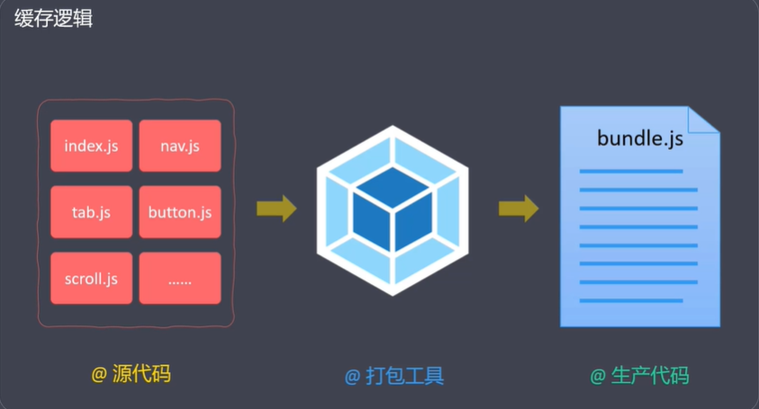

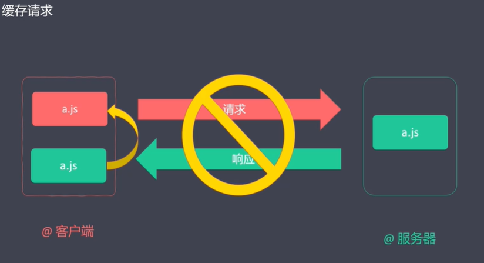

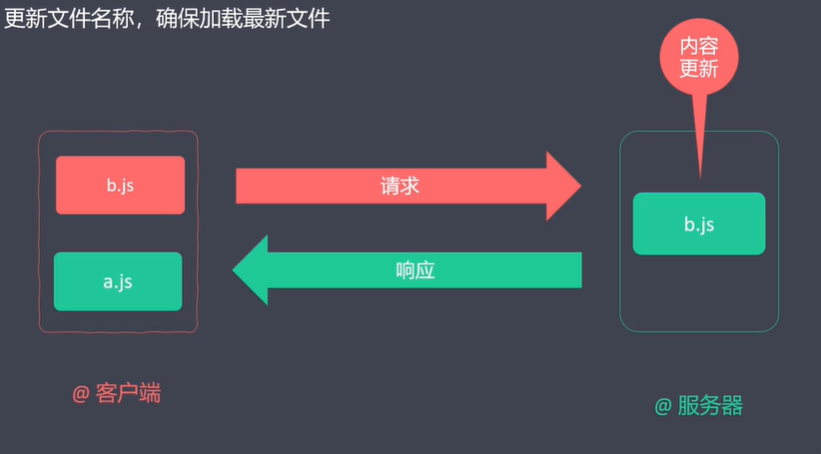

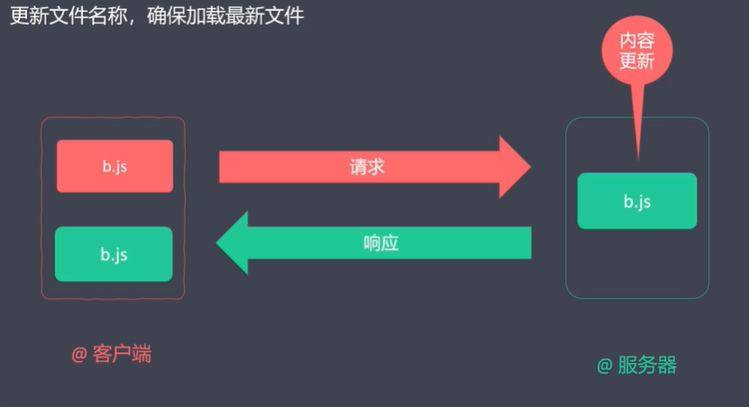

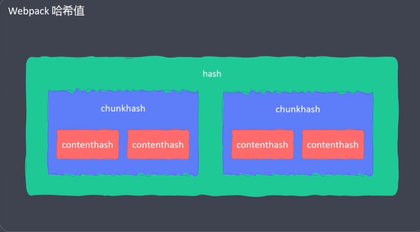


## webpack 模块解析 （resolve）

- resolve
  - 配置模块解析的规则
  - alias: 配置模块加载的路径别名
    - alias: {'@': resolve('src')}
  - extensions: 引入模块时，可以省略哪些后缀
    - extensions: [".js", ".json"]
  - https://webpack.docschina.org/configuration/resolve/

```js
  // 模块的解析规则
  resolve: {
    alias: {
      // 指定路径的别名
      '@': resolve('src')
    },
    // 指定引入文件的后缀名，再引入文件时，后缀名可以省略
    extensions: [".js", ".json", ".less"],
    // 指定模块默认加载的路径
    modules: [resolve(__dirname, './node_modules'), './node_modules']
  }
```


## webpack 排除依赖 （externals）

- externals
  - 排除打包依赖项 （防止对某个依赖库进行打包）
  - 一般来说，一些成熟的第三方库，是不需要打包的
  - 例如：Jquery，我们可以在模板文件中直接引用 CDN 中的压缩
  - https://webpack.docschina.org/configuration/externals/

```js
// 排除打包依赖项
  externals: {
    'jquery': 'jQuery'
  }
```


## webpack 模块联邦 （Module Federation）

- 多个应用，可以共享一个模块 （本地可以调用远程的模块）
- 模块提供方
  - name: 当前应用名称 （供调用方使用）
  - filename: 打包后的文件名称 （供调用方使用）
  - exposes: 暴露模块 （相当于）
    - 模块名称： 模块文件路径
- 模块使用方
  - remote：导入模块 （相当于 import）
    - 导入后的别名: "远程应用名称@远程地址/远程导出的文件名"
  - import("导入后的名称/模块名称").then(//......)
- https://webpack.docschina.org/concepts/module-federation/


## webpack 性能优化

webpacl 性能优化

- 开发环境性能优化

  - 优化打包构建速度
    - HMR
  - 优化代码调试
    - source-map

- 生产环境性能优化

  - 优化打包构建速度
    - oneOf
    - babel 缓存
    - 多进程打包
    - externals （排除依赖）
    - dll
  - 优化代码运行的性能
    - 缓存（hash-chunkhash-contenthash）
    - Tree Shaking
    - code split
    - 懒加载/预加载
    - pwa

  