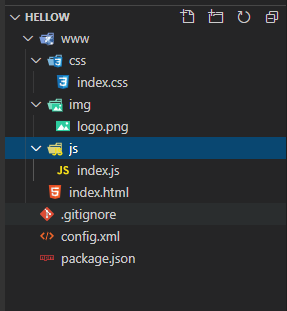
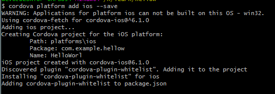
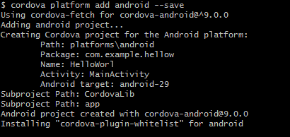
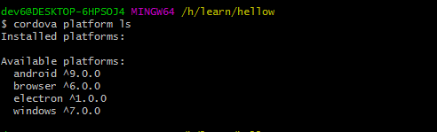
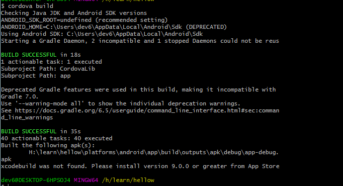
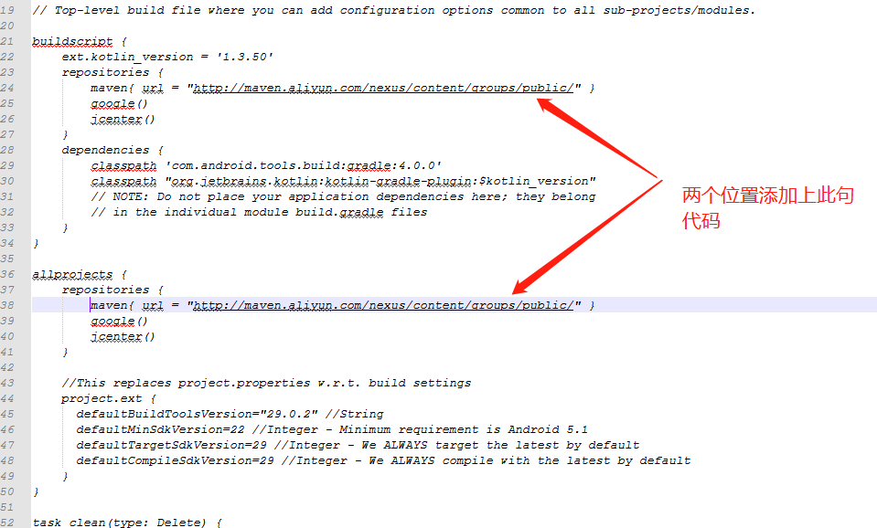

# Cordova 入门


## Cordova 起步

### 1. 安装 Cordova 

 Cordova的命令行运行在[Node.js](http://nodejs.org/) 上面并且可以通过[NPM](https://npmjs.org/package/cordova)安装。 根据 [平台具体指导]( https://cordova.axuer.com/docs/zh-cn/latest/guide/cli/index.html ) 安装相应平台的依赖。打开命令提示符或终端，然后键入`npm install -g cordova`.


### 2. 创建一个项目

使用命令行创建一个空的Cordova项目。导航到你希望创建项目的目录，然后键入 `cordova create `。要知道这个命令完整的选项，键入`cordova help create`。

```bash
cordova create hello com.example.hello HelloWorld
//cordova create 文件夹名， 反向域名地址（包名）， 项目名称
```

 这将会为你的cordova应用创造必须的目录。默认情况下，`cordova create`命令生成基于web的应用程序的骨骼，项目的主页是 `www/index.html` 文件。 

**项目目录**




### 3. 添加一个平台

在创建完一个Cordova项目后，导航到项目目录。在项目目录中，你需要添加你想构建app的平台

为了添加平台， 键入 `cordova platform add `。

为了知道你可以添加的平台，你可以运行`cordova platform`。


给你的App添加目标平台。我们将会添加'ios'和'android'平台，并确保他们保存在了`config.xml`中:

```bash
$ cordova platform add ios --save
$ cordova platform add android --save
```





检查你当前平台设置状况:

```bash
$ cordova platform ls
```



运行add或者remove平台的命令将会影响项目 *platforms*的内容，在这个目录中每个指定平台都有一个子目录。

 注意:在你使用CLI创建应用的时候， *不要* 修改`/platforms/`目录中的任何文件。当准备构建应用或者重新安装插件时这个目录通常会被重写。 


### 4. 构建App

默认情况下, `cordova create`生产基于web应用程序的骨架，项目开始页面位于`www/index.html` 文件。任何初始化任务应该在`www/js/index.js`文件中的[deviceready](https://cordova.axuer.com/docs/zh-cn/latest/cordova/events/events.html#deviceready)事件的事件处理函数中。

运行下面命令为*所有*添加的平台构建:

```bash
$ cordova build
```

你可以在每次构建中选择限制平台范围 - 这个例子中是'ios':

```bash
$ cordova build ios
```



build 成功之后，就会在 H:\learn\hellow\platforms\android\app\build\outputs\apk\debug\app-debug.apk 对应的目录下找到build 好的apk文件。


在电脑第一次构建的时候，会非常慢，会一直下载 [download fastutil-7.2.0.jar](https://www.cnblogs.com/caoxinyu/p/10568462.html)。原因是需要烦请，所以我们要修改一下`/myApp/platforms/android/`文件夹下面的 `build.gradle` 文件在其 `buildscript.repositories` 和 `allprojects.repositories ` 里面添加上

```javascript
maven{ url = "http://maven.aliyun.com/nexus/content/groups/public/" }
```

效果图如下所示：




## Cordova 事件

### deviceready cordova加载完成

当Cordova完全加载好deviceready事件会触发。这个事件对每一个应用程序都是必须的。他是Cordova设备API准备好并可以访问的信号。

一旦Cordova全部加载`deviceready`事件就会触发。一定事件出发，你可以安全的进行CordovaAPI的调用。应用程序通常一旦HTML document DOM加载完成，就会使用 `document.addEventListener`绑定一个事件监听。

`deviceready`事件和其他事件有点不同。其他事件的事件处理函数注册都是在`deviceready`事件出发的回调函数中立马执行。

简单例子

```javascript
document.addEventListener("deviceready", onDeviceReady, false);

function onDeviceReady() {
    // 现在可以安全的使用设备API
}
```


### pause 程序进入后台

 当原生平台把应用程序放入后台这个pause事件会触发，通常是用户切换到了不同的应用程序。 

简单例子：

```javascript
document.addEventListener("pause", onPause, false);

function onPause() {
    // 处理pause事件
}
```

ios的古怪行为

在`pause`处理函数中，任何的CordovaAPI调用或者通过Objective-C完成的原生插件他们是不工作的，和任何的交互调用，如`alert`和`console.log()`是一样的。只有在下一个运行时钟中，app被唤醒才会处理。

iOS的特定`resign`事件可作为`pause`的替代品，并可以检测用户启动 **Lock**按钮锁定设备和app在前台运行。如果app(和设备)支持多任务，这个事件了一系列`pause`事件是配对出现的，但是仅在iOS5。事实上，在支持多任务的iOS5中，所有被锁的应用程序都被推送到了后台。对于应用程序来说挡在iOS中被锁任然在运行的，让多任务不可用可以设置[UIApplicationExitsOnSuspend](http://developer.apple.com/library/ios/#documentation/general/Reference/InfoPlistKeyReference/Articles/iPhoneOSKeys.html)为`YES`。在iOS锁定时运行，这个设置无效。


### resume 从后台进入程序

 当原生平台将应用程序从后台运行拉出`resume`事件就会触发。 

简单例子：

```javascript
document.addEventListener("resume", onResume, false);

function onResume() {
    // 处理resume事件
}
```

#### iOS的古怪行为

任何在[pause](https://cordova.axuer.com/docs/zh-cn/latest/cordova/events/events.html#pause)事件处理函数中调用的交互方法都会在app恢复的时候执行，以`resume`事件作为信号。包括alerts、`console.log()`和其他任何来自插件和CordovaAPId的调用，他们是通过Object-C完成的。

- **active** 事件

iOS的特定`active`事件可作为`resume`的替代品，并可以检测用户关闭 **Lock**按钮解锁设备和app在前台运行。如果app(和设备)支持多任务，这个事件了一系列`resume`事件是配对出现的，但是仅在iOS5。事实上，在支持多任务的iOS5中，所有被锁的应用程序都被推送到了后台。对于应用程序来说挡在iOS中被锁任然在运行的，让多任务不可用可以设置[UIApplicationExitsOnSuspend](http://developer.apple.com/library/ios/#documentation/general/Reference/InfoPlistKeyReference/Articles/iPhoneOSKeys.html)为`YES`。在iOS锁定时运行，这个设置无效。

- **resume** 事件

  当从`resume`事件回掉中调用交互方法，比如：`alert()`需要用`setTimeout()`时间为0包裹调用，或者其他app挂起。例子：

  ```javascript
  document.addEventListener("resume", onResume, false);
  function onResume() {
      setTimeout(function() {
              // TODO: do your thing!
          }, 0);
  }
  ```


#### Android的古怪行为

参考[Android生命周期指南](https://cordova.axuer.com/docs/zh-cn/latest/guide/platforms/android/lifecycle.html)来获取关于`resume`事件在Android中古怪行为的详细信息。


### backbutton (按下返回按钮)

 当用户按下返回按钮事件触发，如果你需要重写默写行为你可以注册`backbutton`事件监听。不在需要其他调用方法来重写返回按钮的行为。 

简单例子：

```javascript
document.addEventListener("backbutton", onBackKeyDown, false);

function onBackKeyDown() {
    // 返回按钮事件的事件处理函数
}
```


### menubutton （按下菜单按钮）

 当用户按下菜单按钮事件触发，如果你需要重写默写行为你可以注册`menubutton`事件监听。 

简单例子：

```javascript
document.addEventListener("menubutton", onMenuKeyDown, false);

function onMenuKeyDown() {
    // 菜单按钮事件的事件处理函数
}
```


### searchbutton （按下搜索按钮）

 Android中当用户按下搜索按钮事件触发，如果你需要重写默写行为你可以注册'searchbutton'事件监听。 

简单例子：

```javascript
document.addEventListener("searchbutton", onSearchKeyDown, false);

function onSearchKeyDown() {
    // 搜索按钮事件的事件处理函数
}
```


### startcallbutton(按下通话按钮)

当用户按下通话按钮事件触发，如果你需要重写默写行为你可以注册`startcallbutton` 事件监听。

简单的例子

```javascript
document.addEventListener("startcallbutton", onStartCallKeyDown, false);

function onStartCallKeyDown() {
    // 通话按钮事件的事件处理函数
}
```


### endcallbutton(按下挂断通话按钮) 

 当用户按下挂断通话按钮事件触发，如果你需要重写默写行为你可以注册`endcallbutton`事件监听。 

```javascript
document.addEventListener("endcallbutton", onEndCallKeyDown, false);

function onEndCallKeyDown() {
    // 挂断通话按钮事件的事件处理函数
}
```


###  volumedownbutton(按下降低声音按钮) 

 当用户按下降低声音按钮事件触发，如果你需要重写默写行为你可以注册`volumedownbutton`事件监听。 

简单例子：

```javascript
document.addEventListener("volumedownbutton", onVolumeDownKeyDown, false);

function onVolumeDownKeyDown() {
    // 降低声音按钮事件的事件处理函数
}
```


###  volumeupbutton(按下增加声音按钮) 

 当用户按下增加声音按钮事件触发，如果你需要重写默写行为你可以注册`volumeupbutton`事件监听。 

简单例子：

```javascript
document.addEventListener("volumeupbutton", onVolumeUpKeyDown, false);

function onVolumeUpKeyDown() {
    // 增加声音按钮事件的事件处理函数
}
```


## Cordova 插件使用

### [Battery Status]( https://cordova.axuer.com/docs/zh-cn/latest/reference/cordova-plugin-battery-status/index.html ) 电池插件

cordova 对于插件的使用，需要先进行安装

1. 安装插件 `cordova plugin add cordova-plugin-battery-status`
2. 该插件可以用于监视设备电池的变化
3. 全局提供了三个时间
   - batterystatus	表示电池状态发生改变（至少1%电量变化）或者 充电状态改变触发
   - batterycritical    表示电池电量进入临界值，快关机了（大致是电量剩余5%的时候触发，其余值不触发即便是3% 或者 4% 都没有触发）
   - batterylow          表示电池电量比较低，触发（大致是电量剩余20%的时候触发，其余比20小的值也都没有触发）

注意点：插件的事件监听以及插件方法的调用，一定要在 deviceready 准备完成之后调用

所有的事件，都会返回一个 status 对象，这个对象里面有两个属性

- status.level		   表示设备电池电量的百分比 （0-100） number
- status.isPlugged  表示设备是否正在充电   boolean值   true 表示在充电， false表示不再充电

```javascript
// 检测设备是否连接成功
document.addEventListener('deviceready', onDeviceReady, false);

function onDeviceReady() {
    // 电池插件监听电池电量和充电状态
    window.addEventListener("batterystatus", onBatteryStatus, false);
}

function onBatteryStatus(status) {
  log(`level:${status.level}`)
  log(`isPlugged:${status.isPlugged}`)
  console.log("Level: " + status.level + " isPlugged: " + status.isPlugged);
}
function log (msg) {
  let p = document.createElement('p')
  p.style.fontSize = '16px'
  p.innerHTML = msg
  document.body.appendChild(p)
}
```

显示效果


### [Camera]( https://cordova.axuer.com/docs/zh-cn/latest/reference/cordova-plugin-camera/index.html ) 相机插件

**cordova-plugin-camera**

 这个插件定义了一个全局的 `navigator.camera`对象，它提供了一个用于拍照和从系统的图像库中选择图像的API。 

 尽管该对象附加到全局作用域的 `navigator`，但它只有在deviceready事件之后才可用。 

```javascript
document.addEventListener("deviceready", onDeviceReady, false);
function onDeviceReady() {
    console.log(navigator.camera);
}
```

**Installation**

这需要cordova 5.0以上

```bash
cordova plugin add cordova-plugin-camera
```

**API参考**

- camera
  -  [.getPicture(successCallback, errorCallback, options)](https://cordova.axuer.com/docs/zh-cn/latest/reference/cordova-plugin-camera/index.html#module_camera.getPicture) 
  -  [.cleanup()](https://cordova.axuer.com/docs/zh-cn/latest/reference/cordova-plugin-camera/index.html#module_camera.cleanup) 
  - [.onError](https://cordova.axuer.com/docs/zh-cn/latest/reference/cordova-plugin-camera/index.html#module_camera.onError) : `function`
  - [.onSuccess](https://cordova.axuer.com/docs/zh-cn/latest/reference/cordova-plugin-camera/index.html#module_camera.onSuccess) : `function`
  - [.CameraOptions](https://cordova.axuer.com/docs/zh-cn/latest/reference/cordova-plugin-camera/index.html#module_camera.CameraOptions) : `Object`

- [Camera](https://cordova.axuer.com/docs/zh-cn/latest/reference/cordova-plugin-camera/index.html#module_Camera)
  - [.DestinationType](https://cordova.axuer.com/docs/zh-cn/latest/reference/cordova-plugin-camera/index.html#module_Camera.DestinationType) : `enum`
  - [.EncodingType](https://cordova.axuer.com/docs/zh-cn/latest/reference/cordova-plugin-camera/index.html#module_Camera.EncodingType) : `enum`
  - [.MediaType](https://cordova.axuer.com/docs/zh-cn/latest/reference/cordova-plugin-camera/index.html#module_Camera.MediaType) : `enum`
  - [.PictureSourceType](https://cordova.axuer.com/docs/zh-cn/latest/reference/cordova-plugin-camera/index.html#module_Camera.PictureSourceType) : `enum`
  - [.PopoverArrowDirection](https://cordova.axuer.com/docs/zh-cn/latest/reference/cordova-plugin-camera/index.html#module_Camera.PopoverArrowDirection) : `enum`
  - [.Direction](https://cordova.axuer.com/docs/zh-cn/latest/reference/cordova-plugin-camera/index.html#module_Camera.Direction) : `enum`
- [CameraPopoverHandle](https://cordova.axuer.com/docs/zh-cn/latest/reference/cordova-plugin-camera/index.html#module_CameraPopoverHandle)
- [CameraPopoverOptions](https://cordova.axuer.com/docs/zh-cn/latest/reference/cordova-plugin-camera/index.html#module_CameraPopoverOptions)


<b style='color:red'>camera</b>

**camera.getPicture(successCallback, errorCallback, options)**

 使用相机拍照，或从设备的图片库中检索照片。图像作为base64编码的字符串或图像文件的URI传递给成功回调。 

successCallback 表示的是成功的回调，返回的是一个图片地址，或者 base64的字符串

errorCallback 表示的是失败的回调，返回的是一个失败的提示

options 表示的是 相机的自定义设置，都有以下参数

|   Name   |   Type   |   default   |   description   |
| :--- | :--- | ---- | ---- |
| quality | number | 50 |保存的图像的质量，表示为范围为0-100，其中100通常是完全分辨率，没有文件压缩损失。(请注意，该相机的分辨率信息不可用。)|
| destinationType | [DestinationType](https://cordova.axuer.com/docs/zh-cn/latest/reference/cordova-plugin-camera/index.html#module_Camera.DestinationType) | FILE_URI | 选择返回值的格式                                             |
| sourceType | [PictureSourceType](https://cordova.axuer.com/docs/zh-cn/latest/reference/cordova-plugin-camera/index.html#module_Camera.PictureSourceType) | CAMERA |设置图片的来源。|
| allowEdit | Boolean | true |允许简单的编辑图像之前选择。|
| encodingType | [EncodingType](https://cordova.axuer.com/docs/zh-cn/latest/reference/cordova-plugin-camera/index.html#module_Camera.EncodingType) | JPEG |选择返回的图像文件的编码。|
| targetWidth | number |  |以像素为单位的宽度来缩放图像。必须正确使用。高宽比保持不变。|
| targetHeight | number |  |以像素为单位的高度来缩放图像。必须与目标一起使用。高宽比保持不变。|
| mediaType | [MediaType](https://cordova.axuer.com/docs/zh-cn/latest/reference/cordova-plugin-camera/index.html#module_Camera.MediaType) | PICTURE |设置要从中选择的媒体类型。仅当PictureSourceType为PHOTOLIBRARY或SAVEDPHOTOALBUM时有效。|
| correctOrientation | Boolean |  |旋转图像以校正捕获期间设备的方向。|
| saveToPhotoAlbum | Boolean |  |捕获后将图像保存到设备上的相册中。|
| popoverOptions | [CameraPopoverOptions](https://cordova.axuer.com/docs/zh-cn/latest/reference/cordova-plugin-camera/index.html#module_CameraPopoverOptions) |  |仅在iPad中指定弹窗位置的ios选项。|
| cameraDirection | [Direction](https://cordova.axuer.com/docs/zh-cn/latest/reference/cordova-plugin-camera/index.html#module_Camera.Direction) | BACK |选择要使用的相机(前置或后置)。|


### [console]( https://cordova.axuer.com/docs/zh-cn/latest/reference/cordova-plugin-console/index.html ) 控制台插件

**cordova-plugin-console**

 这个插件旨在确保console.log()尽可能有用。它为iOS、Ubuntu、Windows Phone 8和Windows系统增加了额外的功能。 

这个插件定义了一个全局 `console` 对象。

尽管该对象附加到全局范围内的 `console` ，但它只有在deviceready事件之后才可用。 

```javascript
document.addEventListener("deviceready", onDeviceReady, false);
function onDeviceReady() {
    console.log("console.log works well");
}
```

**Installation**

```bash
cordova plugin add cordova-plugin-console
```

 Supported Methods 

- `console.log`
- `console.error`
- `console.exception`
- `console.warn`
- `console.info`
- `console.debug`
- `console.assert`
- `console.dir`
- `console.dirxml`
- `console.time`
- `console.timeEnd`
- `console.table`


### [Contacts]( https://cordova.axuer.com/docs/zh-cn/latest/reference/cordova-plugin-contacts/index.html ) 联系人插件

 这个插件定义了一个全局的 `navigator.contacts `  对象， 该对象提供对设备联系人数据库的访问。 

 尽管该对象附加到全局作用域的 `navigator`，但它只有在deviceready事件之后才可用。 

```javascript
document.addEventListener("deviceready", onDeviceReady, false);
function onDeviceReady() {
    console.log(navigator.contacts);
}
```

**Installation**

这需要cordova 5.0以上

```bash
cordova plugin add cordova-plugin-contacts
```


### [Device]( https://cordova.axuer.com/docs/zh-cn/latest/reference/cordova-plugin-device/index.html ) 设备插件

**cordova-plugin-device**

 这个插件定义了一个全局 `device` 对象，它描述了设备的硬件和软件。尽管该对象在全局作用域中，但它只有在deviceready事件之后才可用。 

```javascript
document.addEventListener("deviceready", onDeviceReady, false);
function onDeviceReady() {
    console.log(device.cordova);
}
```

**Installation**

```bash
cordova plugin add cordova-plugin-device
```


### [Device Motion]( https://cordova.axuer.com/docs/zh-cn/latest/reference/cordova-plugin-device-motion/index.html ) 设备运动传感器插件

**cordova-plugin-device-motion**

 这个插件提供了对设备加速计的访问。加速度计是一种运动传感器，它在x、y和z轴上检测相对于当前设备方向的运动变化(delta)。

访问是通过一个全局的 ` navigator.accelerometer ` 对象

  尽管该对象附加到全局作用域的 `navigator`，但它只有在deviceready事件之后才可用。 

```javascript
document.addEventListener("deviceready", onDeviceReady, false);
function onDeviceReady() {
    console.log(navigator.accelerometer);
}
```

**Installation**

```bash
cordova plugin add cordova-plugin-device-motion
```


### [Device Orientation]( https://cordova.axuer.com/docs/zh-cn/latest/reference/cordova-plugin-device-orientation/index.html ) 设备指南针传感器插件

**cordova-plugin-device-orientation**

 这个插件提供了对设备指南针的访问。指南针是一个传感器，用于探测设备指向的方向或方向，通常从设备的顶部开始。它测量航向的角度从0到359.99，其中0是北。 

访问是通过一个全局的 ` navigator.compass` 对象

尽管该对象附加到全局作用域的 `navigator`，但它只有在deviceready事件之后才可用。 

```javascript
document.addEventListener("deviceready", onDeviceReady, false);
function onDeviceReady() {
    console.log(navigator.compass);
}
```

**Installation**

```bash
cordova plugin add cordova-plugin-device-orientation
```


### [Dialogs]( https://cordova.axuer.com/docs/zh-cn/latest/reference/cordova-plugin-dialogs/index.html ) 原生对话框元素插件

**cordova-plugin-dialogs**

这个插件提供了 通过 全局的` navigator.notification ` 对象，访问一些原生对话框 UI元素的功能。

 尽管该对象附加到全局作用域的 `navigator`，但它只有在deviceready事件之后才可用。

```javascript
document.addEventListener("deviceready", onDeviceReady, false);
function onDeviceReady() {
    console.log(navigator.notification);
}
```

**Installation**

```bash
cordova plugin add cordova-plugin-dialogs
```


### [File]( https://cordova.axuer.com/docs/zh-cn/latest/reference/cordova-plugin-file/index.html ) 文件插件

**cordova-plugin-file**

这个插件实现了一个文件API，允许对驻留在设备上的文件进行读/写访问。 

这个插件定义了一个全局的 `cordova.file` 对象

尽管在全局范围中，它只有在deviceready事件之后才可用。 

```javascript
document.addEventListener("deviceready", onDeviceReady, false);
function onDeviceReady() {
    console.log(cordova.file);
}
```

**Installation**

```bash
cordova plugin add cordova-plugin-file
```


###  [File Transfer]( https://cordova.axuer.com/docs/zh-cn/latest/reference/cordova-plugin-file-transfer/index.html ) 文件上传下载插件

**cordova-plugin-file-transfer**

 这个插件允许你上传和下载文件。 

 这个插件定义了全局`FileTransfer`, `FileUploadOptions`构造函数。尽管在全局范围内，它们只有在deviceready事件之后才可用。 

```javascript
document.addEventListener("deviceready", onDeviceReady, false);
function onDeviceReady() {
    console.log(FileTransfer);
}
```

**Installation**

```bash
cordova plugin add cordova-plugin-file
```


###  [Geolocation]( https://cordova.axuer.com/docs/zh-cn/latest/reference/cordova-plugin-geolocation/index.html ) 设备位置插件

**cordova-plugin-geolocation**

 这个插件提供了关于设备位置的信息，比如纬度和经度。位置信息的常见来源包括全球定位系统(GPS)和从网络信号推断的位置，如IP地址、RFID、WiFi和蓝牙MAC地址和GSM/CDMA小区id。不能保证API返回设备的实际位置。 

 这个插件定义了一个全局` navigator.geolocation `。地理定位对象(用于缺少它的平台)。 

 尽管该对象在全局范围内，但此插件提供的特性只有在deviceready事件发生后才可用。 

```javascript
document.addEventListener("deviceready", onDeviceReady, false);
function onDeviceReady() {
    console.log("navigator.geolocation works well");
}
```

**Installation**

```bash
cordova plugin add cordova-plugin-geolocation
```


### [Globalization](https://cordova.axuer.com/docs/zh-cn/latest/reference/cordova-plugin-globalization/index.html) 全球化信息插件

**cordova-plugin-globalization**

 此插件获取特定于用户地区、语言和时区的信息并执行操作。请注意语言环境和语言之间的区别:语言环境控制一个区域的数字、日期和时间的显示方式，而语言独立于语言环境设置决定语言文本的显示方式。通常开发人员使用locale来设置这两个设置，但是用户没有理由不将语言设置为“英语”，而将locale设置为“法语”，这样文本就会以英语显示，而日期、时间等会以法语显示。不幸的是，大多数移动平台目前并不区分这些设置。 

这个插件定义了全局的 `navigator.globalization` 对象

尽管该对象在全局范围内，但此插件提供的特性只有在deviceready事件发生后才可用。

```javascript
document.addEventListener("deviceready", onDeviceReady, false);
function onDeviceReady() {
    console.log(navigator.globalization);
}
```

**Installation**

```bash
cordova plugin add cordova-plugin-globalization
```


### [Inappbrowser]( https://cordova.axuer.com/docs/zh-cn/latest/reference/cordova-plugin-inappbrowser/index.html )  web浏览器视图插件

**cordova-plugin-inappbrowser**

 这个插件提供了一个web浏览器视图，在调用cordova.InAppBrowser.open()时显示。 

```
var ref = cordova.InAppBrowser.open('http://apache.org', '_blank', 'location=yes');
```

 该`cordova.InAppBrowser.open()`功能被定义为该`window.open()`功能的替代品。`window.open()`通过替换window.open，现有调用可以使用InAppBrowser窗口： 

```javascript
window.open = cordova.InAppBrowser.open;
```

 InAppBrowser窗口的行为类似于标准的Web浏览器，并且无法访问Cordova API。因此，如果您需要加载第三方（不可信）内容，而不是将其加载到主Cordova Web视图中，则建议使用InAppBrowser。InAppBrowser不受白名单限制，也不会在系统浏览器中打开链接。 

 默认情况下，InAppBrowser为用户提供其自己的GUI控件（后退，前进，完成） 

 为了向后兼容，此插件还挂钩`window.open`。但是，插件安装的hook `window.open`可能具有意想不到的副作用（尤其是如果仅将此插件作为另一个插件的依赖项包含在内）。 The hook of `window.open`  将在以后的主要版本中删除。在从插件中删除钩子之前，应用程序可以手动恢复默认行为： 

```
delete window.open // Reverts the call back to it's prototype's default
```

 尽管`window.open`在全局范围内，但InAppBrowser直到`deviceready`事件发生后才可用。 

```
document.addEventListener("deviceready", onDeviceReady, false);
function onDeviceReady() {
    console.log("window.open works well");
}
```

**Installation**

```
cordova plugin add cordova-plugin-inappbrowser
```


### [Media]( https://cordova.axuer.com/docs/zh-cn/latest/reference/cordova-plugin-media/index.html )  多媒体插件

**cordova-plugin-media**

 这个插件提供了记录和播放设备上的音频文件的能力。 

这个插件定义了全局的  `Media`  构造函数

尽管在全局范围内，但此插件提供的特性只有在deviceready事件发生后才可用。

```javascript
document.addEventListener("deviceready", onDeviceReady, false);
function onDeviceReady() {
    console.log(Media);
}
```

** Installation **

```bash
cordova plugin add cordova-plugin-media
```


### [Media Capture]( https://cordova.axuer.com/docs/zh-cn/latest/reference/cordova-plugin-media-capture/index.html ) 多媒体捕获访问插件

**cordova-plugin-media-capture**

 这个插件提供了对设备的音频、图像和视频捕获功能的访问。 

这个插件定义了全局的  `navigator.device.capture`  对象

尽管在全局范围内，但此插件提供的特性只有在deviceready事件发生后才可用。

```javascript
document.addEventListener("deviceready", onDeviceReady, false);
function onDeviceReady() {
    console.log(navigator.device.capture);
}
```

**Installation**

```bash
cordova plugin add cordova-plugin-media-capture
```


### [Network Information]( https://cordova.axuer.com/docs/zh-cn/latest/reference/cordova-plugin-network-information/index.html ) 网络连接插件

**cordova-plugin-network-information**

 这个插件提供了一个旧版本的网络信息API的实现。它提供设备的蜂窝和wifi连接信息，以及设备是否有互联网连接。 

**Installation**

```bash
cordova plugin add cordova-plugin-network-information
```


### [Splashscreen]( https://cordova.axuer.com/docs/zh-cn/latest/reference/cordova-plugin-splashscreen/index.html ) 屏幕插件

**cordova-plugin-splashscreen**

 这个插件需要与启动屏幕工作。这个插件在应用程序启动时显示和隐藏启动屏幕 

**Installation**

```bash
// npm hosted (new) id
cordova plugin add cordova-plugin-splashscreen

// you may also install directly from this repo
cordova plugin add https://github.com/apache/cordova-plugin-splashscreen.git
```


### [Vibration]( https://cordova.axuer.com/docs/zh-cn/latest/reference/cordova-plugin-vibration/index.html ) 设备震动插件

**cordova-plugin-vibration**

 这个插件提供了震动设备的方法。 

 这个插件定义了全局对象，包括`navigator.vibrate`。

 尽管在全局范围内，它们只有在deviceready事件之后才可用。 

```javascript
document.addEventListener("deviceready", onDeviceReady, false);
function onDeviceReady() {
    console.log(navigator.vibrate);
}
```

 **Installation**

```bash
cordova plugin add cordova-plugin-vibration
```


### [Statusbar]()  状态栏插件

**cordova-plugin-statusbar**

 StatusBar对象提供了一些自定义iOS和Android状态栏的功能。 

**Installation**

 这种安装方法需要cordova 5.0以上 

```bash
cordova plugin add cordova-plugin-statusbar
```


### [Whitelist]( https://cordova.axuer.com/docs/zh-cn/latest/reference/cordova-plugin-whitelist/index.html ) webview白名单插件

**cordova-plugin-statusbar**

 这个插件实现了一个在Cordova 4.0上导航应用webview的白名单策略 

