# cordova 常见问题

## 1. Please install Android target / API level:"android-28"

类似这种的问题，实际过程中是缺少 android-29,那么就要去Android SDK去进行安装。

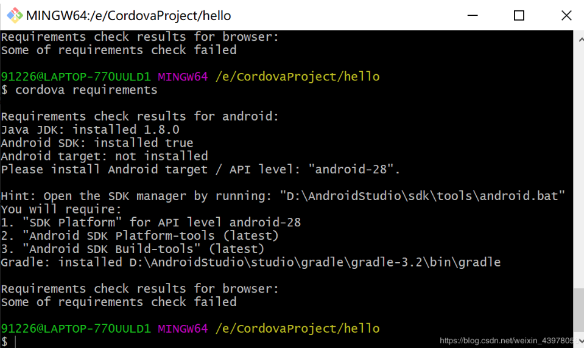

解决方案：

1.  Android API 28已经安装，若为安装，可以勾选它，并点击右下角得“Apply”按钮下载 

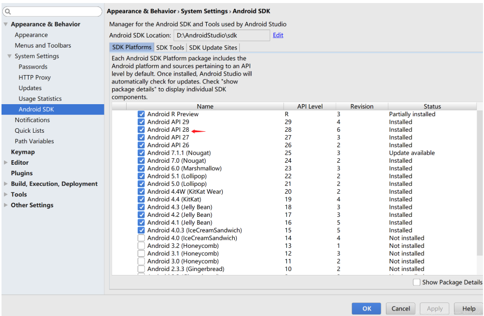

2.  点击“SDK Tools” 

 添加这三个选项：Android SDK Build-Tools 、Android SDK Platforms Tools、documentation for Android SDK
然后点击“Apply” 

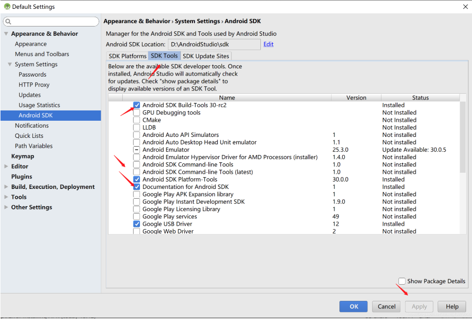

3. 重新运行命令行

```bash
cordova requiremens
```

 解决了 

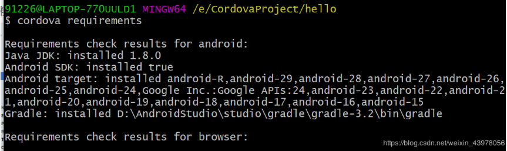


## 2. 配置 Android studio 里面的 PhoneGap/Cordova

依次点击图中所示按钮，打开 Run/Debug Configurations，点击加号，看看里面是否存在

`PhoneGap/Cordova`，第一次使用android studio 的时候，`PhoneGap/Cordova` 是不存在的，所以需要去安装插件。

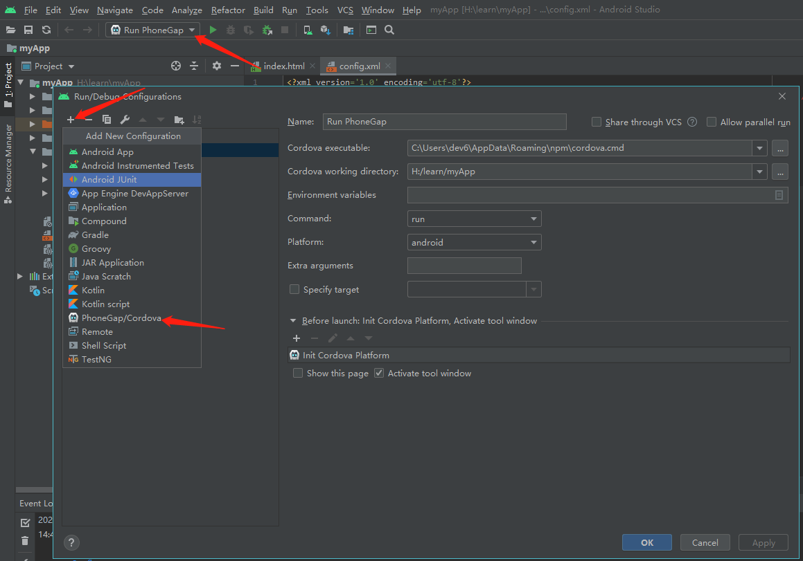

**`PhoneGap/Cordova` 不存在，安装插件过程**

点击 file（1） --> setting（2） --> plugins（3） 打开安装插件的菜单目录了

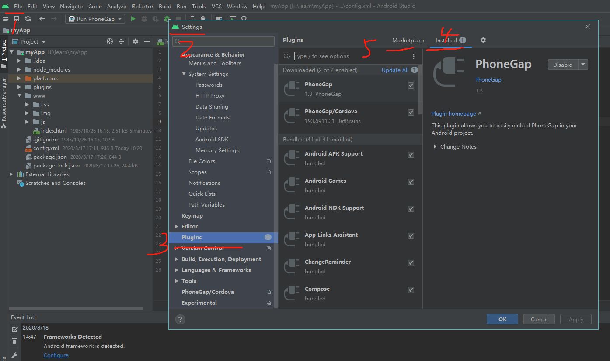

（4） Installed 表示安装成功的。

（5） MarketPlace 表示插件库里面的所有插件，未安装的。

需要在 MarketPlace 里面找到 `PhoneGap`  和 `PhoneGap/Cordova`。点击安装，安装成功之后，重启就可以在 Run/Debug Configurations 设置中找到 `PhoneGap/Cordova`。

**添加 `PhoneGap/Cordova` 启动配置**

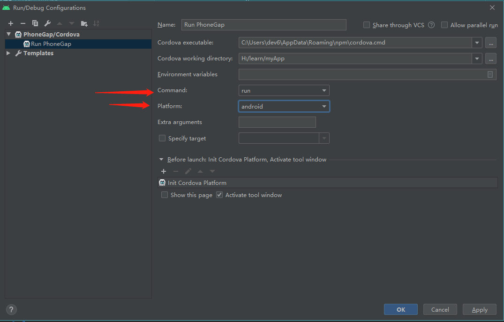

配置完成之后，点击 启动按钮，即可启动成功。

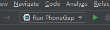


## 3. android studio 使用 安卓模拟器打开打包好的app

点击按钮，按照所示，添加一个安卓模拟器，添加完成之后是如下页面，打开右侧启动按钮，即可启动成功。

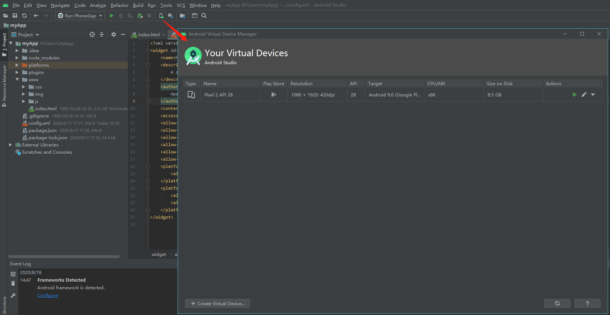

当运行 cordova 程序的时候，注意**安卓模拟器应处于关闭状态，当cordova启动之后，会自动启动安卓模拟器，并自动加载已经打包好的 app**


## 4. 打开安卓模拟器的时候报错

报错内容： Emulator: Process finished with exit code -1073741819 (0xC0000005)

修改方案：

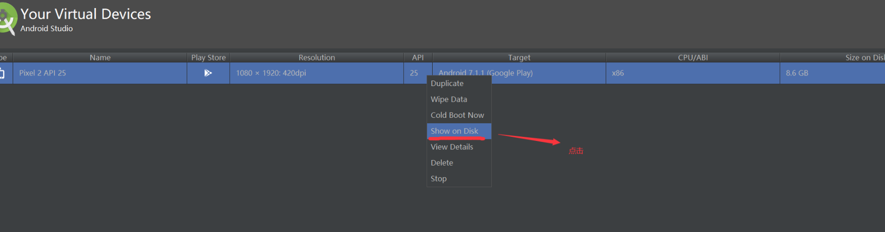

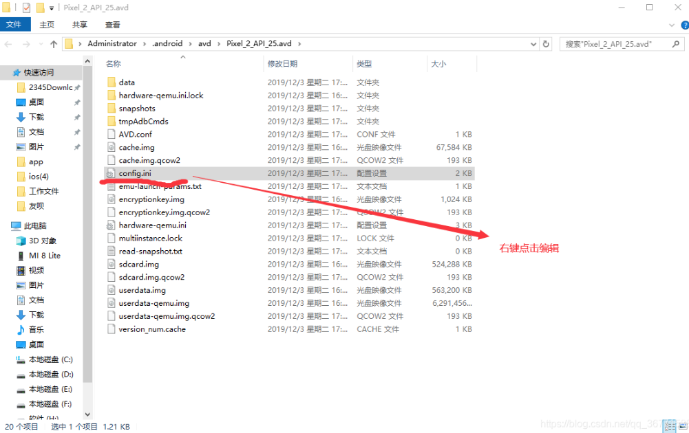

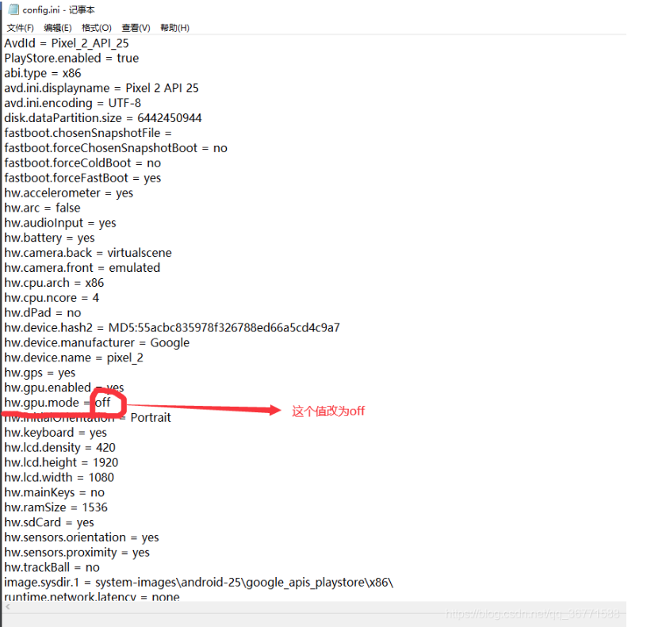

## 5 在vscode 启动并开启调试

在 vscode 中添加 cordova Tools 扩展插件，

在 debugger 页面中，添加配置，选中 Cordova： Run on Android

然后就可以在debugger中找到，Run Android on emulator 即可启动之前在 android studio 里面默认的android虚拟机，在vscode中打断点就行。

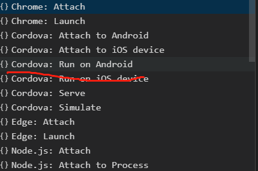

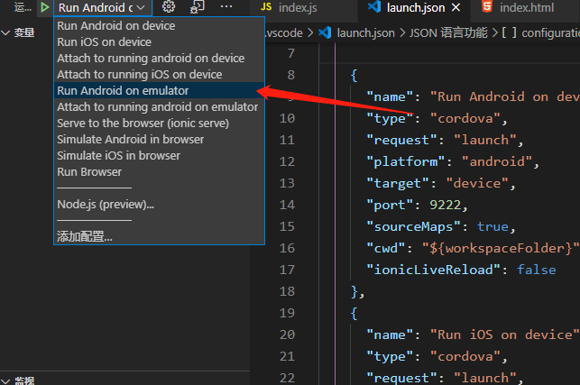

## 6 在 android studio 中调试

在 Android Studio 中，调试设置中 Command 设置为 run 的时候，启动项目会打开这个项目的虚拟机，没有办法进行调试，

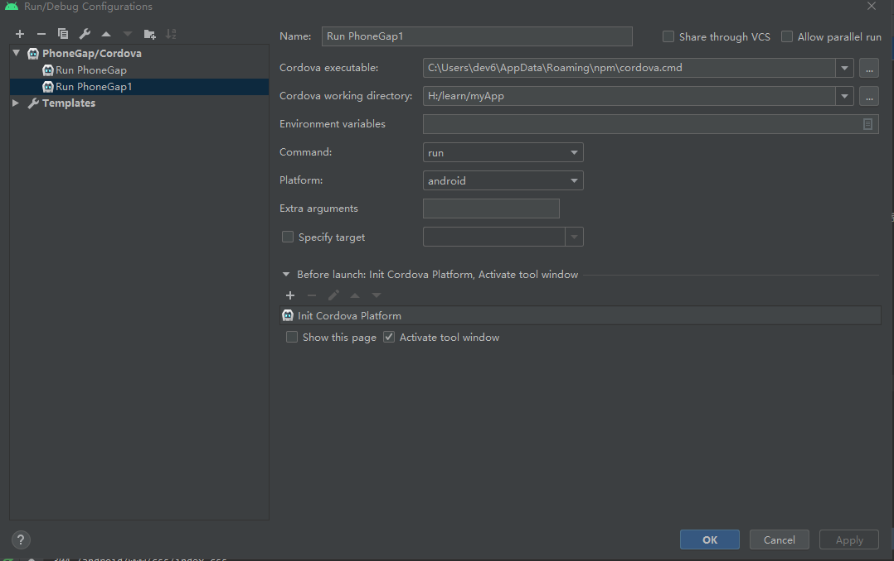

但是当 Android studio 中，调试设置中的 Command 设置为 serve 的时候，会打开一个 localhost:8000 的地址，打开browser按钮，可以在此地址里面查看页面在各个大小不同设备下的页面效果。打开页面之后，会直接显示页面链接成功，当切换到其他页面的时候，会触发（ [pause](https://cordova.axuer.com/docs/zh-cn/latest/cordova/events/events.html#pause) 事件）显示进入后台。当切回页面会触发 （  [resume]( https://cordova.axuer.com/docs/zh-cn/latest/cordova/events/events.html#resume ) ）事件。其他事件，还未操作，不知如果在页面中触发。

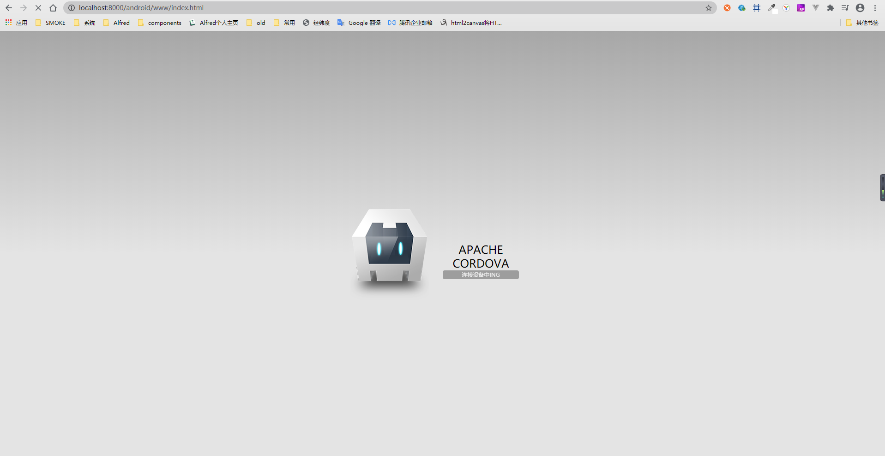

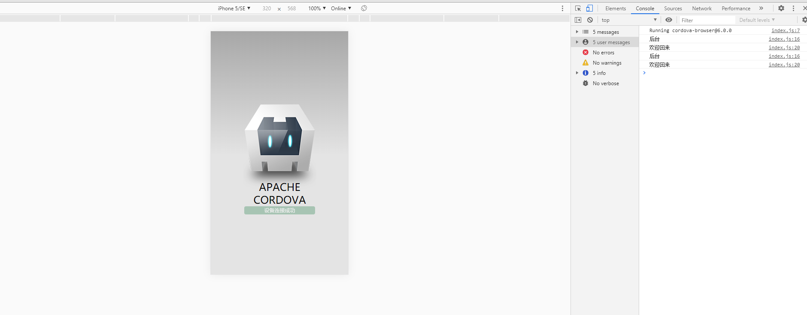