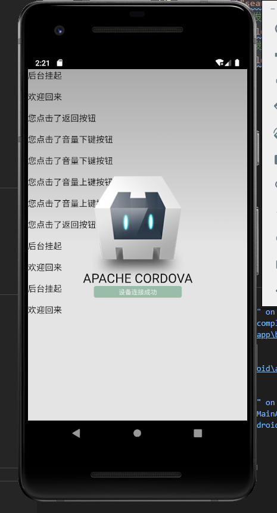
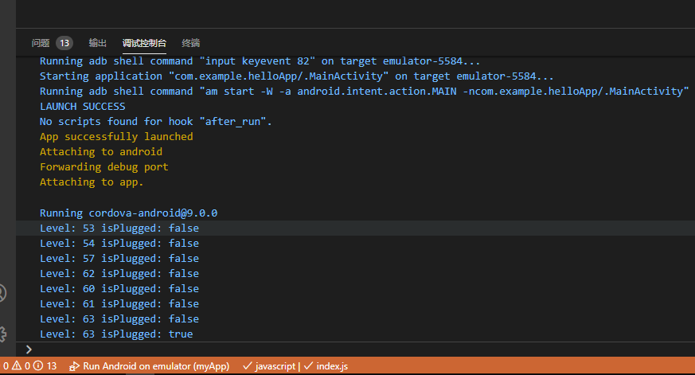
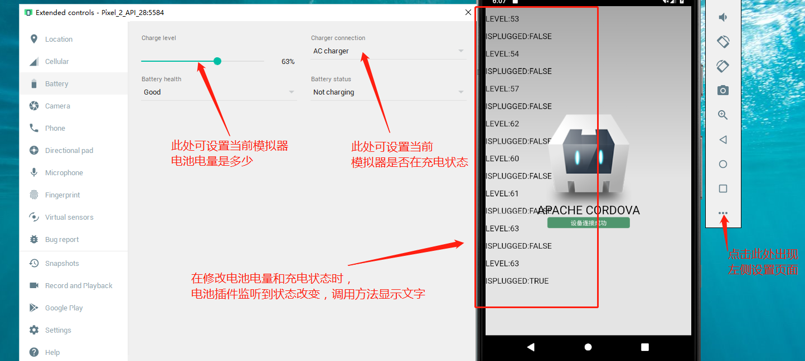
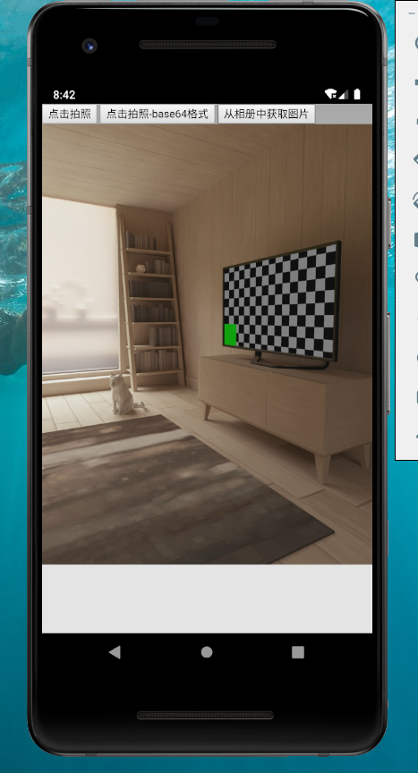

# Cordova 代码示例

## Cordova 事件

```javascript
// 检测设备是否连接成功
document.addEventListener('deviceready', onDeviceReady, false);

function onDeviceReady() {
    // cordova 连接成功之后，显示连接成功文字
    console.log('Running cordova-' + cordova.platformId + '@' + cordova.version);
    document.getElementById('deviceready').classList.add('ready');
    /* 设备连接成功之后，才可以调用Cordova的原生事件 */
    // 当原生平台把应用程序放入后台这个pause事件会触发，通常是用户切换到了不同的应用程序。
    document.addEventListener("pause", onPause, false);
    // 当原生平台将应用程序从后台运行拉出resume事件就会触发。
    document.addEventListener("resume", onResume, false);
    // 当用户按下返回按钮事件触发，如果你需要重写默写行为你可以注册backbutton事件监听。不在需要其他调用方法来重写返回按钮的行为。
    document.addEventListener("backbutton", onBackKeyDown, false);
    // 当用户按下菜单按钮事件触发，如果你需要重写默写行为你可以注册menubutton事件监听。
    document.addEventListener("menubutton", onMenuKeyDown, false);
    // Android中当用户按下搜索按钮事件触发，如果你需要重写默写行为你可以注册'searchbutton'事件监听。
    document.addEventListener("searchbutton", onSearchKeyDown, false);
    // 当用户按下降低声音按钮事件触发，如果你需要重写默写行为你可以注册volumedownbutton事件监听。
    document.addEventListener("volumedownbutton", onVolumeDownKeyDown, false);
    // 当用户按下增加声音按钮事件触发，如果你需要重写默写行为你可以注册volumeupbutton事件监听。
    document.addEventListener("volumeupbutton", onVolumeUpKeyDown, false);
}
function onPause() {
  log('后台挂起')
}

function onResume () {
  log('欢迎回来')
}

function onBackKeyDown() {
  log('您点击了返回按钮')
}

function onMenuKeyDown() {
  log('您点击了菜单按钮')
}

function onSearchKeyDown() {
  log('您点击了搜索按钮')
}
function onVolumeDownKeyDown() {
  log('您点击了音量下键按钮')
}

function onVolumeUpKeyDown() {
  log('您点击了音量上键按钮')
}

function log (msg) {
  let p = document.createElement('p')
  p.style.fontSize = '16px'
  p.innerHTML = msg
  document.body.appendChild(p)
}
```

效果展示：



此段代码中，监听了菜单按钮和搜索按钮，但在测试过程中，未发现此按钮，所以未能测试出来。


## Cordova bettary电池插件

```javascript
// 检测设备是否连接成功
document.addEventListener('deviceready', onDeviceReady, false);

function onDeviceReady() {
    // cordova 连接成功之后，显示连接成功文字
    console.log('Running cordova-' + cordova.platformId + '@' + cordova.version);
    document.getElementById('deviceready').classList.add('ready');
    /* 设备连接成功之后，才可以调用Cordova的原生事件 */
    
    // 电池插件监听电池电量和充电状态事件
    window.addEventListener("batterystatus", onBatteryStatus, false);
    // 电池插件监听电池电量不足事件
    window.addEventListener("batterylow", onbatterylow, false);
    // 电池插件监听电池电量进入临界值，快关机了
    window.addEventListener("batterycritical", onbatterycritical, false);
}


function onBatteryStatus(status) {
  log(`level:${status.level}`)
  log(`isPlugged:${status.isPlugged}`)
  console.log("Level: " + status.level + " isPlugged: " + status.isPlugged);
}

function onbatterylow(status) {
  log(`onbatterylow:${status.level}`)
  console.log("onbatterylowLevel: " + status.level + " onbatterylowisPlugged: " + status.isPlugged);
}

function onbatterycritical(status) {
  log(`onbatterycritical:${status.level}`)
  console.log("onbatterycriticalLevel: " + status.level + " onbatterycriticalisPlugged: " + status.isPlugged);
}

function log (msg) {
  let p = document.createElement('p')
  p.style.fontSize = '16px'
  p.innerHTML = msg
  document.body.appendChild(p)
}
```






## cordova camera 插件

```html
<!DOCTYPE html>
<html>
    <head>
        <meta charset="utf-8">
        <meta http-equiv="Content-Security-Policy" content="default-src 'self' data: gap: https://ssl.gstatic.com 'unsafe-eval'; style-src 'self' 'unsafe-inline'; media-src *; img-src 'self' data: content:;">
        <meta name="format-detection" content="telephone=no">
        <meta name="msapplication-tap-highlight" content="no">
        <meta name="viewport" content="initial-scale=1, width=device-width, viewport-fit=cover">
        <meta name="color-scheme" content="light dark">
        <link rel="stylesheet" href="css/index.css">
        <title>Hello Cordova</title>
    </head>
    <body>
        <button id="btn1">点击拍照</button>
        <button id="btn2">点击拍照-base64格式</button>
        <button id="btn3">从相册中获取图片</button>
        

        <script src="cordova.js"></script>
        <script src="js/index.js"></script>
    </body>
</html>

```

```javascript
/**
 * cordova 中提供了，可以调用摄像头设备的 api， 需要安装对应的插件
 * 1. 添加插件 cordova plugin add cordova-plugin-camera
 * 2. 这个插件提供了一个全局对象 navigate.camera 提供了一系列 api
 *    这些 api，可以帮助我们拍照，或者从相册中读取图片
 *    注意：需要在 deviceready 完成后，才能获取 navigator.camera 对象
 *    在 navigator.camera 对象中，提供了一个方法， getPicture(success, error, options)
 *    getPicture 可以用于拍照 或者 从相册中读取图片
 */

/**
 * 需求
 * 1. 点击按钮，拍摄照片，显示在页面中
 * 2. 点击按钮，从相册中， 找到图片，显示在页面中
 */

var btn1 = document.getElementById('btn1') // 拍照
var btn2 = document.getElementById('btn2') // 拍照，返回base64格式
var btn3 = document.getElementById('btn3') // 从相册中选图片
var img = document.querySelector('img') // 查找img标签
// 检测设备是否连接成功
document.addEventListener('deviceready', onDeviceReady, false);

function onDeviceReady() {
  // cordova 连接成功之后，显示连接成功文字
  // console.log('Running cordova-' + cordova.platformId + '@' + cordova.version);
  // document.getElementById('deviceready').classList.add('ready');
  
  btn1.addEventListener('click', tackPic)
  btn2.addEventListener('click', tackPicBase64)
  btn3.addEventListener('click', getPic)
}

function tackPic() {
  // 点击拍照按钮，再次调用 getPicture 方法可以进行拍照
  console.log('点击了拍照按钮')
  navigator.camera.getPicture(success, error, {
    quality: 50,  // 表示图片的质量，默认值 50， 范围 0-100
    destinationType: Camera.DestinationType.FILE_URI, // 表示显示的时候，返回图片的url地址
    sourceType: Camera.PictureSourceType.CAMERA // 表示通过相机进行拍照
  })
  
  function success(params) {
    console.log('拍照成功')
    // 拍照成功返回的是一个 success： file:///storage/emulated/0/Android/data/com.example.helloApp/cache/1597823472665.jpg
    console.log('success：', params)
    img.src = params
  }
  function error(params) {
    console.log("拍照失败");
    // 拍照失败 error： No Image Selected
    console.log("error：", params);
  }
}

function tackPicBase64() {
  navigator.camera.getPicture(success, error, {
    quality: 50, // 表示图片的质量，默认值 50， 范围 0-100
    destinationType: Camera.DestinationType.DATA_URL, // 表示显示的时候，返回图片的url地址
    sourceType: Camera.PictureSourceType.CAMERA, // 表示通过相机进行拍照
  })

  function success( base64Str ) {
    console.log("拍照成功");
    // 默认读取的 base64 编码后的图片，是没有前面的格式说明的
    console.log("success：", base64Str);
    // 因为 camera.options 里面默认设置的encodingType是 JPEG
    let str = "data:image/jpeg;base64, " + base64Str;
    img.src = str;
  }
  function error(params) {
    console.log("拍照失败");
    console.log("error：", params);
  }
}

function getPic() {
  navigator.camera.getPicture(success, error, {
    quality: 50, // 表示图片的质量，默认值 50， 范围 0-100
    destinationType: Camera.DestinationType.FILE_URI, // 表示显示的时候，返回图片的url地址
    sourceType: Camera.PictureSourceType.PHOTOLIBRARY, // 表示通过相机进行拍照
  });

  function success(params) {
    console.log("从相册获取图片成功");
    // 拍照成功返回的是一个 success： file:///storage/emulated/0/Android/data/com.example.helloApp/cache/1597823472665.jpg
    console.log("success：", params);
    img.src = params;
  }
  function error(params) {
    console.log("从相册获取图片失败");
    // 拍照失败 error： No Image Selected
    console.log("error：", params);
  }
}
```

