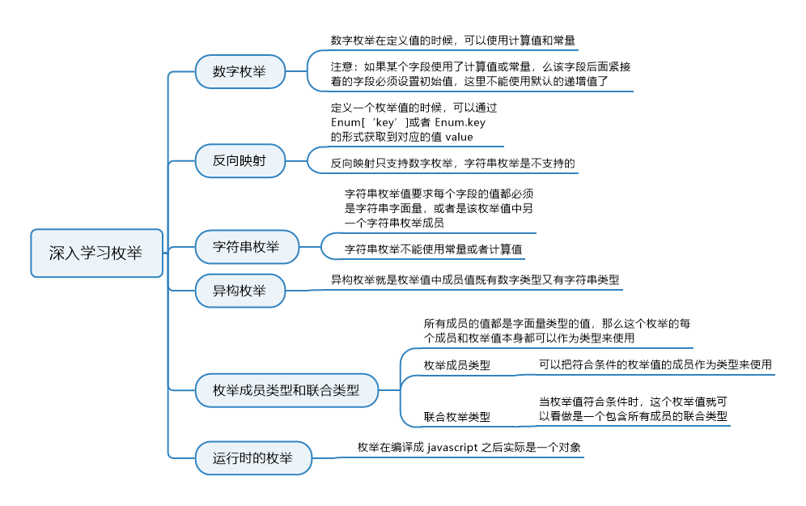

# 8. 枚举

枚举是 TypeScript 新增加的一种数据类型，这在其他很多语言中很常见，但是 JavaScript 却没有。使用枚举，我们可以给一些难以理解的常量赋予一组具有意义的直观的名字，使其更为直观，你可以理解枚举就是一个字典。枚举使用 `enum` 关键字定义，TypeScript 支持数字和字符串的枚举。

## 8.1 知识图谱



## 8.2 数字枚举

我们先来通过数字枚举的简单例子，来看下枚举是做什么的：

```typescript
enum Status {// 这里你的TSLint可能会报一个：枚举声明只能与命名空间或其他枚举声明合并。这样的错误，这个不影响编译，声明合并的问题我们在后面的小节会讲。
  Uploading,
  Success,
  Failed
}
console.log(Status.Uploading); // 0
console.log(Status["Success"]); // 1
console.log(Status.Failed); // 2
```

我们使用`enum`关键字定义了一个枚举值 Status，它包含三个字段，每个字段间用逗号隔开。我们使用枚举值的元素值时，就像访问对象的属性一样，你可以使用`’.‘`操作符和`’[]'`两种形式访问里面的值，这和对象一样。

再来看输出的结果，`Status.Uploading` 是 0，`Status['Success']`是 1，`Status.Failed` 是 2，我们在定义枚举 Status 的时候，并没有指定索引号，是因为这是默认的编号，我们也可以自己指定：

```typescript
// 修改起始编号
enum Color {
  Red = 2,
  Blue,
  Yellow
}
console.log(Color.Red, Color.Blue, Color.Yellow); // 2 3 4
// 指定任意字段的索引值
enum Status {
  Success = 200,
  NotFound = 404,
  Error = 500
}
console.log(Status.Success, Status.NotFound, Status.Error); // 200 404 500
// 指定部分字段，其他使用默认递增索引
enum Status {
  Ok = 200,
  Created,
  Accepted,
  BadRequest = 400,
  Unauthorized
}
console.log(Status.Created, Status.Accepted, Status.Unauthorized); // 201 202 401
```

**数字枚举**在定义值的时候，可以使用计算值和常量。但是要注意，如果某个字段使用了计算值或常量，那么该字段后面紧接着的字段必须设置初始值，这里不能使用默认的递增值了，来看例子：

```typescript
const getValue = () => {
  return 0;
};
enum ErrorIndex {
  a = getValue(),
  b, // error 枚举成员必须具有初始化的值
  c
}
enum RightIndex {
  a = getValue(),
  b = 1,
  c
}
const Start = 1;
enum Index {
  a = Start,
  b, // error 枚举成员必须具有初始化的值
  c
}
```


## 8.3 反向枚举

我们定义一个枚举值的时候，可以通过` Enum[‘key’]`或者 `Enum.key` 的形式获取到对应的值 value。TypeScript 还支持反向映射，**但是反向映射只支持数字枚举**，我们后面要讲的字符串枚举是不支持的。来看下反向映射的例子：

```typescript
enum Status {
  Success = 200,
  NotFound = 404,
  Error = 500
}
console.log(Status["Success"]); // 200
console.log(Status[200]); // 'Success'
console.log(Status[Status["Success"]]); // 'Success'
```

TypeScript 中定义的枚举，编译之后其实是对象，我们来看下上面这个例子中的枚举值 Status 编译后的样子：

> 我们可以直接使用tsc指定某个文件或者不指定文件直接编译整个目录，运行后就会产生相应的编译后的JavaScript文件，你也可以到TypeScript官方文档提供的[在线练习场](http://www.typescriptlang.org/play/index.html)，在这里你可以编写TypeScript代码，它会同步进行编译。实时编译为JavaScript代码，是你了解编译后结果的好方式。

```javascript
{
    200: "Success",
    404: "NotFound",
    500: "Error",
    Error: 500,
    NotFound: 404,
    Success: 200
}
```

可以看到，TypeScript 会把我们定义的枚举值的字段名分别作为对象的属性名和值，把枚举值的字段值分别作为对象的值和属性名，同时添加到对象中。这样我们既可以通过枚举值的字段名得到值，也可以通过枚举值的值得到字段名。


## 8.4 字符串枚举

TypeScript2.4 版本新增了字符串枚举，字符串枚举值要求每个字段的值都必须是字符串字面量，或者是该枚举值中另一个字符串枚举成员，先来看个简单例子：

```typescript
enum Message {
  Error = "Sorry, error",
  Success = "Hoho, success"
}
console.log(Message.Error); // 'Sorry, error'
```

再来看我们使用枚举值中其他枚举成员的例子：

```typescript
enum Message {
  Error = "error message",
  ServerError = Error,
  ClientError = Error
}
console.log(Message.Error); // 'error message'
console.log(Message.ServerError); // 'error message'
```

注意，这里的其他枚举成员指的是同一个枚举值中的枚举成员，因为字符串枚举不能使用常量或者计算值，所以也不能使用其他枚举值中的成员。


## 8.5 异构枚举

简单来说异构枚举就是枚举值中成员值既有数字类型又有字符串类型，如下：

```typescript
enum Result {
  Faild = 0,
  Success = "Success"
}
```

但是这种**如果不是真的需要，不建议使用**。因为往往我们将一类值整理为一个枚举值的时候，它们的特点是相似的。比如我们在做接口请求时的返回状态码，如果是状态码都是数值，如果是提示信息，都是字符串，所以在使用枚举的时候，**往往是可以避免使用异构枚举的，重点是做好类型的整理。**


## 8.6 枚举成员类型和联合枚举类型

如果枚举值里所有成员的值都是字面量类型的值，那么这个枚举的每个成员和枚举值本身都可以作为类型来使用，先来看下满足条件的枚举成员的值有哪些：

- 不带初始值的枚举成员，例如`enum E { A }`
- 值为字符串字面量，例如`enum E { A = ‘a’ }`
- 值为数值字面量，或者带有`-`符号的数值字面量，例如`enum E { A = 1 }`、`enum E { A = -1 }`

当我们的枚举值的所有成员的值都是上面这三种情况的时候，枚举值和成员就可以作为类型来用：

### 8.6.1 枚举成员类型

我们可以把符合条件的枚举值的成员作为类型来使用，来看例子：

```typescript
enum Animal {
  Dog = 1,
  Cat = 2
}
interface Dog {
  type: Animal.Dog; // 这里使用Animal.Dog作为类型，指定接口Dog的必须有一个type字段，且类型为Animal.Dog
}
interface Cat {
  type: Animal.Cat; // 这里同上
}
let cat1: Cat = {
  type: Animal.Dog // error [ts] 不能将类型“Animal.Dog”分配给类型“Animal.Cat”
};
let dog: Dog = {
  type: Animal.Dog
};
```


### 8.6.2 联合枚举类型

当我们的枚举值符合条件时，这个枚举值就可以看做是一个包含所有成员的联合类型，先来看例子：

```typescript
enum Status {
  Off,
  On
}
interface Light {
  status: Status;
}
enum Animal {
  Dog = 1,
  Cat = 2
}
const light1: Light = {
  status: Animal.Dog // error 不能将类型“Animal.Dog”分配给类型“Status”
};
const light2: Light = {
  status: Status.Off
};
const light3: Light = {
  status: Status.On
};
```

上面例子定义接口 Light 的 status 字段的类型为枚举值 Status，那么此时 status 的属性值必须为 Status.Off 和 Status.On 中的一个，也就是相当于`status: Status.Off | Status.On`。


## 8.7 运行时的枚举

枚举在编译成 JavaScript 之后实际是一个对象。这个我们前面讲过了，既然是对象，那么就可以当成对象来使用，我们来看个例子：

```typescript
enum E {
  A,
  B
}
const getIndex = (enumObj: { A: number }): number => {
  return enumObj.A;
};
console.log(getIndex(E)); // 0
```

上面这个例子要求 getIndex 的参数为一个对象，且必须包含一个属性名为’A’的属性，其值为数值类型，只要有这个属性即可。当我们调用这个函数，把枚举值 E 作为实参传入是可以的，因为它在运行的时候是一个对象，包含’A’这个属性，因为它在运行的时候相当于下面这个对象：

```javascript
{
    0: "A",
    1: "B",
    A: 0,
    B: 1
}
```


## 8.8 完全嵌入的枚举

我们定义了枚举值之后，编译成 JavaScript 的代码会创建一个对应的对象，这个对象我们可以在程序运行的时候使用。但是如果我们使用枚举只是为了让程序可读性好，并不需要编译后的对象呢？这样会增加一些编译后的代码量。所以 TypeScript 在 1.4 新增 <b style="color:red">const enum*(完全嵌入的枚举)*</b>，在之前讲的定义枚举的语句之前加上`const`关键字，这样编译后的代码不会创建这个对象，只是会从枚举里拿到相应的值进行替换，来看我们下面的定义：

```typescript
enum Status {
  Off,
  On
}
const enum Animal {
  Dog,
  Cat
}
const status = Status.On;
const animal = Animal.Dog;
```

上面的例子编译成 JavaScript 之后是这样的：

```javascript
var Status;
(function(Status) {
  Status[(Status["Off"] = 0)] = "Off";
  Status[(Status["On"] = 1)] = "On";
})(Status || (Status = {}));
var status = Status.On;
var animal = 0; /* Dog */
```

我们来看下 Status 的处理，先是定义一个变量 Status，然后定义一个立即执行函数，在函数内给 Status 添加对应属性，首先`Status[“Off”] = 0`是给`Status`对象设置`Off`属性，并且值设为 0，这个赋值表达式的返回值是等号右边的值，也就是 0，所以`Status[Status[“Off”] = 0] = "Off"`相当于`Status[0] = “Off”`。创建了这个对象之后，将 Status 的 On 属性值赋值给 status；再来看下 animal 的处理，我们看到编译后的代码并没有像`Status`创建一个`Animal`对象，而是直接把`Animal.Dog`的值`0`替换到了`const animal = Animal.Dog`表达式的`Animal.Dog`位置，这就是**const enum**的用法了。