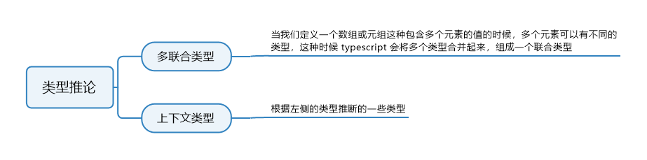
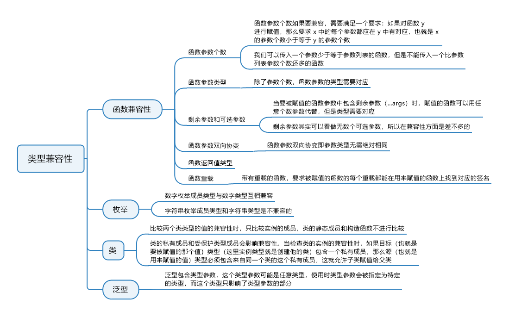

# 9 类型推论和兼容性

## 9.1 知识图谱





## 9.2 类型推论

### 9.2.1 基础

在学习基础部分的章节时，我们讲过，在一些定义中如果你没有明确指定类型，编译器会自动推断出适合的类型；比如下面的这个简单例子：

```typescript
let name = "lison";
name = 123; // error 不能将类型“123”分配给类型“string”
```

我们看到，在定义变量 name 的时候我们并没有指定 name 的类型，而是直接给它赋一个字符串。当我们再给 name 赋一个数值的时候，就会报错。在这里，TypeScript 根据我们赋给 name 的值的类型，推断出我们的 name 的类型，这里是 string 类型，当我们再给 string 类型的 name 赋其他类型值的时候就会报错。

这个是最基本的类型推论，根据右侧的值推断左侧变量的类型，接下来我们看两个更复杂的推论。


### 9.2.2 多类型联合

当我们定义一个数组或元组这种包含多个元素的值的时候，多个元素可以有不同的类型，这个时候 TypeScript 会将多个类型合并起来，组成一个联合类型，来看例子：

```typescript
let arr = [1, 'a']
arr = ['b', 2, false] // error 不能将类型 ‘false’ 分配给类型 ‘string | number'
```

可以看到，此时的 arr 的元素被推断为 string | number，也就是元素可以是 string 类型也可以是 number 类型，除此两种类型外的类型是不可以的。再来看个例子：

```typescript
let value = Math.random() * 10 > 5 ? 'abc' : 123
value = false // error不能将类型 ’false‘ 分配给类型 ’string | number'
```

这里我们给value赋值为一个三元操作符表达式，`Math.random() * 10`的值为0-10的随机数。这里判断，如果这个随机值大于5，则赋给value的值为字符串’abc’，否则为数值123，所以最后编译器推断出的类型为联合类型`string | number`，当给它再赋值为false的时候就会报错。


### 9.2.3 上下文类型

我们上面讲的两个例子都是根据`=`符号右边值的类型，推断左侧值的类型。现在要讲的上下文类型则相反，它是根据左侧的类型推断右侧的一些类型，先来看例子：

```typescript
window.onmousedown = function(mouseEvent) {
  console.log(mouseEvent.a); // error 类型“MouseEvent”上不存在属性“a”
};
```

我们可以看到，表达式左侧是 window.onmousedown(鼠标按下时发生事件)，因此 TypeScript 会推断赋值表达式右侧函数的参数是事件对象，因为左侧是 mousedown 事件，所以 TypeScript 推断 mouseEvent 的类型是 MouseEvent。在回调函数中使用 mouseEvent 的时候，你可以访问鼠标事件对象的所有属性和方法，当访问不存在属性的时候，就会报错。


### 9.2.4 小结

本小节我们学习了TypeScript编译器进行类型推断的论据，其中有两种是由右推左的，也就是在赋值时根据右侧要赋的具体值，推断左侧要赋值的目标的类型，包括基本推论和多类型联合推论。基础推论是最基础的推论，多类型联合推论是根据数组、代码逻辑等，推断出多个符合的类型，然后组成联合类型的推论。还有一种由左推右的推论，我们是通过给元素绑定事件来讲解的，根据左侧要赋值的目标，来推断出右侧要赋的值中的一些类型信息。


## 9.3 函数兼容性

### 9.3.1 函数参数个数

函数参数个数如果要兼容，需要满足一个要求：**如果对函数 y 进行赋值，那么要求 x 中的每个参数都应在 y 中有对应，也就是 x 的参数个数小于等于 y 的参数个数**，来看例子：

```typescript
let x = (a: number) => 0
let y = (b: number, c:string) => 0
```

上面定义的两个函数，如果进行赋值的话，来看下两种情况的结果：

```typescript
y = x; // 没问题
```

将 x 赋值给 y 是可以的，因为如果对函数 y 进行赋值，那么要求 x 中的每个参数都应在 y 中有对应，也就是 x 的参数个数小于等于 y 的参数个数，而至于参数名是否相同是无所谓的。

```typescript
x = y // error Type '(b: number, s: string) => number' is not assignable to type '(a: number) => number'
```

这个例子中，y 要赋值给 x，但是 y 的参数个数要大于 x，所以报错。

这可能不好理解，我们用另一个例子来解释下：

```typescript
const arr = [1, 2, 3]
arr.forEach((item, index, array) => {
    console.log(item)
})
arr.forEach((item) => {
    console.log(item)
})
```

这个例子中，传给 forEach 的回调函数的参数是三个，但是可以只用一个，这样就只需写一个参数。我们传入的 forEach 的函数是 forEach 的参数，它是一个函数，这个函数的参数列表是定义在 forEach 方法内的，我们可以传入一个参数少于等于参数列表的函数，但是不能传入一个比参数列表参数个数还多的函数。


### 9.3.2 函数参数类型

除了参数个数，参数的类型需要对应：

```typescript
let x = (a: number) => 0;
let y = (b: string) => 0;
let z = (c: string) => false;
x = y; // error 不能将类型“(b: string) => number”分配给类型“(a: number) => number”。
x = z; // error 不能将类型“(c: string) => boolean”分配给类型“(a: number) => number”。
```

我们看到 x 和 y 两个函数的参数个数和返回值都相同，只是参数类型对不上，所以也是不行的。

如果函数 z 想要赋值给 x，要求 y 的返回值类型必须是 x 的返回值类型的子类型，这个例子中 x 函数的返回值是联合类型，也就是返回值既可以是 string 类型也可以是 number 类型。而 y 的返回值类型是 number 类型，参数个数和类型也没问题，所以可以赋值给 x。而 z 的返回值类型 false 并不是 string 也不是 number，所以不能赋值。


### 9.3.3 剩余参数和可选参数

当要被赋值的函数参数中包含剩余参数（…args）时，赋值的函数可以用任意个数参数代替，但是类型需要对应。来看例子：

```typescript
const getNum = ( // 这里定义一个getNum函数，他有两个参数
  arr: number[], // 第一个参数是一个数组
  callback: (...args: number[]) => number // 第二个参数是一个函数，这个函数的类型要求可以传入任意多个参数，但是类型必须是数值类型，返回值必须是数值类型
): number => {
  return callback(...arr); // 这个getNum函数直接返回调用传入的第二个参数这个函数，以第一个参数这个数组作为参数的函数返回值
};
getNum(
  [1, 2],
  (...args: number[]): number => args.length // 这里传入一个函数，逻辑是返回参数的个数
);
```

剩余参数其实可以看做无数个可选参数，所以在兼容性方面是差不多的，我们来看个可选参数和剩余参数结合的例子：

```typescript
const getNum = (
  arr: number[],
  callback: (arg1: number, arg2?: number) => number // 这里指定第二个参数callback是一个函数，函数的第二个参数为可选参数
): number => {
  return callback(...arr); // error 应有 1-2 个参数，但获得的数量大于等于 0
};
```

这里因为arr可能为空数组或不为空，如果为空数组则…arr不会给callback传入任何实际参数，所以这里报错。如果我们换成`return callback(arr[0], …arr)`就没问题了。


### 9.3.4 函数参数双向协变

函数参数双向协变即参数类型无需绝对相同，来看个例子：

```typescript
let x = (a: number): string | number => 0
let y = (b: number) => 'a'
let z = (c: number) => false
x = y
x = z  // error 不能将类型“(arg1: number, arg2: number) => number”分配给类型“{ (arg1: number, arg2: number): number; (arg1: string, arg2: string): string; }”
```

上面例子中，sum函数的重载缺少参数都为string返回值为string的情况，与merge函数不兼容，所以赋值时会报错。


## 9.4 枚举

数字枚举成员类型与数字类型互相兼容，来看例子：

```typescript
enum Status {
    On,
    Off
}
enum Color {
    White,
    Black
}
let s = Status.On
s = Color.White; // error Type 'Color.White' is not assignable to type 'Status'
```

可以看到，虽然 Status.On 和 Color.White 的值都是 0，但它们是不兼容的。

字符串枚举成员类型和字符串类型是不兼容的，来看例子：

```typescript
enum Status {
  On = 'on',
  Off = 'off'
}
let s = Status.On
s = 'Lison' // error 不能将类型“"Lison"”分配给类型“Status”
```

这里会报错，因为字符串字面量类型`'Lison'`和Status.On是不兼容的。


## 9.5 类

**基本比较**

比较两个类类型的值的兼容性时，只比较实例的成员，类的静态成员和构造函数不进行比较：

```typescript
class Animal {
  static age: number;
  constructor(public name: string) {}
}
class People {
  static age: string;
  constructor(public name: string) {}
}
class Food {
  constructor(public name: number) {}
}
let a: Animal;
let p: People;
let f: Food;
a = p; // right
a = f; // error Type 'Food' is not assignable to type 'Animal'
```

上面例子中，Animal类和People类都有一个age静态属性，它们都定义了实例属性name，且name的类型都是string。我们看到把类型为People的p赋值给类型为Animal的a没有问题，因为我们讲了，类类型比较兼容性时，只比较实例的成员，这两个变量虽然类型是不同的类类型，但是它们都有相同字段和类型的实例属性name，而类的静态成员是不影响兼容性的，所以它俩兼容。而类Food定义了一个实例属性name，类型为number，所以类型为Food的f与类型为Animal的a类型不兼容，不能赋值。

**类的私有成员和受保护成员**

类的私有成员和受保护成员会影响兼容性。当检查类的实例兼容性时，如果目标（也就是要被赋值的那个值）类型（这里实例类型就是创建它的类）包含一个私有成员，那么源（也就是用来赋值的值）类型必须包含来自同一个类的这个私有成员，这就允许子类赋值给父类。先来看例子：

```typescript
class Parent {
  private age: number;
  constructor() {}
}
class Children extends Parent {
  constructor() {
    super();
  }
}
class Other {
  private age: number;
  constructor() {}
}

const children: Parent = new Children();
const other: Parent = new Other(); // 不能将类型“Other”分配给类型“Parent”。类型具有私有属性“age”的单独声明
```

可以看到，当指定 other 为 Parent 类类型，给 other 赋值 Other 创建的实例的时候，会报错。因为 Parent 的 age 属性是私有成员，外界是无法访问到的，所以会类型不兼容。而children的类型我们指定为了Parent类类型，然后给它赋值为Children类的实例，没有问题，是因为Children类继承Parent类，且实例属性没有差异，Parent类有私有属性age，但是因为Children类继承了Parent类，所以可以赋值。

同样，使用 protected 受保护修饰符修饰的属性，也是一样的。

```typescript
class Parent {
  protected age: number;
  constructor() {}
}
class Children extends Parent {
  constructor() {
    super();
  }
}
class Other {
  protected age: number;
  constructor() {}
}
const children: Parent = new Children();
const other: Parent = new Other(); // 不能将类型“Other”分配给类型“Parent”。属性“age”受保护，但类型“Other”并不是从“Parent”派生的类
```


## 9.6 泛型

泛型包含类型参数，这个类型参数可能是任意类型，使用时类型参数会被指定为特定的类型，而这个类型只影响使用了类型参数的部分。来看例子：

```typescript
interface Data<T> {}
let data1: Data<number>;
let data2: Data<string>;

data1 = data2;
```

在这个例子中，data1 和 data2 都是 Data 接口的实现，但是指定的泛型参数的类型不同，TS 是结构性类型系统，所以上面将 data2 赋值给 data1 是兼容的，因为 data2 指定了类型参数为 string 类型，但是接口里没有用到参数 T，所以传入 string 类型还是传入 number 类型并没有影响。我们再来举个例子看下：

```typescript
interface Data<T> {
  data: T;
}
let data1: Data<number>;
let data2: Data<string>;

data1 = data2; // error 不能将类型“Data<string>”分配给类型“Data<number>”。不能将类型“string”分配给类型“number”
```

现在结果就不一样了，赋值时报错，因为 data1 和 data2 传入的泛型参数类型不同，生成的结果结构是不兼容的。

## 9.7 兼容性小结

本小节我们学习了TypeScript的类型兼容性，学习了各种情况下赋值的可行性。这里面函数的兼容性最为复杂，能够影响函数兼容性的因素有：

- 函数参数个数： 如果对函数 y 进行赋值，那么要求 x 中的每个参数都应在 y 中有对应，也就是 x 的参数个数小于等于 y 的参数个数；
- 函数参数类型： 这一点其实和基本的赋值兼容性没差别，只不过比较的不是变量之间而是参数之间；
- 剩余参数和可选参数： 当要被赋值的函数参数中包含剩余参数（…args）时，赋值的函数可以用任意个数参数代替，但是类型需要对应，可选参数效果相似；
- 函数参数双向协变： 即参数类型无需绝对相同；
- 函数返回值类型： 这一点和函数参数类型的兼容性差不多，都是基础的类型比较；
- 函数重载： 要求被赋值的函数每个重载都能在用来赋值的函数上找到对应的签名。

枚举较为简单，数字枚举成员类型与数值类型兼容，字符串枚举成员与字符串类型不兼容。类的兼容性比较的主要依据是实例成员，但是私有成员和受保护成员也会影响兼容性。最后是涉及到泛型的类型兼容性，一定要记住一点的是**使用时指定的特定类型只会影响使用了类型参数的部分**。