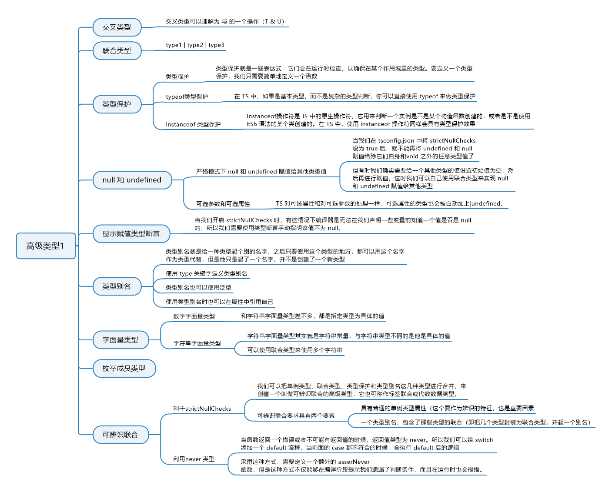

# 10. 高级类型1

## 10.1 知识图谱




## 10.2 交叉类型

**交叉类型就是取多个类型的并集** 

Object.assign 就是合并两个对象，包含两个对象各有属性，合成一个总的对象。

```javascript
let obj1 = {
    a: 'a'
}
let obj2 = {
    b: 'b'
}
Object.assign(obj1, obj2)
// {a: 'a', b: 'b'}
```

定义一个函数，函数接受两个对象，最后返回这两个对象合并后的结果。

返回值里既包含 arg1，也包含arg2的属性

```typescript
const mergeFunc = <T, U>(arg1:T, arg2:U): T & U => {
    // 定义一个res返回值，需要判断res返回值的类型，不能随便定义，所以要使用类型断言，让res属于 T & U
    let res = {} as T & U
    res = Object.assign(arg1, arg2)
    return res
}
mergeFunc({a: 'a', b: 'b'})
```

调用这个方法传进去两个对象，最终返回的是两个对象合并后的对象，所以这里再通过点.就可以把a和b这两个属性都点出来了

这就是交叉类型，可以理解为与的一个操作


## 10.3 联合类型

这就表示这个类型可以是 type1 也可以是 type2 还可以是 type3 只要是其中的一种就可以了

```
type1 | type2 | type3
```

定义一个函数，传入一个值，如果是string类型，就返回它的length，如果不是string类型，就先tostring一下，然后在返回它的length

```typescript
const getLengthFunc = (content: string | number): number => {
    if (typeof content === 'string') {
        return content.length
    } else {
        return content.toString().length
    }
}
console.log(getLengthFunc('abc')) // 3
```


## 10.4 类型保护

这个小节我们来学习类型保护，在学习前面知识的时候我们有遇到过需要告诉编译器某个值是指定类型的场景，当时我们使用的是类型断言，这一节我们来看一个不同的场景：

```typescript
const valueList = [123, 'abc']
const getRandomValue = () => {
  const number = Math.random() * 10; // 这里取一个[0, 10)范围内的随机值
  if (number < 5) return valueList[0]; // 如果随机数小于5则返回valueList里的第一个值，也就是123
  else return valueList[1]; // 否则返回"abc"
};
const item = getRandomValue();
if (item.length) {
  // error 类型“number”上不存在属性“length”
  console.log(item.length); // error 类型“number”上不存在属性“length”
} else {
  console.log(item.toFixed()); // error 类型“string”上不存在属性“toFixed”
}
```

上面这个例子中，getRandomValue 函数返回的元素不是固定的，有时返回数值类型，有时返回字符串类型，我们使用这个函数生成一个值 item，然后接下来的逻辑就是通过判断是否有 length 属性来判断是字符串类型，如果没有 length 属性则为数值类型，在 js 中，这段逻辑是没有问题的，但是在 TS 中，因为 TS 在编译阶段是无法知道 item 的类型的，所以当我们在 if 判断逻辑中访问 item 的 length 属性的时候就会报错，因为如果 item 为 number 类型的话是没有 length 属性的。

这个问题我们可以先采取类型断言的方式来解决，类型断言我们学习过，就是相当于告诉 TS 这个值就是制定的类型，我们只需要修改判断逻辑即可：

```typescript
if ((<string>item).length) {
    console.log((<string>item).length)
} else {
    console.log((<number>item).toFixed())
}
```


### 10.4.1 自定义类型保护

上面代码不报错是因为我们通过使用类型断言，告诉 TS 编译器，if 中的 item 是 string 类型，而 else 中的是 number 类型。这样做虽然可以，但是我们需要在使用 item 的地方都使用类型断言来声明，显然有些繁琐，所以我们就可以使用类型保护来优化。

我们先来看，如果使用自定义类型保护来解决：

```typescript
const valueList = [123, "abc"];
const getRandomValue = () => {
  const number = Math.random() * 10; // 这里取一个[0, 10)范围内的随机值
  if (number < 5) return valueList[0]; // 如果随机数小于5则返回valueList里的第一个值，也就是123
  else return valueList[1]; // 否则返回"abc"
};
function isString(value: number | string): value is string {
  return typeof value === 'string'
}
const item = getRandomValue();
if (isString(item)) {
  console.log(item.length); // 此时item是string类型
} else {
  console.log(item.toFixed()); // 此时item是number类型
}
```

我们看到，首先定义一个函数，函数的参数 value 就是要判断的值，在这个例子中 value 的类型可以为 number 或 string，函数的返回值类型是一个结构为 value is type 的类型谓语， value 的命名无所谓，但是谓语中的 value 名必须和参数名一致。而函数里的逻辑则用来返回一个布尔值，如果返回为 true ，则表示传入的值类型为 is 后面的 type。

使用类型保护后，if 的判断逻辑和代码块都无需再对类型做指定工作，不仅如此，既然 item 是 string 类型，则 else 的逻辑中，item 一定是联合类型两个类型中另外一个，也就是 number 类型。


### 10.4.2 typeof 类型保护

但是这样定义一个函数来用于判断类型是字符串类型，难免有些复杂，因为在 JavaScript 中，只需要在 if 的判断逻辑地方使用 typeof 关键字即可判断一个值的类型。所以在 TS 中，如果是基本类型，而不是复杂的类型判断，你可以直接使用 typeof 来做类型保护：

```typescript
if (typeof item === "string") {
  console.log(item.length);
} else {
  console.log(item.toFixed());
}
```

这样直接写也是可以的，效果和自定义类型保护一样。但是在 TS 中，对 typeof 的处理还有些特殊要求：

- 只能使用`=`和`!`两种形式来比较
- type 只能是`number`、`string`、`boolean`和`symbol`四种类型

第一点要求我们必须使用这两种形式来做比较，比如你使用`(typeof item).includes(‘string’)`也能做判断，但是不行的。

第二点要求我们要比较的类型只能是这四种，但是我们知道，在 JS 中，`typeof xxx`的结果还有`object`、`function`和 `undefined` 。但是在 TS 中，只会把对前面四种类型的 typeof 比较识别为类型保护，你可以使用`typeof {} === ‘object’`，但是这里它只是一条普通的 js 语句，不具有类型保护具有的效果。我们可以来看例子：

```typescript
const valueList = [{}, () => {}];
const getRandomValue = () => {
  const number = Math.random() * 10;
  if (number < 5) {
    return valueList[0];
  } else {
    return valueList[1];
  }
};
const res = getRandomValue();
if (typeof res === "object") {
  console.log(res.toString());
} else {
  console.log(ress()); // error 无法调用类型缺少调用签名的表达式。类型“{}”没有兼容的调用签名
}
```


### 10.4.3 instanceof 类型保护

instanceof 操作符是 JS 中的原生操作符，它用来判断一个实例是不是某个构造函数创建的，或者是不是使用 ES6 语法的某个类创建的。在 TS 中，使用 instanceof 操作符同样会具有类型保护效果，来看例子：

```typescript
class CreateByClass1 {
  public age = 18;
  constructor() {}
}
class CreateByClass2 {
  public name = "lison";
  constructor() {}
}
function getRandomItem() {
  return Math.random() < 0.5 ? new CreateByClass1() : new CreateByClass2(); 
  // 如果随机数小于0.5就返回CreateByClass1的实例，否则返回CreateByClass2的实例
}
const item = getRandomItem();
if (item instanceof CreateByClass1) { // 这里判断item是否是CreateByClass1的实例
  console.log(item.age);
} else {
  console.log(item.name);
}
```

这个例子中 if 的判断逻辑中使用 instanceof 操作符判断了 item 。如果是 CreateByClass1 创建的，那么它应该有 age 属性，如果不是，那它就有 name 属性。


### 10.4.4 小结

通过使用类型保护可以更好地指定某个值的类型，可以把这个指定理解为一种强制转换，这样编译器就能知道我们这个值是我们指定的类型，从而符合我们的预期。typeif 和 instanceof 是 JavaScript 中的两个操作符，用来判断某个值的类型和一个值是否是某个构造函数的实例，它们在 TypeScript 中会被当做类型保护。我们也可以自定义类型保护，通过定义一个返回值类型是"参数名 is type"的语句，来指定传入这个类型保护函数的某个参数是什么类型。如果只是简单地要判断某个值是什么类型，使用 typeof 类型保护就可以了。


## 10.5 null 和 undefined

### 10.5.1 严格模式下 null 和 undefined 赋值给其它类型值

当我们在 tsconfig.json 中将 strictNullChecks 设为 true 后，就不能再将 undefined 和 null 赋值给除它们自身和void 之外的任意类型值了，但有时我们确实需要给一个其它类型的值设置初始值为空，然后再进行赋值，这时我们可以自己使用联合类型来实现 null 或 undefined 赋值给其它类型：

```typescript
let str = "alfred";
str = null; // error 不能将类型“null”分配给类型“string”
let strNull: string | null = "alfred"; // 这里你可以简单理解为，string | null即表示既可以是string类型也可以是null类型
strNull = null; // right
strNull = undefined; // error 不能将类型“undefined”分配给类型“string | null”
```

注意，TS 会将 undefined 和 null 区别对待，这和 JS 的本意也是一致的，所以在 TS 中，`string|undefined`、`string|null`和`string|undefined|null`是三种不同的类型。

### 10.5.2 可选参数和可选属性

如果开启了 strictNullChecks，可选参数会被自动加上`|undefined`，来看例子：

```typescript
const sum = (x: number, y?: number) => {
  return x + (y || 0);
};
sum(1, 2); // 3
sum(1); // 1
sum(1, undefined); // 1
sum(1, null); // error Argument of type 'null' is not assignable to parameter of type 'number | undefined'
```

可以根据错误信息看出，这里的参数 y 作为可选参数，它的类型就不仅是 number 类型了，它可以是 undefined，所以它的类型是联合类型`number | undefined`。

TS 对可选属性和对可选参数的处理一样，可选属性的类型也会被自动加上`|undefined`。

```typescript
interface PositionInterface {
  x: number;
  b?: number;
}
const position: PositionInterface = {
  x: 12
};
position.b = "abc"; // error
position.b = undefined; // right
position.b = null; // error
```

## 10.6 类型保护和类型断言

如何使用**显式赋值断言**，它的作用就是告诉编译器某个值确实不为null，

当我们开启 strictNullChecks 时，有些情况下编译器是无法在我们声明一些变量前知道一个值是否是 null 的，所以我们需要使用类型断言手动指明该值不为 null。这可能不好理解，接下来我们就来看一个编译器无法推断出一个值是否是null的例子：

```typescript
function getSplicedStr(num: number | null): string {
  function getRes(prefix: string) { // 这里在函数getSplicedStr里定义一个函数getRes，我们最后调用getSplicedStr返回的值实际是getRes运行后的返回值
    return prefix + num.toFixed().toString(); // 这里使用参数num，num的类型为number或null，在运行前编译器是无法知道在运行时num参数的实际类型的，所以这里会报错，因为num参数可能为null
  }
  num = num || 0.1; // 但是这里进行了赋值，如果num为null则会将0.1赋给num，所以实际调用getRes的时候，getRes里的num拿到的始终不为null
  return getRes("lison");
}
```

这个例子中，因为有嵌套函数，而编译器无法去除嵌套函数的 null（除非是立即调用的函数表达式），所以我们需要使用显式赋值断言，写法就是在不为 null 的值后面加个`!`。来看上面的例子该怎么改：

```typescript
function getSplicedStr(num: number | null): string {
  function getLength(prefix: string) {
    return prefix + num!.toFixed().toString();
  }
  num = num || 0.1;
  return getLength("lison");
}
```

这样编译器就知道了，num 不为 null，即便 getSplicedStr 函数在调用的时候传进来的参数是null，在 getLength函数中的 num 也不会是 null。

一个是如何在严格模式，也就是在tsconfig.json中将strictNullChecks设为true的情况下，将null或undefined赋值给除它们自身和void之外的类型的值；另一个知识点是当将strictNullChecks设为true后，编译器对可选参数和可选属性类型定义的处理，效果相当于在我们指定的类型后面加上`|undefined`。


## 10.7 类型别名

类型别名就是给一种类型起个别的名字，之后只要使用这个类型的地方，都可以用这个名字作为类型代替，但是它只是起了一个名字，并不是创建了一个新类型。这种感觉就像 JS 中对象的赋值，你可以把一个对象赋给一个变量，使用这个对象的地方都可以用这个变量代替，但你并不是创建了一个新对象，而是通过引用来使用这个对象。

我们来看下怎么定义类型别名，使用 `type` 关键字：

```typescript
type TypeString = string;
let str: TypeString;
str = 123; // error Type '123' is not assignable to type 'string'
```

类型别名也可以使用泛型，来看例子：

```typescript
type PositionType<T> = { x: T; y: T };
const position1: PositionType<number> = {
  x: 1,
  y: -1
};
const position2: PositionType<string> = {
  x: "right",
  y: "top"
};
```

使用类型别名时也可以在属性中引用自己：

```typescript
type Child<T> = {
  current: T;
  child?: Child<T>;
};
let ccc: Child<string> = {
  current: "first",
  child: {
    // error
    current: "second",
    child: {
      current: "third",
      child: "test" // 这个地方不符合type，造成最外层child处报错
    }
  }
};
```

但是要注意，只可以在对象属性中引用类型别名自己，不能直接使用，比如下面这样是不对的：

```typescript
type Child = Child[]; // error 类型别名“Child”循环引用自身
```

另外要注意，因为类型别名只是为其它类型起了个新名字来引用这个类型，所以当它为接口起别名时，不能使用 `extends` 和 `implements` 。

接口和类型别名有时可以起到同样作用，比如下面这个例子：

```typescript
type Alias = {
  num: number;
};
interface Interface {
  num: number;
}
let _alias: Alias = {
  num: 123
};
let _interface: Interface = {
  num: 321
};
_alias = _interface;
```

可以看到用类型别名和接口都可以定义一个只包含 num 属性的对象类型，而且类型是兼容的。那么什么时候用类型别名，什么时候用接口呢？可以通过两点来选择：

- 当你定义的类型要用于拓展，即使用 implements 等修饰符时，用接口。

- 当无法通过接口，并且需要使用联合类型或元组类型，用类型别名。

  

## 10.8 字面量类型

字面量类型其实比较基础，但是它又不适合放到基本类型里讲，因为字符串字面量类型和字符串类型其实并不一样，所以接下来我们来学习两种字面量类型。

### 10.8.1 字符串字面量类型

字符串字面量类型其实就是字符串常量，与字符串类型不同的是它是具体的值。

```typescript
type Name = "Lison";
const name1: Name = "test"; // error 不能将类型“"test"”分配给类型“"Lison"”
const name2: Name = "Lison";
```

你还可以使用联合类型来使用多个字符串：

```typescript
type Direction = "north" | "east" | "south" | "west";
function getDirectionFirstLetter(direction: Direction) {
  return direction.substr(0, 1);
}
getDirectionFirstLetter("test"); // error 类型“"test"”的参数不能赋给类型“Direction”的参数
getDirectionFirstLetter("east");
```


### 10.8.2 数字字面量类型

数字字面量类型，它和字符串字面量类型差不多，都是指定类型为具体的值。

```typescript
type Age = 18;
interface Info {
  name: string;
  age: Age;
}
const info: Info = {
  name: "Lison",
  age: 28 // error 不能将类型“28”分配给类型“18”
};
```

这里补充一个比较经典的逻辑错误，来看例子：

```typescript
function getValue(index: number) {
  if (index !== 0 || index !== 1) {
    // error This condition will always return 'true' since the types '0' and '1' have no overlap
    // ...
  }
}
```

这个例子中，在判断逻辑处使用了 `||` 符，当 index !== 0 不成立时，说明 index 就是 0，则不应该再判断 index 是否不等于 1；而如果 index !== 0 成立，那后面的判断也不会再执行；所以这个地方会报错。


### 10.8.3 小结

类型别名就是给一个类型起个别名，以后我们可以使用类型别名将较为复杂的类型抽离出来，这样任何需要使用这个类型的地方都可以使用这个别名代替；使用类型别名的好处有时和使用变量一样，我们可以将复杂的逻辑判断语句赋给一个变量，然后再进行判断，只需要判断这个变量的true或false即可；我们使用类型别名也可以起到简化代码的作用。我们还学习了两种字面量类型：数字字面量类型和字符串字面量类型，它们都是使用具体的字面量值来作为一种类型，所以我们叫它单调类型。


## 10.9 枚举成员类型

 能够做类型使用的枚举要符合三个条件

1.  不带初始值的枚举成员。
2. 成员的值为字符串自变量。
3. 值是数值自变量或者带有一个负号的数值自变量。

 以上三种满足一个就可以。那么这个枚举值和他的枚举成员都可以做为类型来使用


## 10.10 可辨识联合

我们可以把单例类型、联合类型、类型保护和类型别名这几种类型进行合并，来创建一个叫做**可辨识联合**的高级类型，它也可称作**标签联合**或**代数数据类型**。

> 所谓单例类型，你可以理解为符合[单例模式](https://zh.wikipedia.org/wiki/单例模式)的数据类型，比如枚举成员类型，字面量类型。

可辨识联合要求具有两个要素：

- 具有普通的单例类型属性（这个要作为辨识的特征，也是重要因素）。
- 一个类型别名，包含了那些类型的联合（即把几个类型封装为联合类型，并起一个别名）

来看例子：

```typescript
interface Square {
  kind: "square"; // 这个就是具有辨识性的属性
  size: number;
}
interface Rectangle {
  kind: "rectangle"; // 这个就是具有辨识性的属性
  height: number;
  width: number;
}
interface Circle {
  kind: "circle"; // 这个就是具有辨识性的属性
  radius: number;
}
type Shape = Square | Rectangle | Circle; // 这里使用三个接口组成一个联合类型，并赋给一个别名Shape，组成了一个可辨识联合。
function getArea(s: Shape) {
  switch (s.kind) {
    case "square":
      return s.size * s.size;
    case "rectangle":
      return s.height * s.width;
    case "circle":
      return Math.PI * s.radius ** 2;
  }
}
```

上面这个例子中，我们的 Shape 即可辨识联合，它是三个接口的联合，而这三个接口都有一个 kind 属性，且每个接口的 kind 属性值都不相同，能够起到标识作用。

这里有个 ES7 的新特性：***\*** 运算符，两个`*`符号组成的这个运算符就是求幂运算符，2 ** 3 ==> 8

看了上面的例子，你可以看到我们的函数内应该包含联合类型中每一个接口的 case。但是如果遗漏了，我们希望编译器应该给出提示。所以我们来看下两种**完整性检查**的方法：


### 10.10.1 利用 strictNullChecks

我们给上面的例子加一种接口：

```typescript
interface Square {
  kind: "square";
  size: number;
}
interface Rectangle {
  kind: "rectangle";
  height: number;
  width: number;
}
interface Circle {
  kind: "circle";
  radius: number;
}
interface Triangle {
  kind: "triangle";
  bottom: number;
  height: number;
}
type Shape = Square | Rectangle | Circle | Triangle; // 这里我们在联合类型中新增了一个接口，但是下面的case却没有处理Triangle的情况
function getArea(s: Shape) {
  switch (s.kind) {
    case "square":
      return s.size * s.size;
    case "rectangle":
      return s.height * s.width;
    case "circle":
      return Math.PI * s.radius ** 2;
  }
}
```

上面例子中，我们的 Shape 联合有四种接口，但函数的 switch 里只包含三个 case，这个时候编译器并没有提示任何错误，因为当传入函数的是类型是 Triangle 时，没有任何一个 case 符合，则不会有 return 语句执行，那么函数是默认返回 undefined。所以我们可以利用这个特点，结合 strictNullChecks(详见3.4小节) 编译选项，我们可以开启 strictNullChecks，然后让函数的返回值类型为 number，那么当返回 undefined 的时候，就会报错：

```typescript
function getArea(s: Shape): number {
  // error Function lacks ending return statement and return type does not include 'undefined'
  switch (s.kind) {
    case "square":
      return s.size * s.size;
    case "rectangle":
      return s.height * s.width;
    case "circle":
      return Math.PI * s.radius ** 2;
  }
}
```

这种方法简单，但是对旧代码支持不好，因为strictNullChecks这个配置项是2.0版本才加入的，如果你使用的是低于这个版本的，这个方法并不会有效。


### 10.10.2 使用 never 类型

我们在学习基本类型时学习过，当函数返回一个错误或者不可能有返回值的时候，返回值类型为 never。所以我们可以给 switch 添加一个 default 流程，当前面的 case 都不符合的时候，会执行 default 后的逻辑：

```typescript
function assertNever(value: never): never {
  throw new Error("Unexpected object: " + value);
}
function getArea(s: Shape) {
  switch (s.kind) {
    case "square":
      return s.size * s.size;
    case "rectangle":
      return s.height * s.width;
    case "circle":
      return Math.PI * s.radius ** 2;
    default:
      return assertNever(s); // error 类型“Triangle”的参数不能赋给类型“never”的参数
  }
}
```

采用这种方式，需要定义一个额外的 asserNever 函数，但是这种方式不仅能够在编译阶段提示我们遗漏了判断条件，而且在运行时也会报错。


### 10.10.3 小结

，定义一个可辨识联合类型有两个要素：具有普通的单例类型属性，和一个类型别名。第一个要素是最重要的一点，因为编译器要根据这个属性来判断当前分支是什么类型，而第二个要素并不影响使用，你完全可以指定上面例子中的s为`Square | Rectangle | Circle`而不使用`Shape`。最后我们讲了两种避免遗忘处理某个case的方法：利用strictNullChecks和使用never类型，都能够帮我们检查遗漏的case，第二种方法的提示更为全面（**never类型**），推荐大家使用。