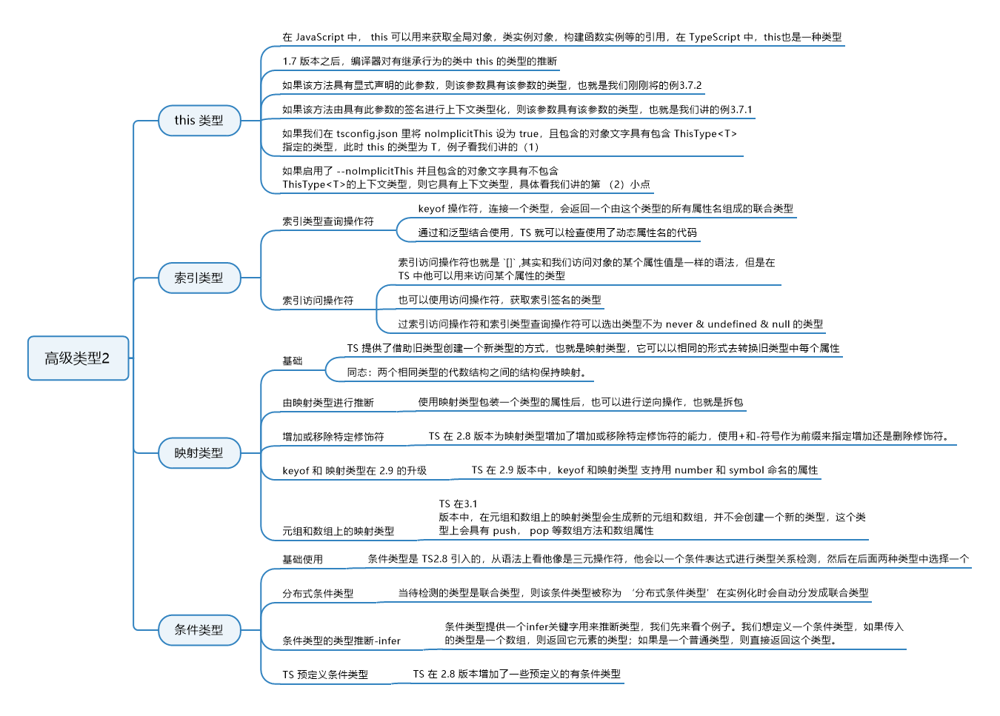

# 11. 高级类型2

## 11.1 知识图谱




## 11.2 this 类型

在 JavaScript 中，this 可以用来获取对全局对象、类实例对象、构建函数实例等的引用，在 TypeScript 中，this 也是一种类型，我们先来看个计算器 Counter 的例子：

```typescript
class Counter {
  constructor(public count: number = 0) {}
  add(value: number) { // 定义一个相加操作的方法
    this.count += value;
    return this;
  }
  subtract(value: number) { // 定义一个相减操作的方法
    this.count -= value;
    return this;
  }
}
let counter = new Counter(10);
console.log(counter.count); // 10
counter.add(5).subtract(2);
console.log(counter.count); // 13
```

我们给 Counter 类定义几个方法，每个方法都返回 this，这个 this 即指向实例，这样我们就可以通过链式调用的形式来使用这些方法。这个是没有问题的，但是如果我们要通过类继承的形式丰富这个 Counter 类，添加一些方法，依然返回 this，然后采用链式调用的形式调用，在过去版本的 TypeScript 中是有问题的，先来看我们继承的逻辑：

```typescript
class PowCounter extends Counter {
  constructor(public count: number = 0) {
    super(count);
  }
  pow(value: number) { // 定义一个幂运算操作的方法
    this.count = this.count ** value;
    return this;
  }
}
let powcounter = new PowCounter(2);
powCounter
  .pow(3)
  .subtract(3)
  .add(1);
console.log(powCounter.count); // 6
```

我们定义了 PowCounter 类，它继承 Counter 类，新增了 pow 方法用来求值的幂次方，这里我们使用了 ES7 新增的幂运算符`**`。我们使用 PowCounter 创建了实例 powcounter，它的类型自然是 PowCounter，在该实例上调用继承来的 subtract 和 add 方法。如果是在过去，就会报错，因为创建实例 powcounter 的类 PowCounter 没有定义这两个方法，所以会报没有这两个方法的错误。但是在 1.7 版本中增加了 this 类型，TypeScript 会对方法返回的 this 进行判断，就不会报错了。

对于对象来说，对象的属性值可以是一个函数，那么这个函数也称为方法，在方法内如果访问this，默认情况下是对这个对象的引用，this类型也就是这个对象的字面量类型，如下：

```typescript
// 例3.7.1
let info = {
  name: 'Lison',
  getName () {
      return this.name // "Lison" 这里this的类型为 { name: string; getName(): string; }
  }
}
```

但是如果显式地指定了this的类型，那么this的类型就改变了，如下：

```typescript
// 例3.7.2
let info = {
  name: "Lison",
  getName(this: { age: number }) {
    this; // 这里的this的类型是{ age: number }
  }
};
```

如果我们在 tsconfig.json 里将 noImplicitThis 设为 true，这时候有两种不同的情况：

（1）对象字面量具有 ThisType\<T> 指定类型，此时 this 的类型为 T，来看例子：

​	

```typescript
type ObjectDescriptor<D, M> = { // 使用类型别名定义一个接口，这里用了泛型，两个泛型变量D和M
  data?: D; // 这里指定data为可选字段，类型为D
  // 这里指定methods为可选字段，类型为M和ThisType<D & M>组成的交叉类型；  
  // ThisType是一个内置的接口，用来在对象字面量中键入this，这里指定this的类型为D & M  
  methods?: M & ThisType<D & M>;  
}

// 这里定义一个mackObject函数，参数desc的类型为ObjectDescriptor<D, M>
function makeObject<D, M>(desc: ObjectDescriptor<D, M>): D & M { 
  let data: object = desc.data || {};
  let methods: object = desc.methods || {};
  // 这里通过...操作符，将data和methods里的所有属性、方法都放到了同一个对象里返回，这个对象的类型自然就      是D & M，因为他同时包含D和M两个类型的字段  
  return { ...data, ...methods } as D & M; 
}

let obj = makeObject({
  data: { x: 0, y: 0 }, // 这里data的类型就是我们上面定义ObjectDescriptor<D, M>类型中的D
  methods: { // 这里methods的类型就是我们上面定义ObjectDescriptor<D, M>类型中的M
    moveBy(dx: number, dy: number) {
      this.x += dx;  // 所以这里的this是我们通过ThisType<D & M>指定的，this的类型就是D & M
      this.y += dy;
    }
  }
});

obj.x = 10;
obj.y = 20;
obj.moveBy(5, 5);
```

（2） 不包含 ThisType\<T> 指定的上下文类型，那么此时 this 具有上下文类型，也就是普通的情况。你可以试着把上面使用了 ThisType<T> 的例子中，ObjectDescriptor<D, M>类型中指定methods的类型中的 `& ThisType` 去掉，你会发现 `moveBy` 方法中 `this.x` 和 `this.y` 报错了，因为此时 `this` 的类型是`methods` 这个对象字面量的类型。


this的类型的规则：

- 如果该方法具有显式声明的此参数，则该参数具有该参数的类型，也就是我们刚刚讲的例3.7.2；
- 否则，如果该方法由具有此参数的签名进行上下文类型化，则该参数具有该参数的类型，也就是我们讲的例3.7.1；
- 否则，如果在 tsconfig.json 里将 noImplicitThis 设为 true，且包含的对象文字具有包含 ThisType<T> 的上下文类型，则其类型为T，例子看我们讲的第(1)小点.
- 否则，如果启用了 --noImplicitThis 并且包含的对象文字具有不包含 ThisType<T> 的上下文类型，则它具有上下文类型，具体看我们讲的第(2)小点。
- 否则，this 的类型为 any 任何类型。


## 11.3 索引类型

### 11.3.1 索引类型查询操作符

`keyof`操作符，连接一个类型，会返回一个由这个类型的所有属性名组成的联合类型。来看例子：

```typescript
interface Info {
  name: string;
  age: number;
}
let infoProp: keyof Info;
infoProp = "name";
infoProp = "age";
infoProp = "no"; // error 不能将类型“"no"”分配给类型“"name" | "age"”
```

通过例子可以看到，这里的`keyof Info`其实相当于`"name" | “age”`。通过和泛型结合使用，TS 就可以检查使用了动态属性名的代码：

```typescript
function getValue<T, K extends keyof T>(obj: T, names: K[]): T[K][] { // 这里使用泛型，并且约束泛型变量K的类型是"keyof T"，也就是类型T的所有字段名组成的联合类型
  return names.map(n => obj[n]); // 指定getValue的返回值类型为T[K][]，即类型为T的值的属性值组成的数组
}
const info = {
  name: "lison",
  age: 18
};
let values: string[] = getValue(info, ["name"]);
values = getValue(info, ["age"]); // error 不能将类型“number[]”分配给类型“string[]”
```


### 11.3.2 索引访问操作符

索引访问操作符也就是`[]`，其实和我们访问对象的某个属性值是一样的语法，但是在 TS 中它可以用来访问某个属性的类型：

```typescript
interface Info {
  name: string;
  age: number;
}
type NameType = Info["name"];
let name: NameType = 123; // error 不能将类型“123”分配给类型“string”
```

再来看个例子：

```typescript
function getProperty<T, K extends keyof T>(o: T, name: K): T[K] {
  return o[name]; // o[name] is of type T[K]
}
```

这个函数中，两个参数的类型分别为泛型 T 和 K，而函数的返回值类型为`T[K]`，只要函数的返回值也是这种形式，即访问参数 o 的参数 name 属性，即可。

最后我们来看个结合接口的例子：

```typescript
interface Obj<T> {
  [key: number]: T;
}
const key: keyof Obj<number>; // keys的类型为number
```

这里需要注意，在讲接口一节时，讲索引类型的时候我们讲过，如果索引类型为 number，那么实现该接口的对象的属性名必须是 number 类型；但是如果接口的索引类型是 string 类型，那么实现该接口的对象的属性名设置为数值类型的值也是可以的，因为数值最后还是会先转换为字符串。这里一样，如果接口的索引类型设置为 string 的话，`keyof Obj`等同于类型`number | string`：

```typescript
interface Obj<T> {
  [key: string]: T;
}
let key: keyof Obj<number>; // keys的类型为number | string
key = 123; // right
```

也可以使用访问操作符，获取索引签名的类型：

```typescript
interface Obj<T> {
  [key: string]: T;
}
const obj: Obj<number> = {
  age: 18
};
let value: Obj<number>["age"]; // value的类型是number，也就是name的属性值18的类型
```

还有一点，我们在讲后面知识的时候会遇到，就是当tsconfig.json里`strictNullChecks`设为`false`时，通过`Type[keyof Type]`获取到的，是除去`never & undefined & null`这三个类型之后的字段值类型组成的联合类型，来看例子：

```typescript
interface Type {
  a: never;
  b: never;
  c: string;
  d: number;
  e: undefined;
  f: null;
  g: object;
}
type test = Type[keyof Type];
// test的类型是string | number | object
```

这个例子中接口 Type 有几个属性，通过索引访问操作符和索引类型查询操作符可以选出类型不为 never & undefined & null 的类型。


### 11.3.3 小结

索引类型查询操作符`keyof`，和索引访问操作符`[]`。通过keyof我们能够获取一个类型的所有属性名组成的联合类型，通过[]我们可以获取某个类型定义中指定字段值的类型。我们还学习了它们的组合使用方法，当tsconfig.json里`strictNullChecks`设为`false`时，我们可以通过`[keyof Type]`获取一个类型定义的所有除去`never & undefined & null`的字段值的类型组成的联合类型。


## 11.4 映射类型

### 11.4.1 基础

TS 提供了借助旧类型创建一个新类型的方式，也就是映射类型，它可以用相同的形式去转换旧类型中每个属性。来看个例子：

```typescript
interface Info {
  age: number;
}
```

我们可以使用这个接口实现一个有且仅有一个 age 属性的对象，但如果我们想再创建一个只读版本的同款对象，那我们可能需要再重新定义一个接口，然后让 age 属性 readonly。如果接口就这么简单，你确实可以这么做，但是如果属性多了，而且这个结构以后会变，那就比较麻烦了。这种情况我们可以使用映射类型，下面来看例子：

```typescript
interface Info {
  age: number;
}
type ReadonlyType<T> = { readonly [P in keyof T]: T[P] }; // 这里定义了一个ReadonlyType<T>映射类型
type ReadonlyInfo = ReadonlyType<Info>;
let info: ReadonlyInfo = {
  age: 18
};
info.age = 28; // error Cannot assign to 'age' because it is a constant or a read-only property
```

这个例子展示了如何通过一个普通的接口创建一个每个属性都只读的接口，这个过程有点像定义了一个函数，这个函数会遍历传入对象的每个属性并做处理。同理你也可以创建一个每个属性都是可选属性的接口：

```typescript
interface Info {
  age: number;
}
type ReadonlyType<T> = { readonly [P in keyof T]?: T[P] };
type ReadonlyInfo = ReadonlyType<Info>;
let info: ReadonlyInfo = {};
```

注意了，我们在这里用到了一个新的操作符 in，TS 内部使用了 for … in，定义映射类型，这里涉及到三个部分：

- 类型变量，也就是上例中的 P，它就像 for…in 循环中定义的变量，用来在每次遍历中绑定当前遍历到的属性名；
- 属性名联合，也就是上例中`keyof T`，它返回对象 T 的属性名联合；
- 属性的结果类型，也就是 T[P]。

因为这两个需求较为常用，所以 TS 内置了这两种映射类型，无需定义即可使用，它们分别是`Readonly`和`Partial`。还有两个内置的映射类型分别是`Pick`和`Record`，它们的实现如下：

```typescript
type Pick<T, K extends keyof T> = { [P in K]: T[P] };
type Record<K extends keyof any, T> = { [P in K]: T };
```

先来使用一下 Pick，官方文档的例子并不完整，我们来看完整的例子：

```typescript
interface Info {
  name: string;
  age: number;
  address: string;
}
const info: Info = {
  name: "lison",
  age: 18,
  address: "beijing"
};
function pick<T, K extends keyof T>(obj: T, keys: K[]): Pick<T, K> { // 这里我们定义一个pick函数，用来返回一个对象中指定字段的值组成的对象
  let res = {} as Pick<T, K>;
  keys.forEach(key => {
    res[key] = obj[key];
  });
  return res;
}
const nameAndAddress = pick(info, ["name", "address"]); // { name: 'lison', address: 'beijing' }
```

另外一个就是 Record，它适用于将一个对象中的每一个属性转换为其他值的场景，来看例子：

```typescript
function mapObject<K extends string | number, T, U>(
  obj: Record<K, T>,
  f: (x: T) => U
): Record<K, U> {
  let res = {} as Record<K, U>;
  for (const key in obj) {
    res[key] = f(obj[key]);
  }
  return res;
}

const names = { 0: "hello", 1: "world", 2: "bye" };
const lengths = mapObject(names, s => s.length); // { 0: 5, 1: 5, 2: 3 }
```

我们输入的对象属性值为字符串类型，输出的对象属性值为数值类型。

讲完这四个内置的映射类型之后，我们需要讲一个概念——同态。同态在维基百科的解释是：两个相同类型的代数结构之间的结构保持映射。这四个内置映射类型中，Readonly、Partial 和 Pick 是同态的，而 Record 不是，因为 Record 映射出的对象属性值是新的，和输入的值的属性值不同。


### 11.4.2 由映射类型进行推断

我们学习了使用映射类型包装一个类型的属性后，也可以进行逆向操作，也就是拆包，先来看我们的包装操作：

```typescript
type Proxy<T> = { // 这里定义一个映射类型，他将一个属性拆分成get/set方法
  get(): T;
  set(value: T): void;
};
type Proxify<T> = { [P in keyof T]: Proxy<T[P]> }; // 这里再定义一个映射类型，将一个对象的所有属性值类型都变为Proxy<T>处理之后的类型
function proxify<T>(obj: T): Proxify<T> { // 这里定义一个proxify函数，用来将对象中所有属性的属性值改为一个包含get和set方法的对象
  let result = {} as Proxify<T>;
  for (const key in obj) {
    result[key] = {
      get: () => obj[key],
      set: value => (obj[key] = value)
    };
  }
  return result;
}
let props = {
  name: "lison",
  age: 18
};
let proxyProps = proxify(props);
console.log(proxyProps.name.get()); // "lison"
proxyProps.name.set("li");
```

我们来看下这个例子，这个例子我们定义了一个函数，这个函数可以把传入的对象的每个属性的值替换为一个包含 get 和 set 两个方法的对象。最后我们获取某个值的时候，比如 name，就使用 proxyProps.name.get()方法获取它的值，使用 proxyProps.name.set()方法修改 name 的值。

接下来我们来看如何进行拆包：

```typescript
function unproxify<T>(t: Proxify<T>): T { // 这里我们定义一个拆包函数，其实就是利用每个属性的get方法获取到当前属性值，然后将原本是包含get和set方法的对象改为这个属性值
  let result = {} as T;
  for (const k in t) {
    result[k] = t[k].get(); // 这里通过调用属性值这个对象的get方法获取到属性值，然后赋给这个属性，替换掉这个对象
  }
  return result;
}
let originalProps = unproxify(proxyProps);
```


### 11.4.3 增加或移除特定修饰符

TS 在 2.8 版本为映射类型增加了增加或移除特定修饰符的能力，使用`+`和`-`符号作为前缀来指定增加还是删除修饰符。首先来看我们如何通过映射类型为一个接口的每个属性增加修饰符，我们这里使用+前缀：

```typescript
interface Info {
  name: string;
  age: number;
}
type ReadonlyInfo<T> = { +readonly [P in keyof T]+?: T[P] };
let info: ReadonlyInfo<Info> = {
  name: "lison"
};
info.name = ""; // error
```

这个例子中，经过 ReadonlyInfo 创建的接口类型，属性是可选的，所以我们在定义 info 的时候没有写 age 属性也没问题，同时每个属性是只读的，所以我们修改 name 的值的时候报错。我们通过+前缀增加了 readonly 和?修饰符。当然，增加的时候，这个+前缀可以省略，也就是说，上面的写法和`type ReadonlyInfo = { readonly [P in keyof T]?: T[P] }`是一样的。我们再来看下怎么删除修饰符：

```typescript
interface Info {
  name: string;
  age: number;
}
type RemoveModifier<T> = { -readonly [P in keyof T]-?: T[p] };
type InfoType = RemoveModifier<Readonly<Partial<Info>>>;
let info1: InfoType = {
  // error missing "age"
  name: "lison"
};
let info2: InfoType = {
  name: "lison",
  age: 18
};
info2.name = ""; // right, can edit
```

这个例子我们定义了去掉修饰符的映射类型 RemoveModifier，`Readonly>`则是返回一个既属性可选又只读的接口类型，所以 InfoType 类型则表示属性必含而且非只读。

TS 内置了一个映射类型`Required`，使用它可以去掉 T 所有属性的`?`修饰符。


### 11.4.4 keyof 和映射类型在 2.9 的升级

TS 在 2.9 版本中，keyof 和映射类型支持用 number 和 symbol 命名的属性，我们先来看 keyof 的例子：

```typescript
const stringIndex = "a";
const numberIndex = 1;
const symbolIndex = Symbol();
type Obj = {
  [stringIndex]: string;
  [numberIndex]: number;
  [symbolIndex]: symbol;
};
type keys = keyof Obj;
let key: keys = 2; // error
let key: keys = 1; // right
let key: keys = "b"; // error
let key: keys = "a"; // right
let key: keys = Symbol(); // error
let key: keys = symbolIndex; // right
```

再来看个映射类型的例子：

```typescript
const stringIndex = "a";
const numberIndex = 1;
const symbolIndex = Symbol();
type Obj = {
  [stringIndex]: string;
  [numberIndex]: number;
  [symbolIndex]: symbol;
};
type ReadonlyType<T> = { readonly [P in keyof T]?: T[P] };
let obj: ReadonlyType<Obj> = {
  a: "aa",
  1: 11,
  [symbolIndex]: Symbol()
};
obj.a = "bb"; // error Cannot assign to 'a' because it is a read-only property
obj[1] = 22; // error Cannot assign to '1' because it is a read-only property
obj[symbolIndex] = Symbol(); // error Cannot assign to '[symbolIndex]' because it is a read-only property
```


### 11.4.5 元组和数组上的映射类型

TS 在 3.1 版本中，在元组和数组上的映射类型会生成新的元组和数组，并不会创建一个新的类型，这个类型上会具有 push、pop 等数组方法和数组属性。来看例子：

```typescript
type MapToPromise<T> = { [K in keyof T]: Promise<T[K]> };
type Tuple = [number, string, boolean];
type promiseTuple = MapToPromise<Tuple>;
let tuple: promiseTuple = [
  new Promise((resolve, reject) => resolve(1)),
  new Promise((resolve, reject) => resolve("a")),
  new Promise((resolve, reject) => resolve(false))
];
```

这个例子中定义了一个MapToPromise映射类型。它返回一个将传入的类型的所有字段的值转为Promise，且Promise的resolve回调函数的参数类型为这个字段类型。我们定义了一个元组Tuple，元素类型分别为number、string和boolean，使用MapToPromise映射类型将这个元组类型传入，并且返回一个promiseTuple类型。当我们指定变量tuple的类型为promiseTuple后，它的三个元素类型都是一个Promise，且resolve的参数类型依次为number、string和boolean。


### 11.4.6 小结

本小节我们学习了映射类型的相关知识，我们学习了映射类型的基础应用，它的定义和使用像极了函数的定义和使用。函数是处理实际的值，而映射类型处理的是类型。我们还通过一个例子学习了由映射类型进行推断，根据映射类型推断出处理前的类型，也就是拆包操作。通过增加或移除特定修饰符"+“和”-“可以实现给字段添加或移除一些readonly等修饰符，但用的最多的是”-"。因为如果需要给某个字段加修饰符，"+"是可以省略不写的。最后我们补充了两个TypeScript在后面升级中对映射类型的更新。


## 11.5 条件类型

### 11.5.1 基础使用

条件类型是 TS2.8 引入的，从语法上看它像是三元操作符。它会以一个条件表达式进行类型关系检测，然后在后面两种类型中选择一个，先来看它怎么写：

```typescript
T extends U ? X : Y
```

这个表达式的意思是，如果 T 可以赋值给 U 类型，则是 X 类型，否则是 Y 类型。来看个实际例子：

```typescript
type Type<T> = T extends string | number
let index: Type<'a'> // index的类型为string
let index2: Type<false> // index2的类型为number
```


### 11.5.2 分布式条件类型

当待检测的类型是联合类型，则该条件类型被称为“分布式条件类型”，在实例化时会自动分发成联合类型，来看例子：

```typescript
type TypeName<T> = T extends any ? T : never;
type Type1 = TypeName<string | number>; // Type1的类型是string|number
```

你可能会说，既然想指定 Type1 的类型为 string|number，为什么不直接指定，而要使用条件类型？其实这只是简单的示范，条件类型可以增加灵活性，再来看个复杂点的例子，这是官方文档的例子：

```typescript
type TypeName<T> = T extends string
  ? string
  : T extends number
  ? number
  : T extends boolean
  ? boolean
  : T extends undefined
  ? undefined
  : T extends Function
  ? Function
  : object;
type Type1 = TypeName<() => void>; // Type1的类型是Function
type Type2 = TypeName<string[]>; // Type2的类型是object
type Type3 = TypeName<(() => void) | string[]>; // Type3的类型是object | Function
```

我们来看一个分布式条件类型的实际应用：

```typescript
type Diff<T, U> = T extends U ? never : T;
type Test = Diff<string | number | boolean, undefined | number>;
// Test的类型为string | boolean
```

这个例子定义的条件类型的作用就是，找出从 T 中出去 U 中存在的类型，得到剩下的类型。不过这个条件类型已经内置在 TS 中了，只不过它不叫 Diff，叫 Exclude，我们待会儿会讲到。

来看一个条件类型和映射类型结合的例子：

```typescript
type Type<T> = { [K in keyof T]: T[K] extends Function ? K : never }[keyof T];
interface Part {
  id: number;
  name: string;
  subparts: Part[];
  updatePart(newName: string): void;
}
type Test = Type<Part>; // Test的类型为"updatePart"
```

来看一下，这个例子中，接口 Part 有四个字段，其中 updatePart 的值是函数，也就是 Function 类型。Type的定义中，涉及到映射类型、条件类型、索引访问类型和索引类型。首先[K in keyof T]用于遍历 T 的所有属性名，值使用了条件类型，T[K]是当前属性名的属性值，`T[K] extends Function ? K : never`表示如果属性值为 Function 类型，则值为属性名字面量类型，否则为 never 类型。接下来使用`keyof T`获取 T 的属性名，最后通过索引访问类型`[keyof T]`获取不为 never 的类型。


### 11.5.3 条件类型的类型推断-infer

条件类型提供一个`infer`关键字用来推断类型，我们先来看个例子。我们想定义一个条件类型，如果传入的类型是一个数组，则返回它元素的类型；如果是一个普通类型，则直接返回这个类型。来看下不使用 infer 的话，怎么写：

```typescript
type Type<T> = T extends any[] ? T[number] : T;
type test = Type<string[]>; // test的类型为string
type test2 = Type<string>; // test2的类型为string
```

这个例子中，如果传入 Type 的是一个数组类型，那么返回的类型为`T[number]`，也就是该数组的元素类型，如果不是数组，则直接返回这个类型。这里我们是自己通过索引访问类型`T[number]`来获取类型的，如果使用 infer 关键字则无需自己手动获取，我们来看下怎么使用 infer：

```typescript
type Type<T> = T extends Array<infer U> ? U : T;
type test = Type<string[]>; // test的类型为string
type test2 = Type<string>; // test2的类型为string
```

这里 infer 能够推断出 U 的类型，并且供后面使用，你可以理解为这里定义了一个变量 U 来接收数组元素的类型。


### 11.5.4 TS 预定义条件类型

TS 在 2.8 版本增加了一些预定义的有条件类型，来看一下：

- Exclude<T, U>，从 T 中去掉可以赋值给 U 的类型：

```typescript
type Type = Exclude<"a" | "b" | "c", "a" | "b">;
// Type => 'c'
type Type2 = Exclude<string | number | boolean, string | number>;
// Type2 => boolean
```

- Extract<T, U>，选取 T 中可以赋值给 U 的类型：

```typescript
type Type = Extract<"a" | "b" | "c", "a" | "c" | "f">;
// Type => 'a' | 'c'
type Type2 = Extract<number | string | boolean, string | boolean>;
// Type2 => string | boolean
```

- NonNullable，从 T 中去掉 null 和 undefined：

```typescript
type Type = Extract<string | number | undefined | null>;
// Type => string | number
```

- ReturnType，获取函数类型返回值类型：

```typescript
type Type = ReturnType<() => string)>
// Type => string
type Type2 = ReturnType<(arg: number) => void)>
// Type2 => void
```

- InstanceType，获取构造函数类型的实例类型：

InstanceType直接看例子可能不好理解，所以我们先来看下它的实现：

```typescript
type InstanceType<T extends new (...args: any[]) => any> = T extends new (
  ...args: any[]
) => infer R
  ? R
  : any;
```

InstanceType 条件类型要求泛型变量 T 类型是创建实例为 any 类型的构造函数，而它本身则通过判断 T 是否是构造函数类型来确定返回的类型。如果是构造函数，使用 infer 可以自动推断出 R 的类型，即实例类型；否则返回的是 any 类型。

看过 InstanceType 的实现后，我们来看怎么使用：

```typescript
class A {
  constructor() {}
}
type T1 = InstanceType<typeof A>; // T1的类型为A
type T2 = InstanceType<any>; // T2的类型为any
type T3 = InstanceType<never>; // T3的类型为never
type T4 = InstanceType<string>; // error
```

上面例子中，T1 的定义中，`typeof A`返回的的是类 A 的类型，也就是 A，这里不能使用 A 因为它是值不是类型，类型 A 是构造函数，所以 T1 是 A 构造函数的实例类型，也就是 A；T2 传入的类型为 any，因为 any 是任何类型的子类型，所以它满足`T extends new (…args: any[]) => infer R`，这里 infer 推断的 R 为 any；传入 never 和 any 同理。传入 string 时因为 string 不能不给构造函数类型，所以报错。


### 11.5.5 小结

本小节我们学习了条件类型的相关知识，它的语法是`T extends U ? X : Y`，我们可以形象地理解它是三元操作符的形式，`T extends U`是判断条件，如果T的类型符合U，则取类型X，否则为类型Y。我们还学习了分布式条件类型，它比较简单，是条件类型的一种特殊情况，即待检测的类型是联合类型。我们还学习了如何使用**infer**来更好地利用类型推断。最后我们学习了几个TypeScript中常用的内置条件类型，方便我们开发使用。