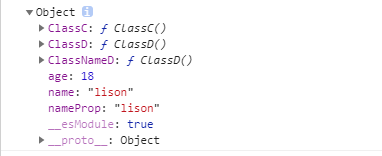

# 15 模块和命名空间

TypeScript 在1.5版本之前，有**内部模块**和**外部模块**的概念，从1.5版本开始，**内部模块**改称为**命名空间**，**外部模块**改称为**模块**。

## 15.1 TypeScript 模块

**TypeScript** 和 **ES6** 保持一致，包含顶级 **import** 或 **export** 的文件都被当成一个模块，则里面定义的内容仅模块内可见，而不是全局可见。**TypeScript** 的模块除了遵循 **ES6** 标准的模块语法外，还有一些特定语法，用于类型系统兼容多个模块格式。

### 15.1.1 export

**TypeScript** 中，仍然使用 **export** 来导出声明，而且能够导出的不仅有**变量、函数、类**，还包括 **TypeScript** 特有的 **类型别名**和**接口**。

```typescript
// a.ts
export interface FuncInterface {
  name: string
  (age: number): string
}
export class ClassC {
  constructor() {
    //
  }
}
class ClassD {
  constructor() {
    //
  }
}
export { ClassD }
export { ClassD as ClassNameD }
```

上面例子中，你可以使用 **export** 直接导出一个声明，也可以先声明一个类或其他内容，然后使用 **export{}**的形式导出，也可以使用 **as** 来为导出的接口换个名字再导出一次

你也可以像 **ES6** 模块那样重新导出一个模块，也就是 **export** 一个引入内容，也可以重新导出部分内容，也可以重命名重新导出： 

```type
// b.ts
export const name = 'lison'
export const age = 18

// a.ts
// 可以全部导入
export * from './b'
// 可以导入部分
export { name } from './b'
// 也可以将导入的重命名一下
export { name as nameProp } from './b'
```


### 15.1.2 import

导出的模块，依然是使用 **import** 引入

```typescript
// index.ts
import { name } from './b'
console.log(name) // lison

import * as info from './b'
console.log(info) // {name: 'lison', age: 18}

import { name as nameProp } from './b'
console.log(nameProp) // lison
```

因为之前**a.ts** 中引入 **b.ts** 文件内容，**a.ts** 如下所示

```typescript
// a.ts
export interface FuncInterface {
  name: string
  (age: number): string
}
export class ClassC {
  constructor() {
    //
  }
}
class ClassD {
  constructor() {
    //
  }
}
export { ClassD }
export { ClassD as ClassNameD }

export * from './b'
export { name } from './b'
export { name as nameProp } from './b'
```

那么如果我们在 **index.ts** 中引入 **a.ts** 文件，会将 **b.ts** 中声明的内容，也全部导出来，重命名的也会导出来，导出结果如下

```typescript
// index.ts
export * as AData from './a.ts'
console.log(AData)
```

接口在console里面是看不到的，所以打印出的结果如下



同样，可以使用 **import** 直接接模块名或文件路径，进行具有副作用的导入：

这种引用只能引用适合全局作用的逻辑而不是要再一次加工或者使用

```typescript
import './a'
```

### 15.1.3 export default

同样在 **TypeScript** 中使用 **export default** 默认导出，这个和**ES6** 一样：

```typescript
// c.ts
export default 'lison'

// index.ts
import name from './c'
console.log(name)
```

