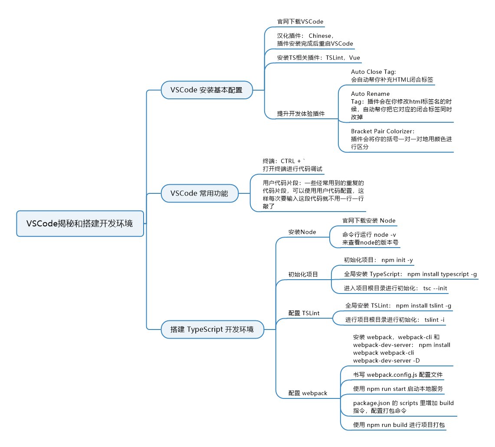

# 1. 搭建开发环境

>\- 使用npm初始化项目
>
>\- 全局安装部分依赖
>
>\- 使用tsc初始化配置
>
>\- 配置webpack
>
>\- 添加开发和打包命令


## 1.1 章节知识图谱



## 1.2 初始化项目

新建一个文件夹 typeScriptLearning：

```bash
mkdir typeScriptLearning
cd typeScriptLearning
```

使用npm初始化这个项目：

```bash
# 使用npm默认package.json配置
npm init -y
# 或者使用交互式自行配置，遇到选项如果直接敲回车即使用括号内的值
npm init
package name: (client-side) # 可敲回车即使用client-side这个名字，也可输入其他项目名
version: (1.0.0) # 版本号，默认1.0.0
description: # 项目描述，默认为空
entry point: (index.js) # 入口文件，我们这里改为./src/index.ts
test command: # 测试指令，默认为空
git repository: # git仓库地址，默认为空
keywords: # 项目关键词，多个关键词用逗号隔开，我们这里写typescript,client,lison
author: # 项目作者，这里写lison<lison16new@163.com>
license: (ISC) # 项目使用的协议，默认是ISC，我这里使用MIT协议
# 最后会列出所有配置的项以及值，如果没问题，敲回车即可。
```

这时我们看到了在根目录下已经创建了一个 package.json 文件，接下来我们创建几个文件夹：

- src：用来存放项目的开发资源，在 src 下创建如下文件夹：
  - utils：和业务相关的可复用方法
  - tools：和业务无关的纯工具函数
  - assets：图片字体等静态资源
  - api：可复用的接口请求方法
  - config：配置文件

- typings：模块声明文件
- build： webpack 构建配置

接下来我们在全局安装 typescript ，全局安装后，你就可以在任意文件夹使用tsc命令：

```bash
npm install typescript -g
```

>
>
>如果全局安装失败，多数都是权限问题，要以管理员权限运行。
>
>

安装成功后我们进入项目根目录，使用typescript进行初始化：

```bash
tsc --init
```

>
>
>注意： 运行的指令是 tsc 不是 typescript
>
>

这时你会发现在项目根目录多了一个 tsconfig.json 文件，里面有很多内容。而且你可能会奇怪， json 文件里怎么可以使用 // 和 /**/ 注释，这个是 TS 在 1.8 版本支持的。

**tsconfig.json**  里默认有 4 项没有注释的配置，有一个需要提前讲下，就是 **"lib" ** 这个配置项，他是一个数组，他用来配置需要引入的声明库文件，我们后面会用到 **ES6** 语法，和 **DOM** 相关内容，所以我们需要引入两个声明库文件，需要在这个数组中添加 **"es6" ** 和 **"dom"**，也就是修改数组为 **`[“dom”, “es6”] `**，其他暂时不用修改，接着往下进行。

然后我们还需要在项目里安装一下 **typescript**，因为我们要搭配使用 **webpack** 进行编译和本地开发，不是使用tsc指令，所以要在项目安装一下：

```bash
npm install typescript
```


## 1.3 配置 TSLint

接下来我们接入TSLint，如果你对代码的风格统一有要求，就需要用到TSLint了，另外TSLint会给你在很多地方起
到提示作用，所以还是建议加入的。接下来我们来接入它。

首先需要在全局安装TSLint，记着要用管理员身份运行：

```bash
npm install tslint -g
```

然后在我们的项目根目录下，使用 **TSLint** 初始化我们的配置文件：

```bash
tslint -i
```

运行结束之后，你会发现项目根目录下多了一个 tslint.json 文件，这个就是TSLint的配置文件了，它会根据这个
文件对我们的代码进行检查，生成的tslint.json文件有下面几个字段:

```json
{
    "defaultSeverity": "error",
    "extends": [
    	"tslint:recommended"
    ],
    "jsRules": {},
    "rules": {},
    "rulesDirectory": []
}
```

- **defaultSeverity** 是提醒级别，如果为 **error** 则会报错，如果为 **warning** 则会警告，如果设为 **off** 则关闭，那 **TSLint** 就关闭了；
- **extends** 可指定继承指定的预设配置规则；
- **jsRules** 用来配置对 <b style="color: red">.js</b> 和 <b style="color: red">.jsx</b> 文件的校验，配置规则的方法和下面的 **rules** 一样；
- **rules**  我们要让TSLint根据怎样的规则来检查代码，都是在这个里面配置，比如当我们不允许代码中使用 <b style="color: red">eval</b> 方法时，就要在这里配置 <b style="color: red">“no-eval”： true</b>
- **rulesDirectory** 可以指定规则配置文件，这里指定相对路径。

以上就是我们初始化的时候TSLint生成的tslint.json文件初始字段，如果你发现你生成的文件和这里看到的不一样，可能是TSLint版本升级导致的，你可以参照 <a src="https://palantir.github.io/tslint/usage/configuration/">TSLint配置说明</a>了解他们的用途。如果你想要查看某条规则的配置及详情，可以参照<a src="https://palantir.github.io/tslint/rules/">TSLint规则说明</a>。


## 1.4 配置 webpack

接下来我们要搭配使用 **webpack** 进行项目的开发和打包，先来安装 **webpack**、 **webpack-cli** 和 **webpack-devserver**：

```bash
npm install webpack webpack-cli webpack-dev-server -D
```

我们将它们安装在项目中，并且作为开发依赖 **（-D）** 安装。 接下来添加一个 **webpack** 配置文件，放在 **build** 文件夹下，我们给这个文件起名 **webpack.config.js** 。然后在 **package.json** 里指定启动命令：

```package.json
{
  "scripts": {
    "start": "cross-env NODE_ENV=development webpack-dev-server --mode=development --config build/webpack.config.js"
  }
}
```

这里我们用到一个插件 **cross-env**，并且后面跟着一个参数 **NODE_ENV=development**，这个用来在 **webpack.config.js** 里通过 **process.env.NODE_ENV** 来获取当前是开发还是生产环境，这个插件要安装：

```bash
npm install cross-env
```

紧接着我们要在 **webpack.config.js** 中书写配置：

```javascript
const HtmlWebpackPlugin = require("html-webpack-plugin");
const { CleanWebpackPlugin } = require("clean-webpack-plugin");

module.exports = {
  // 指定入口文件
  // 这里我们在src文件夹下创建一个index.ts
  entry: "./src/index.ts",
  // 指定输出文件名
  output: {
    filename: "main.js"
  },
  resolve: {
    // 自动解析一下拓展，当我们要引入src/index.ts的时候，只需要写src/index即可
    // 后面我们讲TS模块解析的时候，写src也可以
    extensions: [".tsx", ".ts", ".js"]
  },
  module: {
    // 配置以.ts/.tsx结尾的文件都用ts-loader解析
    // 这里我们用到ts-loader，所以要安装一下
    // npm install ts-loader -D
    rules: [
      {
        test: /\.tsx?$/,
        use: "ts-loader",
        exclude: /node_modules/
      }
    ]
  },
  // 指定编译后是否生成source-map，这里判断如果是生产打包环境则不生产source-map
  devtool: process.env.NODE_ENV === "production" ? false : "inline-source-map",
  // 这里使用webpack-dev-server，进行本地开发调试
  devServer: {
    contentBase: "./dist",
    stats: "errors-only",
    compress: false,
    host: "localhost",
    port: 8089
  },
  // 这里用到两个插件，所以首先我们要记着安装
  // npm install html-webpack-plugin clean-webpack-plugin -D
  plugins: [
    // 这里在编译之前先删除dist文件夹
    new CleanWebpackPlugin({
      cleanOnceBeforeBuildPatterns: ["./dist"]
    }),
    // 这里我们指定编译需要用模板，模板文件是./src/template/index.html，所以接下来我们要创建一个index.html文件
    new HtmlWebpackPlugin({
      template: "./src/template/index.html"
    })
  ]
};
```

这里我们用到了两个 **webpack** 插件，第一个 <b style="color:red">clean-webpack-plugin</b>  插件用于删除某个文件夹，我们编译项目的时候需要重新清掉上次打包生成的 **dist** 文件夹，然后进行重新编译，所以需要用到这个插件将上次打包的dist文件夹清掉。

第二个  <b style="color:red">html-webpack-plugin</b> 插件用于指定编译的模板，这里我们指定模板为 <b style="color:red"> "./src/template/index.html" </b>文件，打包时会根据此html文件生成页面入口文件。

接下来我们创建这个 **index.html** 模板：

```html
<!DOCTYPE html>
<html lang="en">
<head>
  <meta charset="UTF-8">
  <meta name="viewport" content="width=device-width, initial-scale=1.0">
  <meta http-equiv="X-UA-Compatible" content="ie=edge">
  <title>Ts-learning</title>
</head>
<body>
  
<script type="text/javascript" src="main.js"></script></body>
</html>
```

现在我们运行如下命令来启动本地服务:

```bash
npm run start
```

我们看到启动成功了


我们再来配置一下打包命令，在 package.json 的 scripts 里增加 build 指令：

```javascript
{
  "scripts": {
    "test": "echo \"Error: no test specified\" && exit 1",
    "start": "cross-env NODE_ENV=development webpack-dev-server --mode=development --config ./build/webpack.config.js",
    "build": "cross-env NODE_ENV=production webpack --mode=production --config ./build/webpack.config.js"
  }
}
```

同样通过 <b style="color:red">cross-env NODE_ENV=production</b>  传入参数。现在我们运行如下命令即可执行打包:

```bash
npm run build
```

