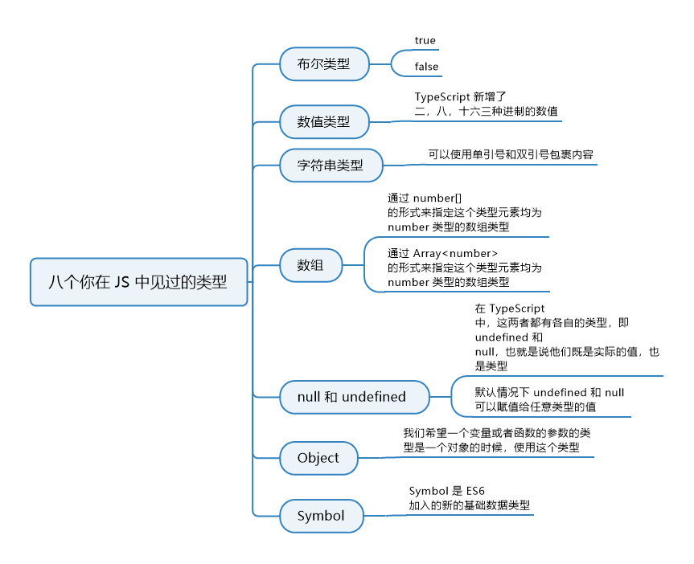
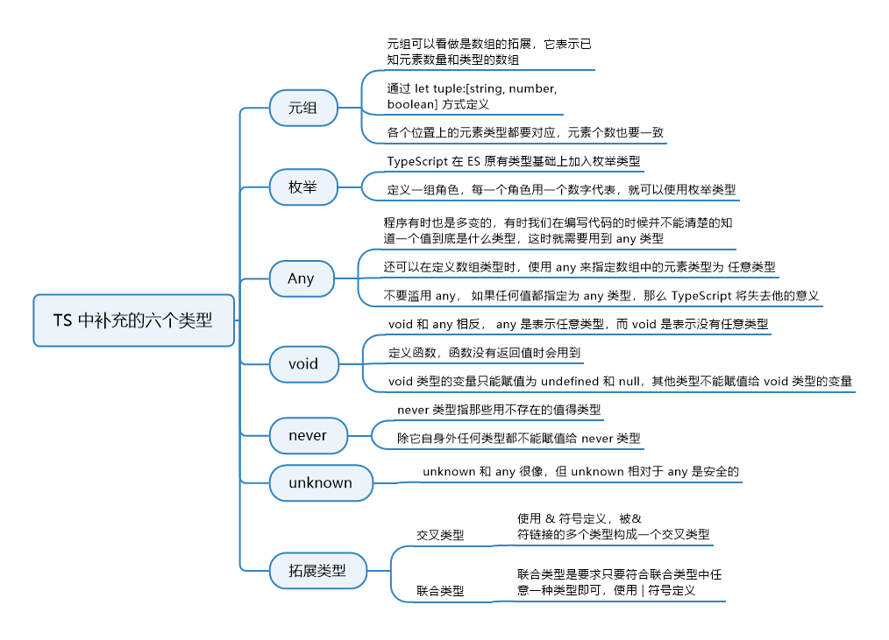

# 2. 基础类型

## 2.1 八个在 JS 中的类型

### 2.1.1 知识图谱


### 2.1.2 布尔类型

类型为布尔类型的变量的值只能是 **true** 或 **false**，如下：

```typescript
let bool:boolean = false;
bool = true;
bool = 123; // error 不能将类型“123”分配给类型“boolean”
```

当然了，赋值给 bool 的值也可以是一个计算之后结果是布尔值的表达式，比如：

```typescript
let bool:boolean = !!0
console.log(bool) // false
```


### 2.1.3 数值类型

**TypeScript** 和 **JavaScript** 一样，所有数字都是浮点数，所以只有一个 <b style="color:red"> number </b> 类型，而没有 <b style="color:red"> int</b> 或者 <b style="color:red"> float </b> 类型。而且 **TypeScript** 还支持 **ES6** 中新增的二进制和八进制数字字面量，所以 **TypeScript** 中共支持 二、八、十和十六 四种进制的数值。

```typescript
let num: number
num = 123;
num = '123' // error 不能将类型 “123” 分配给类型 “number”
num = 0b1111011; // 二进制123
num = 0o173; // 八进制123
num = 0x7b; // 16进制123
```


### 2.1.4 字符串类型

字符串类型中你可以使用单引号和双引号包裹内容，但是可能你使用的 **tslint** 规则会对引号进行检测，使用单引号还是双引号可以在 **tslint** 规则里配置。你还可以使用 **ES6**  语法——模板字符串，拼接变量和字符串更为方便。

```typescript
let str: string = "Alfred"
str = "Lv"
const first = "Alfred"
const last = "Lv"
str = `${first}${last}`
console.log(str)
```

另外还有个和字符串相关的类型： **字符串字面量类型**。即把一个字符串字面量作为一种类型，比如上面的字符
串 **"Lison"**，当你把一个变量指定为这个字符串类型的时候，就不能再赋值为其他字符串值了，如：

```typescript
let str："Lison"
str="haha" // error 不能将类型 “haha” 分配给类型 “Lison”
```


### 2.1.5 数组类型

在 **TypeScript** 中有两种定义数组的方式：

```typescript
let list1: number[] = [1, 2, 3];
let list2: Array<number> = [1, 2, 3];
```

第一种形式通过 <b style="color:red"> number[] </b> 的形式来指定这个类型元素均为  **number** 类型的数组类型。（推荐写法）

第二种形式通过 <b style="color:red"> Array< number > </b> 的形式来指定这个类型元素均为  **number** 类型的数组类型。

如果你要指定一个数组里的元素既可以是数值也可以是字符串，那么你可以使用这种方法： <b style="color:red"> number|string [] </b>

当你使用第二种形式定义时，**tslint** 可能会警告让你使用第一种形式定义，如果你就是想用第二种形式，可以通过在 **tslint.json** 的 **rules** 中加入 <b style="color:red">"array-type": [false]</b> 关闭 **tslint** 对这条的检测。

**ReadonlyArray** （只读数组）


### 2.1.6 null 和 undefined

**null** 和 **undefined** 有一些共同特点，说它们是共同特点，是因为在 **JavaScript** 中，**undefined** 和 **null** 是两个基本数据类型。在 **TypeScript** 中，这两者都有各自的类型即 **undefined** 和 **null** ，也就是说它们既是实际的值，也是类型，来看实际例子：

```typescript
let u:undefined = undefined // 这里可能会报一个tslint的错误， Unnecessary initialization to 'undefined' 就是不能给一个值赋undefined，但我们知道这是可以的，所以如果你的代码规范想让这种代码合理化，可以配置 tslint， 将 "no-unnecessary-initializer" 设为 false 即可。
let n:null = null;
```

默认情况下 **undefined** 和 **null** 可以复制给任意类型的值，也就是说你可以把 **undefined** 赋值给 **void** 类型，也可以赋值给 **number** 类型。当你在 **tsconfig.json** 的 **“compilerOptions”** 里设置了 <b style="color:red">"strictNullChecks": true</b> 时，那必须严格对待。 **undefined** 和 **null** 将只能赋值给它们自身和 **void** 类型。


### 2.1.7 对象类型

**object**  在 **JS** 中是引用类型，它和 JS 中的其他基本类型不一样，像 **number**、 **string**、 **boolean**、 **undefined**、 **null**  这些都是基本类型，这些类型的变量存的是他们的值，而 **object**  类型的变量存的是引用，看个简单的例子：

```javascript
let strInit = 'abc';
let strClone = shrInt;
strClone = 'efg';
console.log(strInit) // 'abc'

let objInit = {a: 'aa'};
let objClone = objInit
console.log(objClone) // {a: 'aa'}
objInit.a = 'bb'
console.log(objClone) // {a: 'bb'}
```

通过例子可以看出，我们修改 **objInit** 时， **objClone** 也被修改了，是因为 **objClone** 保存的是 **objInit** 的引用，实际上**objInit** 和 **objClone** 是同一个对象。

当我们希望一个变量或者函数的参数的类型是一个对象的时候，使用这个类型，比如：

```typescript
let obj:object
obj = {name: 'Alfred'}
obj = 123 // error 不能将类型 ‘123’ 分配给类型 ‘object’
```

这里报错说类型 **object** 上没有 **name** 这个属性。如果你想要达到这种需求你应该使用我们后面章节要讲到的接口，那 **object** 类型适合什么时候使用呢？我们前面说了，当你希望一个值必须是对象而不是数值等类型时，比如我们定义一个函数，参数必须是对象，这个时候就用到object类型了：

```typescript
function getKeys(obj:object) {
    return Object.keys(obj) // 会以列表的形式返回obj中的值
}
getKeys({a: 'a'}) // ['a']
getKeys(123) // error 类型‘123’的参数不能赋给类型‘object’的参数
```


### 2.1.8 symbol

**Symbol** 是 **ES6** 加入的新的基础数据类型。


## 2.2 TS 中补充的六个类型

### 2.2.1 知识图谱




## 2.2.2 元组

元组可以看做是数组的拓展，它表示已知元素数量和类型的数组。确切地说，是已知数组中每一个位置上的元素的类型，来看例子：

```typescript
// 元祖类型
let tuple: [string, number, boolean]
tuple = ['a', 1, false]
tuple = [2, 'a', false] // error 不能将类型 ‘number’ 分配给类型 ‘string’。不能将类型 ’string‘ 分配给类型 'number'
tuple = ['a', 2] // error  Property '2' is missing in type '[string, number]' but required in type '[string, number, boolean]
```

可以看到，上面我们定义了一个元组 tuple，它包含三个元素，且每个元素的类型是固定的。当我们为 tuple 赋值
时：各个位置上的元素类型都要对应，元素个数也要一致。

我们还可给打个元素赋值：

```typescript
tuple[1] = 3;
```

这里我们给元组 tuple 的索引为 1 即第二个元素赋值为 3，第二个元素类型为 number，我们赋值给 3，所以没有问题。

当我们访问元组中元素时， TypeScript 会对我们在元素上做的操作进行检查：

```typescript
tuple[0].split(':') // right 类型 string 拥有属性 split
tuple[1].split(':') // error 类型 number 上不存在属性 split
```

上面的例子中，我们访问的 tuple 的第二个元素的元素类型为 number，而数值没有 split 方法，所以会报错。

在 2.6 版本之前， TypeScript 对于元组长度的校验和 2.6 之后的版本有所不同，我们来看下面的例子，前后版本对于该情况的处理：

```typescript
let tuple: [string, number];
tuple = ["a", 2]; // right 类型和个数都对应，没问题
// 2.6版本之前如下也不会报错
tuple = ["a", 2, "b"];
// 2.6版本之后如下会报错
tuple = ["a", 2, "b"]; // error 不能将类型“[string, number, string]”分配给类型“[string, number]”。 属性“length”的类型不兼容。
```

这个赋给元组的值有三个元素，是比我们定义的元组类型元素个数多的：

- 在 2.6 及之前版本中，超出规定个数的元素称作**越界元素**，但是只要越界元素的类型是定义的类型中的一种即
  可。比如我们定义的类型有两种： string 和 number，越界的元素是 string 类型，属于联合类型 string | number ，所以没问题，联合类型的概念我们后面会讲到。

- 在 2.6 之后的版本，去掉了这个越界元素是联合类型的子类型即可的条件，要求元组赋值必须类型和个数都对
  应。

在 2.6 之后的版本， [string, number]元组类型的声明效果上可以看做等同于下面的声明：

```typescript
interface Tuple extends Array<number|string> {
    0:string;
	1:number;
	length:2;
}
```

上面这个声明中，我们定义接口  <b style="color:red">Tuple</b> ，它继承数组类型，并且数组元素的类型是 <b style="color:red">number</b> 和 <b style="color:red">string</b> 构成的联合类型，这样接口 <b style="color:red">Tuple </b>就拥有了数组类型所有的特性。并且我们明确指定索引为0的值为 <b style="color:red">string</b> 类型，索引为**1**的值为<b style="color:red">number</b> 类型，同时我们指定 <b style="color:red" >length </b>属性的类型字面量为 **2**，这样当我们再指定一个类型为这个接口 <b style="color:red">Tuple</b> 的时候，这个值必须是数组，而且如果元素个数超过2个时，它的**length**就不是**2**是大于**2**的数了，就不满足这个接口定义了，所以就会报错；当然，如果元素个数不够2个也会报错，因为索引为0或1的值缺失。接口我们后面会在后面专门的一节来讲，所以暂时不懂也没关系.。

如果你想要和 2.6 及之前版本一样的元组特性，那你可以这样定义接口：

```typescript
interface Tuple extends Array<number | string> {
  0: string;
  1: number;
}
```

也就是去掉接口中定义的<b style="color:red" >length: 2 </b>，这样 <b style="color:red" >Tuple </b>接口的 <b style="color:red" >length</b>就是从 <b style="color:red" >Array</b>继承过来的 <b style="color:red" >number</b> 类型，而不用必须是 <b style="color:red" >2</b> 了。


### 2.2.3 枚举

<b style="color:red">enum </b>类型在 C++这些语言中比较常见， TypeScript 在 ES 原有类型基础上加入枚举类型，使我们在 TypeScript 中也可以给一组数值赋予名字，这样对开发者来说较为友好。比如我们要定义一组角色，每一个角色用一个数字代
表，就可以使用枚举类型来定义：

```typescript
// 枚举类型
enum Roles {
  SUPER_ADMIN,
  ADMIN,
  USER
}
```

上面定义的枚举类型 Roles 里面有三个值， TypeScript 会为它们每个值分配编号，默认从 0 开始，依次排列，所以它们对应的值是：

```typescript
enum Roles {
  SUPER_ADMIN = 0,
  ADMIN = 1,
  USER = 2
}
```

当我们使用的时候，就可以使用名字而不需要记数字和名称的对照关系了：

```typescript
const superAdmin = Roles.SUPER_ADMIN;
console.log(superAdmin); // 0
```

你也可以修改这个数值，比如你想让这个编码从 1 开始而不是 0，可以如下定义：

```typescript
enum Roles {
  SUPER_ADMIN = 1,
  ADMIN,
  USER
}
```

这样当你访问 <b style="color:red">Roles.ADMIN</b> 时，它的值就是 2 了。

你也可以为每个值都赋予不同的，不按顺序排列的值：

```typescript
enum Roles {
  SUPER_ADMIN = 1,
  ADMIN = 3,
  USER = 6
}
```

通过名字 **Roles.SUPER_ADMIN** 可以获取到它对应的值 1，同时你也可以通过值获取到它的名字，以上面任意数值这个例子为前提：

```typescript
console.log(Roles[3]) // 'ADMIN'
```


### 2.2.4 Any

JavaScript 的类型是灵活的，程序有时也是多变的。有时，我们在编写代码的时候，并不能清楚地知道一个值到底
是什么类型，这时就需要用到 any 类型，即任意类型。我们来看例子：

```typescript
let value: any;
value = 123
value = 'abc'
value = false
```

你可以看到，我们定义变量 value，指定它的类型为 any，接下来赋予任何类型的值都是可以的。

我们还可以在定义数组类型时使用 any 来指定数组中的元素类型为任意类型：

```typescript
const array:any[] = [1, 'a', true]
```

**但是请注意，不要滥用 any，如果任何值都指定为 any 类型，那么 TypeScript 将失去它的意义。**


### 2.2.5 void

**void** 和 **any** 相反， **any** 是表示任意类型，而 **void** 是表示没有任意类型，就是什么类型都不是，这在我们定义函
数，函数没有返回值时会用到：

```typescript
const consoleText = (text:string):void => {
    console.log(text)
}
```

这个函数没有返回任何的值，所以它的返回类型为 **void**。现在你只需知道 **void** 表达的含义即可，后面我们会用专门的一节来学习函数。

**void 类型的变量只能赋值为** <b style="color:red">undefined</b>  **和**  <b style="color:red">null</b> ，**其他类型不能赋值给 void 类型的变量。**


### 2.2.6 never

**never** 类型指那些永不存在的值得类型，它是那些总会抛出异常或根本不会有返回值的函数表达式的返回值类型，当变量被永不为真的类型保护所约束，该变量也是 **never** 类型。

这个类型比较难理解，我们先来看几个例子：

```typescript
const errorFunc = (message: string):never => {
    throw new Error(message);
}
```

这个 errorFunc 函数总是会抛出异常，所以它的返回值类型时 never，用来表明它的返回值是永不存在的。

```typescript
const infiniteFunc = (): never => {
	while (true) {}
};
```

<b style="color:red">infiniteFunc</b> 也是根本不会有返回值的函数，它和之前讲 void 类型时的 <b style="color:red">consoleText</b> 函数不同， <b style="color:red">consoleText</b> 函数没有返回值，是我们在定义函数的时候没有给它返回值，而 <b style="color:red">infiniteFunc</b> 是死循环是根本不会返回值的，所以它们二者还是有区别的。

**never** 类型是任何类型的子类型，所以它可以赋值给任何类型；而没有类型是 **never** 的子类型，所以除了它自身没有任何类型可以赋值给 **never** 类型， **any** 类型也不能赋值给 **never** 类型。我们来看例子：

```typescript
let neverVariable = (() => {
  while (true) {}
})();
neverVariable = 123; // error 不能将类型"number"分配给类型"never"
```

上面例子我们定义了一个立即执行函数，也就是 <b style="color:red">"let neverVariable = "</b> 右边的内容。右边的函数体内是一个死循环，所以这个函数调用后的返回值类型为 **never**，所以赋值之后 **neverVariable** 的类型是 **never** 类型，当我们给 **neverVariable** 赋值 **123** 时，就会报错，因为除它自身外任何类型都不能赋值给 **never** 类型。


### 2.2.7 unknow

<b style="color:red">unknown</b> 类型是 TypeScript 在3.0版本新增的类型，它表示未知的类型，这样看来它貌似和**any**很像，但是还是有区别的，也就是所谓的“**unknown相对于any是安全的**”。怎么理解呢？我们知道当一个值我们不能确定它的类型的时候，可以指定它是any类型；但是当指定了any类型之后，这个值基本上是“废”了，你可以随意对它进行属性方法的访问，不管有的还是没有的，可以把它当做任意类型的值来使用，这往往会产生问题，如下：

```typescript
let value:any;
console.log(value.name)
console.log(value.toFixed())
console.log(value.length)
```

上面这些语句都不会报错，因为value是any类型，所以后面三个操作都有合法的情况，当value是一个对象时，访问name属性是没问题的；当value是数值类型的时候，调用它的toFixed方法没问题；当value是字符串或数组时获取它的length属性是没问题的。

而当你指定值为unknown类型的时候，如果没有通过基于控制流的类型断言来缩小范围的话，是不能对它进行任何操作的，关于类型断言，我们后面小节会讲到。总之这里你知道了， unknown类型的值不是可以随便操作的。


### 2.2.8 拓展阅读

这要讲的不是TypeScript中新增的基本类型，而是高级类型中的两个比较常用类型：联合类型和交叉类型。我们之
所以要提前讲解，是因为它俩比较简单，而且很是常用，所以我们先来学习下。

#### 2.2.8.1 交叉类型

交叉类型就是取多个类型的并集，使用 <b style="color:red">&</b> 符号定义，被 & 符号链接的多个类型构成一个交叉类型，表示这个类型同时具备这几个连接起来的类型的特点，来看例子：

```typescript
const merge = <T,U>(arg1:T, arg2:U):T&U => {
    let res = <T & U>{} // 这里指定返回值的类型兼备T和U两个类型表里代表的类型的特点
    res = Object.assign(arg1, arg2) // 这里使用 Object.assign 方法，返回一个合并后的对象：
    				// 关于该方法，请在例子西面补充中学习
    return res;
}

const info1 = {
    name: 'Alfred'
}
const info2 = {
    age: 18
}
const alfredInfo = merge(info1, info2);

console.log(lisonInfo.address); // error 类型“{ name: string; } & { age: number; }”上不存在属性“address"
```

>
>
>补充阅读： Object.assign方法可以合并多个对象，将多个对象的属性添加到一个对象中并返回，有一点要注意
>的是，如果属性值是对象或者数组这种保存的是内存引用的引用类型，会保持这个引用，也就是如果在
>Object.assign返回的的对象中修改某个对象属性值，原来用来合并的对象也会受到影响。
>
>

可以看到，传入的两个参数分别是带有属性 name 和 age 的两个对象，所以它俩的交叉类型要求返回的对象既有name 属性又有 age 属性。


#### 2.2.8.2 联合类型

联合类型实际是几个类型的结合，但是和交叉类型不同，**联合类型是要求只要符合联合类型中任意一种类型即可**，使用 <b style="color:red">|</b> 符号定义。当我们的程序具有多样性，元素类型不唯一时，即使用联合类型。

```typescript
const getLength = (content: string|number):number => {
    if(typeof content === 'string') return content.length;
    else return content.toString().length;
}
console.log(getLength('abc')) // 3
console.log(getLength(123)) // 3
```

这里我们指定参数既可以是字符串类型也可以是数值类型，这个getLength函数的定义中，其实还涉及到一个知识
点，就是类型保护，就是 <b style="color:red">typeof content === “string” </b>，后面进阶部分我们会学到。

