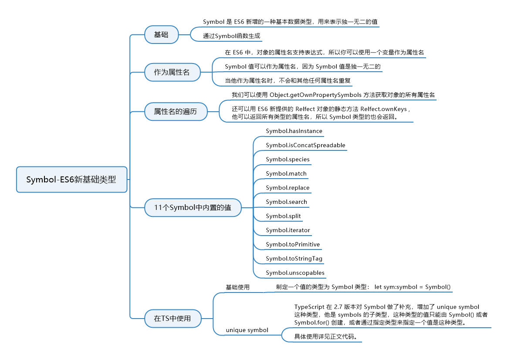

# 3. ES6精讲 - symbol

## 3.1 知识图谱



## 3.2 概述

`symbol`是 ES6 新增的一种基本数据类型，它和 number、string、boolean、undefined 和 null 是同类型的，object 是引用类型。它用来表示独一无二的值，通过 Symbol 函数生成。

Symbol 值通过`Symbol`函数生成。这就是说，对象的属性名现在可以有两种类型，一种是原来就有的字符串，另一种就是新增的 Symbol 类型。凡是属性名属于 Symbol 类型，就都是独一无二的，可以保证不会与其他属性名产生冲突。

```javascript
let s = Symbol();

typeof s
// "symbol"
```

上面代码中，变量`s`就是一个独一无二的值。`typeof`运算符的结果，表明变量`s`是 Symbol 数据类型，而不是字符串之类的其他类型。

注意，`Symbol`函数前不能使用`new`命令，否则会报错。这是因为生成的 Symbol 是一个原始类型的值，不是对象。也就是说，由于 Symbol 值不是对象，所以不能添加属性。基本上，它是一种类似于字符串的数据类型。

我们可以在使用 Symbol 方法创建 symbol 类型值的时候传入一个参数，这个参数需要是字符串的。如果传入的参数不是字符串，会先调用传入参数的 toString 方法转为字符串。先来看例子：

```javascript
const s1 = Symbol("alfred");
const s2 = Symbol("alfred");
console.log(s1 === s2); // false
// 补充：这里第三行代码可能会报一个错误：This condition will always return 'false' since the types 'unique symbol' and 'unique symbol' have no overlap.
// 这是因为编译器检测到这里的s1 === s2始终是false，所以编译器提醒你这代码写的多余，建议你优化。
```

上面这个例子中使用 Symbol 方法创建了两个 symbol 值，方法中都传入了相同的字符串’alfred’，但是`s1 === s2`却是 false，这就是我们说的，Symbol 方法会返回一个独一无二的值，这个值和任何一个值都不等，虽然我们传入的标识字符串都是"alfred"，但是确实两个不同的值。

你可以理解为我们每一个人都是独一无二的，虽然可以有相同的名字，但是名字只是用来方便我们区分的，名字相同但是人还是不同的。Symbol 方法传入的这个字符串，就是方便我们在控制台或程序中用来区分 symbol 值的。我们可以调用 symbol 值的`toString`方法将它转为字符串：

```javascript
const s1 = Symbol('alfred')
console.log(s1.toString()) // Symbol(alfred)
```

你可以简单地理解 symbol 值为字符串类型的值，但是它和字符串有很大的区别，它不可以和其他类型的值进行运算，但是可以转为字符串和布尔类型值：

```javascript
let s = Symbol("lison");
console.log(s.toString()); // 'Symbol(lison)'
console.log(Boolean(s)); // true
console.log(!s); // false
```

通过上面的例子可以看出，symbol 类型值和对象相似，本身转为布尔值为 true，取反为 false。

## 3.3 作为属性名

